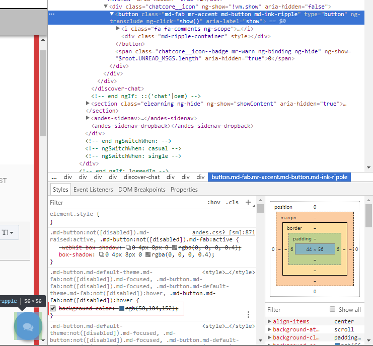

在做Nightwatch自动化测试中，出现需要比较颜色的时候如何来做？
基本的思路是首先需要取到这个element的颜色值，然后跟预期的颜色进行对比。
比如我要取下面这个会话窗口的颜色，选中这个图标，按F12，查看这个图标的属性。发现Angular中的颜色属性不是Elements下，是在Styles下面，如何取到这个颜色值？



这里会用到getCssProperty这个方法，具体如何使用，请看如下代码：
```javascript
getChatColor: function(cb) {
    const chat = '[ng-click="show()"]'
    this.getCssProperty('@chat', 'background-color', function(result) {
      cb(result.value);
    });
    return this;
},
```
将上面的getChatColor command代码放到一个叫chat.js的page下面，然后在测试用例中这样调用这个command,
```javascript
'Test get color': function (client) {
    var chat = client.page.chat();
    let chatColor;
    chat.navigate();

    chat.getChatColor(function(color) {
        chatColor = color;
    });
    client.perform(function() {
        client.assert.equal(chatColor, 'rgba(50, 104, 152, 1)');
    });
}
```
截图中看到的background color是rgb(50, 104, 152), 但是getChatColor返回指是rgba，rgb和rgba之间需要转化一下，a表示透明度，取值0~1之间。