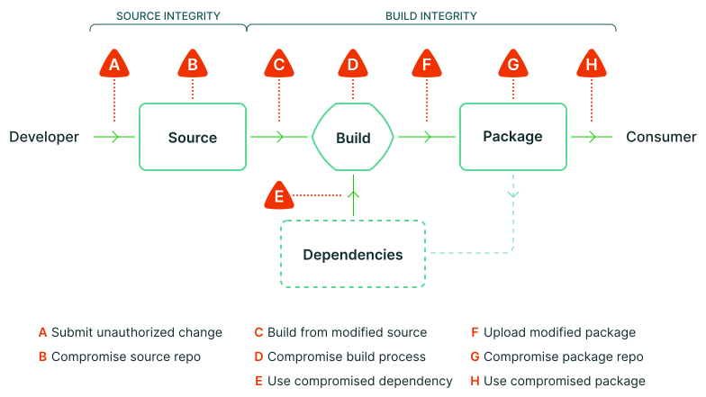

## 什么是 SLSA？

SLSA 全名是 Supply chain Levels for Software Artifacts, or SLSA (发音“salsa”).

它是一个安全框架，一个标准和控制的清单，用于防止篡改、提高完整性并保护您的项目、企业或企业中的软件包和基础设施。这就是您如何在链中的任何环节从足够安全到尽可能有弹性。

### 软件供应链中的问题

任何软件都可能将漏洞引入供应链。随着系统变得越来越复杂，已经有检查和最佳实践来保证工件完整性至关重要，你所依赖的源代码就是你实际使用的代码。如果没有坚实的基础和系统发展计划，就很难集中精力应对明天的下一次黑客攻击、违规或妥协。

#### 供应链攻击包括哪些

A 提交未经认证的修改
B 泄露源码仓库
C 从被修改源代码构建
D 泄露构建过程
E 使用已泄露的依赖
F 上传被修改的包
G 泄露了包仓库
H 使用已泄露的包

##### 防范关键威胁

供应链攻击是一个始终存在的威胁，利用弱点来干扰软件。SLSA 框架建立了三个信任边界，鼓励正确的标准、证明和技术控制，因此您可以强化系统免受这些威胁和风险的影响。

这意味着能够自动分析工件，保证原始源代码，防止构建和分发过程中可能发生的干扰，隔离任何隐藏的漏洞，并确切地知道哪些系统组件可能受到影响。

##### 真实世界的例子

像 SolarWinds，Codecov 或 Linux hypocrite 这样的高调攻击利用了供应链完整性漏洞，这些漏洞可能被忽视或不发达，并在当今的环境中迅速变得非常公开，破坏性和代价高昂。

攻击可能发生在典型软件供应链中的每个环节，这给参与复杂关键系统的任何人都带来了额外的负担。SLSA 的设计考虑了这些示例，以确保它们是常识，并且更容易防范。

##### 它如何融入安全生态系统

安全性不仅仅是防止篡改。从漏洞管理和模糊测试到测试和开发人员信任，其中许多都需要将精力集中在源头的解决方案。这就是 SLSA 补充您更广泛的安全工作的地方，让您确信您运行的代码就是您分析的代码。

### 安全级别

#### 通往理想状态的阶梯

SLSA 的要求着眼于软件工件创建中涉及的三个一般主要领域，以及漏洞的目标 - 构建、源和依赖项。随着级别规模的扩大，它们表明已经做了一些工作来确保每个领域都有更多的完整性，这对场景规划很有帮助。

##### 建立诚信

SLSA 从生成开始，这是发布项目之前的最后一步。这可确保软件是从正确的源和依赖项构建的，并且未被修改。更具复原能力的生成完整性意味着防止在源代码管理、构建平台受损或绕过 CI/CD 后修改代码。

##### 源完整性

然后，需求可以专注于源。所有源代码都应反映软件生产者的意图，代码和更改历史记录仍可供调查。更具弹性的源完整性意味着更好地防止未经审查提交的错误代码或损坏源代码控制系统。

##### 依赖

在生成过程中获取的任何其他软件工件。实施早期安全检查后，可以跟进对系统中的任何依赖项递归应用 SLSA 检查，这有助于保护潜在的大规模攻击面免受依赖项混淆攻击。

TODO:

review https://slsa.dev/spec/v0.1/requirements
---

转载本站文章请注明作者和出处，请勿用于任何商业用途。欢迎关注公众号「DevOps攻城狮」
