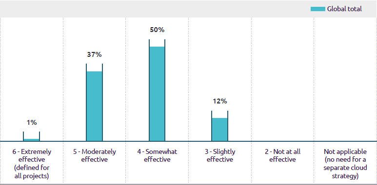

2202-23 世界质量报告（World Quality Report 简称 WQR）是一项全球研究，不论是作为软件测试、开发工程师，关注这类软件质量报告可以帮助我们快速了解软件行业的现状和趋势。

## 七个主题

今年的 WQR 的关键趋势和推荐包括包括以下七个主题：

* 敏捷质量编排
* 质量自动化
* 质量基础设施测试和供应
* 测试数据供应和数据验证
* 质量和可持续的 IT
* 新兴技术趋势的质量工程
* 价值流管理

<!-- more -->

## 敏捷企业中的质量编排

组织内采用 Agile/DevOps 以来，以下各个方面的改进程度如何？

### 自从你的组织采用 Agile/DevOps 以来，以下每个领域有多少改进

敏捷改进了交货时间，启用高质量的软件，并且
允许频繁部署。

敏捷和 DevOps 正在以多种方式影响组织。从调查结果可以清楚地看出，敏捷方法导致上市时间显着改善，并且提高驾驶时的软件质量和可预测性客户体验。上图显示了组织的百分比经历了超过 20% 的改善自从他们采用以来提到的改进领域敏捷/开发运营。

准时交货、可预测性、改进客户体验和生产力提升是关键敏捷实践实施的结果。这使更好的客户体验，同时部署更快的版本。有趣的是，更快发布的业务驱动目标已经只有 54% 的受访者达到了，这意味着它应该获得更多关注。

### 你的团队多久使用一次以下质量和测试方法来测试企业系统？

企业的“安全”赌注系统

在企业系统的世界中，敏捷的采用流程最近才刚刚开始。企业系统是复杂且运行关键的业务流程，这使得
他们在敏捷采用之旅的后期开始。
一个原因企业系统较晚采用敏捷与分解通常非常大的工作流程的困难端到端的业务流程分成更小的块，可以
在较短的开发冲刺中独立处理。然而，在过去几年中，企业采用敏捷系统已经发生了积极的转变，我们预计这种情况将继续下去。今年我们调查了最主要的品质是什么以及用于企业系统的测试方法。

大多数团队 (65%) 使用特定于包的工具来自动化，63% 的团队使用预建的测试用例存储库用于认证冲刺，61% 的团队集成了测试作为 CI/CD 管道中的自动质量门。

### 在执行成功的敏捷开发程序时，以下 QA 技能有多重要？

#### 全栈的概念质量工程师在进步

今年的数据显示，技术和内嵌质量工程师的跨职能技能敏捷 Scrum 团队。

上图显示“采用工程思维”同时“拥抱多技能和提高技能”正在成为新常态。

业务领域知识和跨职能技能是最重要的两个项目今年超过 60% 的受访者。

#### 质量工程师是不可或缺的敏捷团队的一部分

今年的数据显示质量的存在有所增加嵌入敏捷 scrum 团队中的工程师。

### 你的团队中专业质量工程师的比例是多少？

上图显示，平均而言，大多数 IT 组织他们的敏捷团队中有 <30% 的质量工程师。
尽管28% 的组织拥有高达 36–45% 的质量工程师，20% 的组织拥有 16–25% 的质量工程师敏捷团队。

#### 质量的主要建议

敏捷企业中的编排敏捷团队在很大程度上依赖于有效的协作和高效的团队成员之间的沟通。

由于经常不断变化的需求和较短的交付周期，开发人员，业务分析师和质量工程师需要携手合作手交付版本。
他们需要合作，拥抱变化，并迅速适应。

在今年的调查中，我们发现了以下主要发现以及与敏捷质量编排相关的最佳实践：

* 灵活性、所有权和适应性是团队的关键敏捷程序的属性。
* 跨职能技能和业务知识至关重要敏捷程序的成功。
* 持续交付的步伐需要更高的水平自动化和质量过程。
* 敏捷/DevOps 需要更广泛的质量视角，包括左移和右移。
* 敏捷团队中的质量工程师正在进一步发展面向全栈质量工程师。这些是工程师他们带来了丰富的技术和商业技能。这将继续发展以匹配所需的灵活性敏捷环境。

#### 组织应该做什么专注于？

当谈到敏捷质量方法、过程和编排，我们有六点建议：

* 让质量工程师成为敏捷开发的组成部分程式。合适的人才以及技术和业务技能对于敏捷中的质量工程师至关重要。虽然 SDET 角色正在成为常态，但业务领域知识是一项基本技能。
* 发展端到端测试自动化并提高测试水平跨 CI/CD 流程的测试自动化，具有自动化持续测试，以推动更好的代码质量。这会在降低成本的同时提高产品质量质量。
* 确保你的自动化测试作为一部分运行常规 CI 管道，因此可以轻松集成它们与日常工作。
* 随着企业主越来越多地参与测试活动，确保他们有正确的工具和流程让他们能够有效地进行测试。
* 为企业系统使用特定于包的工具和通过预构建的库提高自动化水平适合在敏捷方法中使用。
* 跟踪和监控整体质量指标整个开发生命周期的指标。示例：失败部署指标提供了整个质量的整体视图
团队。

## 质量自动化

### 介绍

测试自动化已经伴随我们几十年了，工具已经显着发展。 当我们看测试自动化时通过世界质量报告的镜头，我们看到了很多的承诺。 但是，我们也看到组织仍然努力让它发挥作用。

组织面临测试的两个非常普遍的挑战自动化有以下几种：

* 测试自动化并不总是自然地集成到开发过程，但组织为单独的活动，独立于开发和测试本身
* 团队优先选择测试自动化工具，但忘记定义适当的测试自动化计划和策略

要使测试自动化成功，你至少需要良好的需求、正确的专家、正确的工具（通常更多一个工具），以及具有足够质量的稳定测试环境测试数据。
今天，所有组织都需要适当水平的测试自动化因为敏捷方法正在推动开发速度。

因此，测试需要更快地完成，但不应该失去它的任何严谨性。 简单来说就是人工测试太多跟不上发展。

### 决定你的测试自动化方法的前三个最重要的因素是什么？

我们询问了我们的调查受访者什么是最重要的确定他们的测试自动化方法。

我们预计投资回报率高，但可维护性处于顶部 - 一个受欢迎的承认，要成功自动化，它需要被视为一种被照顾的资产和发展。
人们认识到企业的需求是也很关键，以及适应需要的新技术有待测试——我们认为，部分原因是不断的转变
进入云端。
我们发现大多数组织的首要任务是满足业务需求需要而不是证明自动化的技术投资回报率是合理的，组织中的对话发生了变化从一个测试工具的成本到它带来的价值到企业。

#### 测试自动化团队不兑现承诺好处

令人失望的是，自动化带来的预期收益仅约一半的时间。甚至 CI/CD 和自动化的集成也是如此低于预期，尽管长期以来转向 CI/CD 来驱动敏捷实践。

### 你的团队中有多少人目前从测试自动化中获得了以下好处？

#### 为什么是这样？

这是工具的失败吗？ 开源和商业工具建立良好。他们的能力是众所周知的，他们的能力也是如此限制——至少在每天使用它们的人中是这样。 从一些深入的后续采访，看起来确实如此关于可以做什么和不能做什么的沟通仍然存在管理不善，尤其是在寻找证明投资回报的合理性。 呼唤的诱惑手动测试作为自动化设置团队的百分比自动化超过他们应该的，而不看手册测试是自动化的好案例，会带来价值。

关键问题是：你能确定你的所有部分吗？解决方案？ 即使你的团队兑现了承诺鉴于现代 IT 世界的全球性质和
互联云/API 驱动世界的复杂性，有些部分可能被忽略了。

我们一直在为许多人研究测试自动化主题年，令人失望的是组织仍在挣扎使测试自动化工作。 调查结果表明
具有成熟敏捷过程的团队通常会获得更多从测试自动化活动中获益。 信息很明确：让流程正确，并有明确的期望，好要求，以及一个可以支持他们看到的团队增加获得所需收益的频率在现代世界取得成功。

#### 自动化给你带来什么最大的好处？

自动化可以提供的远不止是测试前端或在单元测试中测试下拉列表。 多年来，单元测试和功能测试主导了自动化的努力。
现在需要更快地构建，获取大量数据，构建环境和部署代码质量自动化解决方案为所有这些领域带来价值。

### 你目前在测试周期的哪些关键阶段从测试自动化中获益最大

#### 盘点

低代码解决方案越来越受欢迎。 打开 source 每周都有一个新工具。 成熟的商业工具继续交付。 这意味着，对于自动化，有一个比以往任何时候都更丰富、更强大的工具包。 我们在使用人工智能爆炸式增长元素的工具数量和机器学习带来额外的价值、可用性和功能进入工具集。但需要解决一些看法。 太多次了，自动化并没有兑现其承诺。 作为一个行业，我们需要解决自动化问题，因为它对以速度和质量在现代世界中交付，我们都需要成功。

#### 组织应该做什么专注于

我们的研究使我们得出以下建议增加质量自动化计划的价值：

* 尽早与质量自动化专家合作
* 自动化在创建需求时开始；在需求中构建自动化优先的方法和故事
* 在开始之前就自动化要求达成一致自动化
* 专注于为客户带来最大利益和业务而不是证明投资回报率
* 定期审查你的工具和框架
* 规划至少未来三年的路线图
* 一种工具并不能解决所有问题。 选择最好的工具工作。 不要试图让一种工具做所有事情。
* 投资于人。 停止追逐独角兽并与你拥有的人——他们了解你的业务。

改变的好处不是立竿见影的。 你必须允许时间通过你的项目管道进行更改以及调整和改变的心态。 当他们这样做时，自动化可以交付它所承诺的价值——不仅仅是一半的时间，而是大多数时候！

最后一点：可持续性是一个日益重要的趋势 – 不仅在 IT 领域，而且在所有方面。 我们需要开始思考现在关于自动化如何显示其收益和成本世界。 你知道你的碳足迹是多少吗自动化测试是？ 多久之后你必须可以为你的组织报告吗？ 现在是时候开始考虑如何以及如何准备好问题被问到。

## 质量基础设施测试和供应

测试环境管理一直很重要世界质量报告调查的一部分。 今年我们有分析了测试环境供应是如何适应和非生产环境的云配置是如何进行的起飞。 云测试在软件中占据更大的位置开发生命周期，随着越来越多的环境和应用程序迁移到云端。 在世界的这一章质量报告，因此我们检查了状态和采用云测试。

随着越来越多的工作负载转移到云端，我们询问了组织他们的非生产环境的比例是多少在云中提供。 结果显示出明显的进步，但在这个领域还有很长的路要走，几乎一半组织最多只能提供 25% 的非生产性云上的环境。 总体而言，49% 的组织拥有更多超过 50% 的非生产环境在云端。 这非生产环境的云采用表明与去年的调查相比呈积极趋势，当时只有平均 23% 的测试是在云环境中完成的。

### 在云上配置的非生产环境的比例是多少

正如我们注意到的，非生产工作负载越来越多转向云，我们还研究了云平台战略对于非生产环境。 结果是很多
组织 (44%) 目前使用混合（本地加单一云提供商）环境战略。 约 38% 的这些组织制定了多云战略。 还，平均有 30% 的受访者开始思考认真考虑将测试环境移动到多前提（本地加多云提供商）模型。

该数据表明，将非生产迁移到云环境远未完成。 我们希望看到增加在为非生产采用多云、多前提策略方面
环境，因为这些解决方案具有积极的对灾难恢复、安全性和成本效率的影响。

### 你提供非生产环境的云平台策略是什么

#### 测试环境配置自动化

将非生产环境迁移到云是云解决方案进行自动配置测试环境更容易。 我们调查了哪些工具组织用于自动测试环境配置。
结果均匀分布在不同的可用选项。 多达 41% 的受访者使用混合工具结合商业现成工具的策略质量基础设施测试和供应带有开源选项。 谈到云原生工具，或内部供应商制造工具的组合偏好，我们观察到前景相似。

从该分析中脱颖而出的一个策略是组织还没有准备好将所有鸡蛋放在同一个篮子。 因此，工具策略的组合是目前正在跟踪。 我们看到组织正在采取在工具方面采用平衡的方法，因为许多这个领域的工具是新的。

### 你当前自动化端到端非生产环境配置的工具策略是什么？

#### 云和基础设施测试

随着组织部署更多的环境进入云，我们也希望看到云测试在重要性。 通过云测试，组织可以验证可扩展性、性能、安全性、可靠性、灾难恢复、环境的互操作性和多租户和云上的应用程序。 迁移应用程序时到云，功能和非功能方面应用程序必须进行测试，以确保整体功能和性能保持所需。 在我们今年的调查中，我们问如果组织将云和基础设施测试作为一部分他们的开发生命周期。 结果表明，大约 96% 的所有受访者都提到现在包括云测试
作为测试生命周期的一部分，57% 的人已经将云纳入其中对大多数项目进行测试，39% 的人声称已将其包含在内
至少对于某些项目。

这是包含云测试的积极上升趋势能力进入软件开发生命周期。 我们强烈建议这种趋势继续下去，云测试和基础设施测试被列为强制性阶段在生命周期中。

### 你的组织是否将云和基础架构测试作为开发生命周期的一部分？

我们还询问了我们的受访者什么类型的项目云和包括基础设施测试。 我们看到了一个重大转变前几年，今年，大约 40% 的受访者提到他们所有的项目现在都包括云测试作为他们软件开发生命周期的一部分。 约 27% 受访者认为这仅适用于云迁移项目。 这种趋势令人鼓舞，因为云和基础设施测试曾经是在外部进行的阶段数据中心典型的软件开发生命周期

### 什么类型的项目（如果有）将云测试作为开发生命周期的一个组成部分？

我们将云测试视为一种将获得认可的趋势并在未来几年增加采用，我们是肯定会看到更多的组织订阅云和基础设施测试与往年相比。 这甚至由于越来越多地采用云和更加关注潜在的安全和性能问题

#### 云测试策略

如果云测试越来越重要，那么也很重要了解组织在定义云方面的成熟程度他们项目的测试策略。 在这项调查中，发现云测试策略仍远未奏效，需要成熟。 整整一半（50%）的受访者提到他们的云测试策略只是有些有效，而 37% 的受访者提到它适度有效。

这一结果标志着云测试的整体概念和云测试的相关自动化还处于起步阶段在大多数组织中。 这一观察的主要收获
是组织应该紧急开始创建一个端到端的符合的云和基础设施测试策略组织的整体云采用战略。

### 你组织的端到端云测试策略的有效性如何？

#### 云测试自动化

我们还调查了组织采取的方法走向云测试的自动化以及什么类型的他们用于云测试自动化的工具。 我们大约 3% 的人受访者回答说，云测试工具非常具体项目的决定。 目前相同比例 (33%) 更喜欢这个领域的开源工具，而 31% 的人更喜欢云原生工具。

我们观察到跨组织的工具策略非常相似，这也表明没有用于云测试的单一优秀工具或策略。 因此对于组织，所有选项（开源、现成、混合、等）开放供考虑。

我们的建议，考虑到各种趋势，包括采用多前提云采用策略，是组织应认真考虑集成商业现成的和开源的工具选项来解决各种云架构和项目特定要求。 这还可以通过标准化减少工具许可证的支出跨项目工具。

### 你的云测试工具采用策略是什么

组织应该做什么专注于？

总体而言，我们看到围绕测试环境的积极趋势管理：

* 越来越多的组织正在将测试环境迁移到云端，在多云或多前提模型中。
* 组织使用混合工具集来实现自动化提供测试环境，包括云原生，商业现成的供应商或内部内置工具。

我们对测试环境的建议管理和配置如下：

* 加快采用多场所（本地加多云提供商）测试环境的策略提高成本效率、安全性、冗余和数据恢复选项
* 考虑智能集成（包括自定义具体功能），以充分利用商业 off-the-shelf 和开源工具作为混合策略
测试环境配置。
* 进一步利用非生产转移的成本效益趋势通过高效的方式将工作负载转移到云端非生产环境的设计和架构。

在本章中，我们还讨论了积极的趋势到云的测试：

* 大多数组织都将云测试视为一种软件开发生命周期的组成部分
* 与开源工具有很强的联系，尽管有其他选择，例如现成的商业工具也被用于云测试的自动化

我们关于云测试的主要建议是下列：

* 在所有项目中包括云和基础架构测试策略你的项目
* 通过以下方式改进你的端到端云测试策略考虑到所有的云平台和集成确保性能的环境架构，环境的可扩展性和功能方面
* 随着获取的数据越来越多，你更加关注安全测试托管在云端并与第三方云集成应用增加

---

转载本站文章请注明作者和出处，请勿用于任何商业用途。欢迎关注公众号「DevOps攻城狮」
