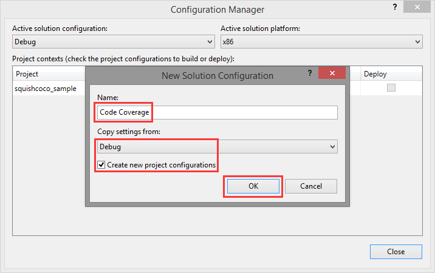
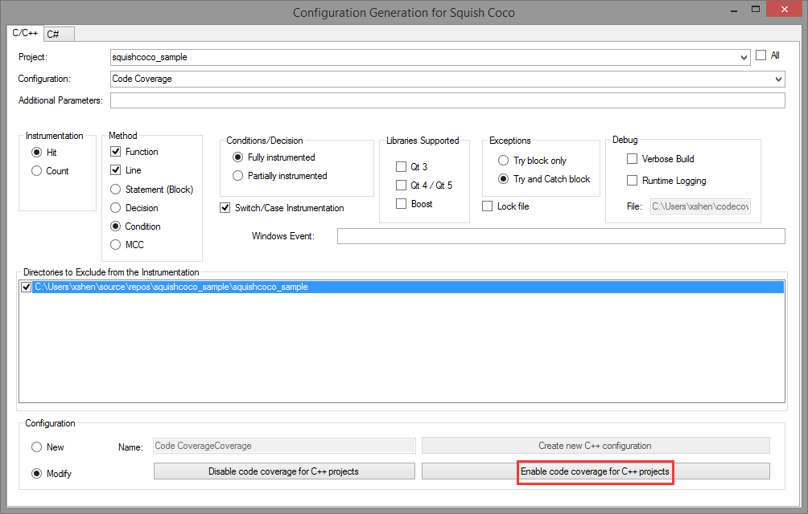

## Preparation

1. You need to ask for a [free trial license](https://www.froglogic.com/coco/free-trial/) and install
    * You will receive a mail with username/password to login for downloading  
2. I test it on the Windows platform, so I download the Windows installer, then install Squish Coco and Add-in
3. Installed Visual Studio 2010 or higher, I used VS2017 Professional

<!-- more -->

## Add-in

* go to ..squishcoco\Setup, see quishCocoVSIX2017.vsix, double click, reopen VS2017, squishcoco will be there

## Create a project

Start Visual Studio and create a new C++ application

1. Click on "File→New→Project..." to pop up the new project wizard.
2. Choose a project type of "Visual C++2" and the "Win32 Console Application" template.
3. Enter a project name of squishcoco_sample, then click the "OK" button.
4. When the wizard’s second page appears, click the "Finish" button.

At this stage the application is not yet instrumented, so now we will create a copy of the build.


1. Open the configuration manager by clicking "Build→Configuration Manager...".
2. In the "Configuration" column, select "New..." in the combobox.
3. In the "New Project Configuration" dialog:
    1. Enter Code Coverage in the "Name" field,
    2. Select Release or Debug in the "Copy settings from" selection dialog.
    3. Click the "OK" button.

Add test code

squishcoco_sample.cpp

```c
// squishcoco_sample.cpp : Defines the entry point for the console application.
//

#include "stdafx.h"
extern int myprint();

int _tmain(int argc, _TCHAR* argv[])
{
    int age;
    printf("Enter your age: ");
    scanf("%d",&age);
    if (age > 0 && age <=40)
        printf("You're young guys\n");
    else if (age >40 && age <=70)
        printf("You're midle guys\n");
    else if (age > 70 && age <=100)
        printf("You're old guys\n");
    else
        printf("You're awesome\n");

    myprint();

    return 0;
}
```

myprint.cpp

```c
#include"stdafx.h"

int myprint ()
{
    printf ("you have call printf function\n");
    return 0;
}
```

## Activate instrumentation

use the Microsoft® Visual Studio® Add-In:


1. Click "Tools→Code Coverage Build Mode..." to pop up the Squish Coco wizard.
2. In the "Project:" selection dialog, select squishcoco_sample.
3. In the selection dialog "Configuration:", select Code Coverage.
4. In the Configuration section at the bottom, select the radio button "Modify", and then click on the button, "Enable code coverage for C++ projects".

The Code Coverage configuration has now been modified to generate code coverage information. The "SquishCoco" output window summarizes all the modifications that have been made:

```log
...
Modifying configuration 'Code Coverage' for the project 'squishcoco_sample' for the platform 'Code Coverage|Win32'
    Compiler Configuration
        Additional command line arguments ' --cs-exclude-file-abs-regex="^.*\\squishcoco_sample\\[^\\]*$" --cs-on --cs-condition --cs-line --cs-function --cs-hit --cs-full-instrumentation --cs-no-qt3 --cs-no-qt4 --cs-no-boost' are appended
    Linker Configuration
        Additional command line arguments ' --cs-exclude-file-abs-regex="^.*\\squishcoco_sample\\[^\\]*$" --cs-on --cs-condition --cs-line --cs-function --cs-hit --cs-full-instrumentation --cs-no-qt3 --cs-no-qt4 --cs-no-boost' are appended
    Librarian Configuration
        Additional command line arguments ' --cs-exclude-file-abs-regex="^.*\\squishcoco_sample\\[^\\]*$" --cs-on --cs-condition --cs-line --cs-function --cs-hit --cs-full-instrumentation --cs-no-qt3 --cs-no-qt4 --cs-no-boost' are appended
    File Specific Configuration
        Additional command line arguments ' --cs-exclude-file-abs-regex="^.*\\squishcoco_sample\\[^\\]*$" --cs-on --cs-condition --cs-line --cs-function --cs-hit --cs-full-instrumentation --cs-no-qt3 --cs-no-qt4 --cs-no-boost' are appended for the file 'squishcoco_sample.cpp'
Modifying configuration 'Code Coverage' for the project 'squishcoco_sample' for the platform 'Code Coverage|x64'
    Compiler Configuration
        Additional command line arguments ' --cs-exclude-file-abs-regex="^.*\\squishcoco_sample\\[^\\]*$" --cs-on --cs-condition --cs-line --cs-function --cs-hit --cs-full-instrumentation --cs-no-qt3 --cs-no-qt4 --cs-no-boost' are appended
    Linker Configuration
        Additional command line arguments ' --cs-exclude-file-abs-regex="^.*\\squishcoco_sample\\[^\\]*$" --cs-on --cs-condition --cs-line --cs-function --cs-hit --cs-full-instrumentation --cs-no-qt3 --cs-no-qt4 --cs-no-boost' are appended
    Librarian Configuration
        Additional command line arguments ' --cs-exclude-file-abs-regex="^.*\\squishcoco_sample\\[^\\]*$" --cs-on --cs-condition --cs-line --cs-function --cs-hit --cs-full-instrumentation --cs-no-qt3 --cs-no-qt4 --cs-no-boost' are appended
    File Specific Configuration
...
```

## Build project

Build project will cause the executable squishcoco_sample.exe to be built and the code coverage instrumentation file squishcoco_sample.exe.csmes to be generated

Double click on squishcoco_sample.exe.csmes to inspect this file in CoverageBrowser

Right now there is no code coverage statistics visible in CoverageBrowser, this is because the application has not yet been executed. Click on squishcoco_sample.cpp in the source list to display the main function. All the instrumented lines are shown grayed out, to indicate that nothing has been executed.

Now execute squishcoco_sample.exe by double clicking it. This will result in a file called squishcoco_sample.exe.csexe being generated. The file contains a code coverage snapshot which can be imported into Coverage Browser

1. Click "File->Load Execution Report...".
2. Select the "File" item and enter the path of the squishcoco_sample.exe.csexe file.
3. Click on the "Import" button.
This will cause the code coverage statistics to be updated. Now, in the source code window, the main function’s return statement will be colored green to indicate that this line has been executed.

## Final result


