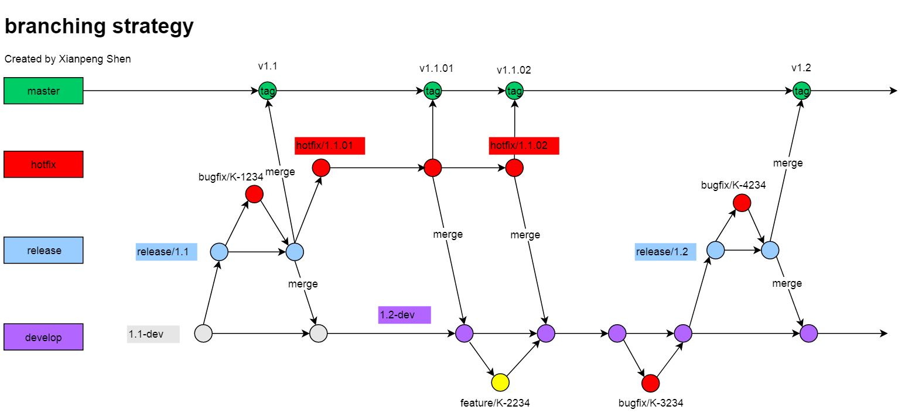

对于刚刚接触的 Git 的人来说，打开一个 Git 仓库，面对几十个分支时，有的人不理解，有的人云里雾里，为什么会创建这么多分支？今天通过介绍 Git 分支策略，让你看懂 Git 分支。

## Git 分支策略

大体上 Git 分为 master, hotfix, release, develop 分支

* master - 只用于存放稳定版本的提交，只限于 merge 操作。比如图里 master 上有 v1.1, v1.1.01, v1.1.02, v.1.2 这些 tag 都是通过合并分支的方式提交上去的。

* hotfix - 热修复分支是在产品发布之后创建的，比如图里的 v1.1 版本发布之后，客户发现有问题，会针对 v1.1 创建 hotfix/1.1.01 分支进行修复。
hotfix 02 会在 hotfix 01 的基础上继续创建分支。

* release - 发布分支是在产品 code freeze 后创建的， code freeze 的意思是“好啦，我们要准备发布了，你们开发再添加的新功能不准再忘了加了，
测试现在就要准备了”，这时候就会创建 release 分支用来测试，如果上面发现 bug，需要在 release 分支上创建 bugfix 分支进行修复。

* develop - 开发分支是所有开发者最常用的分支，当前的 Bug 和 Features 都需要修复到这个分支上面去。

这个图有几个关键点：

* hotfix 分支是从最新的 hotfix 分支上创建的
* hotfix 分支发布后将会合并到 develop 分支
* release 分支是从 develop 分支上创建的
* release 分支发布后将会合并到 develop 和 master 分支
* 在 release 分支上发现的缺陷将会修复到 release 分支
