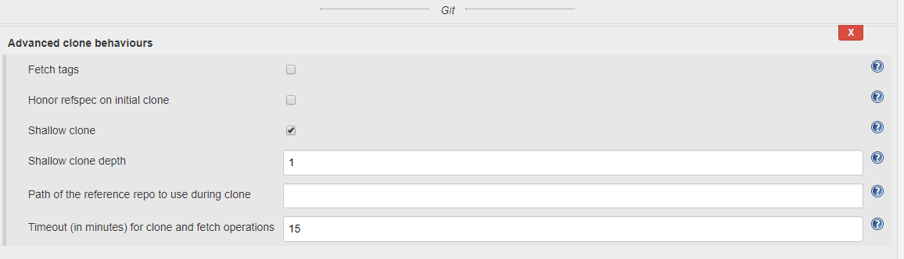

## Jenkins 问题解决记录（一）

最近 Jenkins Build 不知为何总是 git clone 失败，报这个错误,  ERROR: Error cloning remote repo 'origin'。

1. 我首先怀疑是网络原因，我们的 Bitbucket 在 Git clone 时所占带宽很大造成短暂断网情况，怀疑是 IT 更改了 Bitbucket 的设置，但我手动去那台 agent 上执行却没问题，好像跟 IT 无关
2. 再看日志这里有一处显示 timeout=10，这时候我突然想起来前些日子我删除了非常大的一个文件夹，然后做了一次提交，这会导致我们的仓库增大，在做一次完整的 clone 的时候所需要的时间可能超过 Jenkins 默认 10 分钟。

去 Google 搜索最后找到这个 issue JENKINS-47660，和我的问题一样。

<!-- more -->

## 解决办法 Troubleshooting

最终我找到 Git clone 有个 Behaviors 属性，找到里面的 Advanced clone behaviours 功能，将 Fetch tags 去掉（因为我暂时不用，去掉也可能减少那么一丁点的时间吧），勾选了 Shallow clone，然后将 Shallow clone depth 设置为 1，（这个设置等同于 --depth 1），Timeout 时间从 10 分钟改为 15 分钟。最终的设置如图：



## Full Log below

```log
using credential d1cbab74-823d-41aa-abb7
 Wiping out workspace first.
 Cloning the remote Git repository
 Cloning with configured refspecs honoured and without tags
 Cloning repository https://git.company.com/scm/db/blog.git
  > C:\Program Files\Git\bin\git.exe init C:\agent\workspace\develop # timeout=10
 Fetching upstream changes from https://git.company.com/scm/db/blog.git
  > C:\Program Files\Git\bin\git.exe --version # timeout=10
 using GIT_ASKPASS to set credentials blwmv
  > C:\Program Files\Git\bin\git.exe fetch --no-tags --progress https://git.company.com/scm/db/blog.git +refs/heads/develop:refs/remotes/origin/develop
 ERROR: Error cloning remote repo 'origin'
 hudson.plugins.git.GitException: Command "C:\Program Files\Git\bin\git.exe fetch --no-tags --progress https://git.company.com/scm/db/blog.git +refs/heads/develop:refs/remotes/origin/develop" returned status code 130:
 stdout:
 stderr: remote: Counting objects: 1
remote: Counting objects: 242690, done.
 remote: Compressing objects:   0% (1/75028)
remote: Compressing objects:   1% (751/75028)
remote: Compressing objects:   2% (1501/75028)
remote: Compressing objects:   3% (2251/75028)
remote: Compressing objects:   4% (3002/75028)
remote: Compressing objects:   5% (3752/75028)
... ...
remote: Compressing objects: 100% (75028/75028), done.
 Receiving objects:   0% (1/242690)
Receiving objects:   1% (2427/242690)
Receiving objects:   1% (4762/242690), 972.00 KiB | 949.00 KiB/s
Receiving objects:   2% (4854/242690), 972.00 KiB | 949.00 KiB/s
Receiving objects:   3% (7281/242690), 1.38 MiB | 919.00 KiB/s
Receiving objects:   3% (8998/242690), 1.82 MiB | 645.00 KiB/s
Receiving objects:   4% (9708/242690), 1.82 MiB | 645.00 KiB/s
Receiving objects:   4% (9778/242690), 1.82 MiB | 645.00 KiB/s
Receiving objects:   5% (12135/242690), 1.82 MiB | 645.00 KiB/s
... ...
Receiving objects:  86% (209321/242690), 1.01 GiB | 2.08 MiB/s
 	at org.jenkinsci.plugins.gitclient.CliGitAPIImpl.launchCommandIn(CliGitAPIImpl.java:2042)
 	at org.jenkinsci.plugins.gitclient.CliGitAPIImpl.launchCommandWithCredentials(CliGitAPIImpl.java:1761)
 	at org.jenkinsci.plugins.gitclient.CliGitAPIImpl.access$400(CliGitAPIImpl.java:72)
 	at org.jenkinsci.plugins.gitclient.CliGitAPIImpl$1.execute(CliGitAPIImpl.java:442)
 	at org.jenkinsci.plugins.gitclient.CliGitAPIImpl$2.execute(CliGitAPIImpl.java:655)
 	at org.jenkinsci.plugins.gitclient.RemoteGitImpl$CommandInvocationHandler$1.call(RemoteGitImpl.java:153)
 	at org.jenkinsci.plugins.gitclient.RemoteGitImpl$CommandInvocationHandler$1.call(RemoteGitImpl.java:146)
 	at hudson.remoting.UserRequest.perform(UserRequest.java:212)
 	at hudson.remoting.UserRequest.perform(UserRequest.java:54)
 	at hudson.remoting.Request$2.run(Request.java:369)
 	at hudson.remoting.InterceptingExecutorService$1.call(InterceptingExecutorService.java:72)
 	at java.util.concurrent.FutureTask.run(Unknown Source)
 	at java.util.concurrent.ThreadPoolExecutor.runWorker(Unknown Source)
 	at java.util.concurrent.ThreadPoolExecutor$Worker.run(Unknown Source)
 	at java.lang.Thread.run(Unknown Source)
 	Suppressed: hudson.remoting.Channel$CallSiteStackTrace: Remote call to dendevu2uvbw01
 		at hudson.remoting.Channel.attachCallSiteStackTrace(Channel.java:1743)
 		at hudson.remoting.UserRequest$ExceptionResponse.retrieve(UserRequest.java:357)
 		at hudson.remoting.Channel.call(Channel.java:957)
 		at org.jenkinsci.plugins.gitclient.RemoteGitImpl$CommandInvocationHandler.execute(RemoteGitImpl.java:146)
 		at sun.reflect.GeneratedMethodAccessor1074.invoke(Unknown Source)
 		at sun.reflect.DelegatingMethodAccessorImpl.invoke(DelegatingMethodAccessorImpl.java:43)
 		at java.lang.reflect.Method.invoke(Method.java:498)
 		at org.jenkinsci.plugins.gitclient.RemoteGitImpl$CommandInvocationHandler.invoke(RemoteGitImpl.java:132)
 		at com.sun.proxy.$Proxy124.execute(Unknown Source)
 		at hudson.plugins.git.GitSCM.retrieveChanges(GitSCM.java:1152)
 		at hudson.plugins.git.GitSCM.checkout(GitSCM.java:1192)
 		at org.jenkinsci.plugins.workflow.steps.scm.SCMStep.checkout(SCMStep.java:124)
 		at org.jenkinsci.plugins.workflow.steps.scm.SCMStep$StepExecutionImpl.run(SCMStep.java:93)
 		at org.jenkinsci.plugins.workflow.steps.scm.SCMStep$StepExecutionImpl.run(SCMStep.java:80)
 		at org.jenkinsci.plugins.workflow.steps.SynchronousNonBlockingStepExecution.lambda$start$0(SynchronousNonBlockingStepExecution.java:47)
 		at java.util.concurrent.Executors$RunnableAdapter.call(Executors.java:511)
 		at java.util.concurrent.FutureTask.run(FutureTask.java:266)
 		at java.util.concurrent.ThreadPoolExecutor.runWorker(ThreadPoolExecutor.java:1149)
 		at java.util.concurrent.ThreadPoolExecutor$Worker.run(ThreadPoolExecutor.java:624)
 		at java.lang.Thread.run(Thread.java:748)
 [Pipeline] }
 [Pipeline] // ws
 [Pipeline] }
 [Pipeline] // node
 [Pipeline] }
 [Pipeline] // stage
 [Pipeline] }
 Failed in branch Windows build
```
