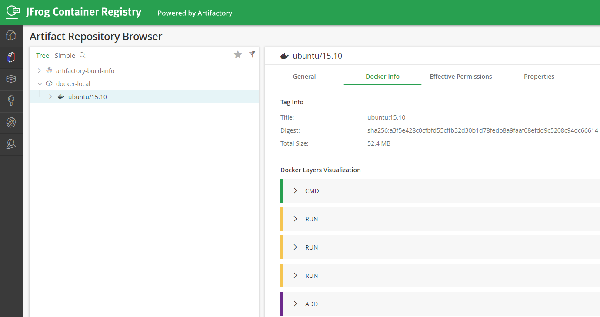

对于如何备份 Jenkins 除了用 Jenkins 插件来定期备份之外，如果把 Jenkins 安装到 Docker 里，定期备份一个 Docker Image 最后传到 Artifatory 中，也是一个不错的方案。

<!-- more -->

## 安装 Docker 版 Jenkins

在 CentOS 上安装 Docker 版 Jenkins，这里推荐用 Long-term Support (LTS) 版本，可以从 Jenkins 官网[下载](https://jenkins.io/download/)。

```bash
# 下载指定 lts 版本 2.130
sudo docker pull jenkins/jenkins:2.130
# 运行指定 docker Jenkins
sudo docker run -p 8080:8080 -p 50000:50000 jenkins/jenkins:2.130
# 如果想下载最新的 lts 版
sudo docker pull jenkins/jenkins:lts
# 运行最新的 lts 版 docker Jenkins
sudo docker run -p 8080:8080 -p 50000:50000 jenkins/jenkins:lts
```

启动成功后即可打开 http://hostname:8080/ 网址

## 修改登录密码

显示所有的 image 以及正在运行的 container

```bash
# 列出来所有 image
sudo docker image list
# 列出当前运行的 container
sudo docker ps
# 进入容器，使用 -it 参数
sudo docker exec -it 39bc7a8307d9 /bin/bash
# 查看默认 admin 密码
jenkins@a6195912b579:/$ cat /var/jenkins_home/secrets/initialAdminPassword
5193d06c813d46d3b18babeda836363a
```

建议登录之后，修改 admin 密码，方便下次登录

```bash
sudo docker commit 39bc7a8307d9 myjenkins:v0.1
```

## 将宿主机目录映射到 Jenkins Docker 中

如果想让 Docker 里的 Jenkins 可以访问宿主机的目录，在运行 docker 时使用 -v 参数进行 mount volume

```bash
sudo docker run -p 8080:8080 -p 50000:50000 --name mydata -v /data/backup:/home/backup jenkins/jenkins:2.130
# 映射成功，可以看到宿主机上的备份文件了
jenkins@c85db3f88115:/home/backup$ ls
FULL-2019-09-14_02-00  FULL-2019-09-28_02-00  FULL-2019-10-19_02-00  FULL-2019-11-02_02-00  FULL-2019-11-23_02-00
FULL-2019-09-21_02-00  FULL-2019-10-05_02-00  FULL-2019-10-26_02-00  FULL-2019-11-09_02-00  FULL-2019-11-30_02-00
```

## 将 Jenkins Docker Image 保存在 Artifactory

下载并安装 Artifactory 企业版或是 JFrog Container Registry，注意 Artifactory Open Source 版本不支持 Docker Registry。

例如我的 JFrog Container Registry 是：dln.dev.mycompany.com:8040，并创建了一个 docker repository 叫 docker-local。

上传 Docker Image 一共分为三步：

docker login

```bash
#  在登录前需要添加如下配置到 /etc/docker/daemon.json
{
"insecure-registries" : ["dln.dev.mycompany.com:8040"]
}
# docker login <DOCKER_SERVER>, example below:
sudo docker login dln.dev.mycompany.com:8040
```

docker tag

```bash
# docker tag <IMAGE_ID> artprod.mycompany/<DOCKER_REPOSITORY>:<DOCKER_TAG>, example below:
sudo docker tag myjenkins:v0.1 dln.dev.mycompany.com:8040/docker-local/myjenkins:v0.1
```

docker push

```bash
# docker push artprod.mycompany/<DOCKER_REPOSITORY>:<DOCKER_TAG>, example below:
$ sudo docker push dln.dev.mycompany.com:8040/docker-local/myjenkins::v0.1
The push refers to repository [dln.dev.mycompany.com:8040/docker-local/myjenkins]
98d59071f692: Pushed
af288f00b8a7: Pushed
4b955941a4d0: Pushed
f121afdbbd5d: Pushed
15.10: digest: sha256:a3f5e428c0cfbfd55cffb32d30b1d78fedb8a9faaf08efdd9c5208c94dc66614 size: 1150
```

登录 JFrog Container Registry 刷新就可以到已经上次的 Image 了。说明：截图是我上传的另外一个镜像 ubuntu:15.10


