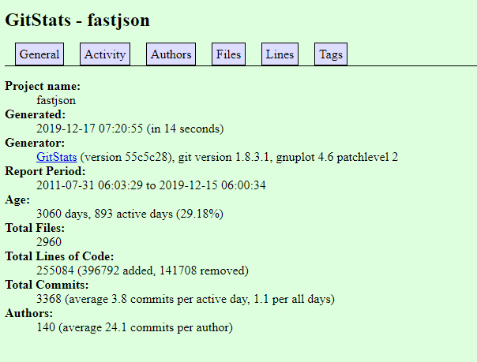
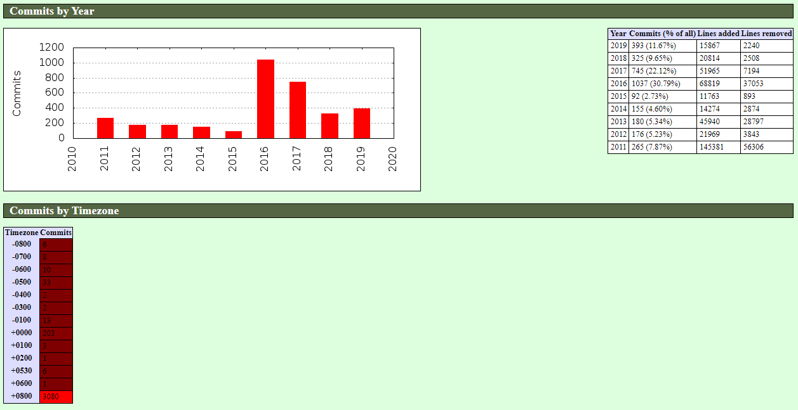
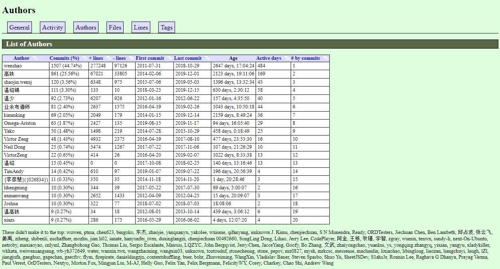
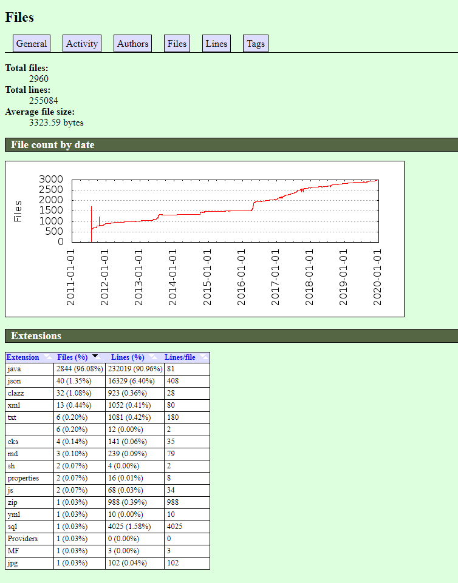
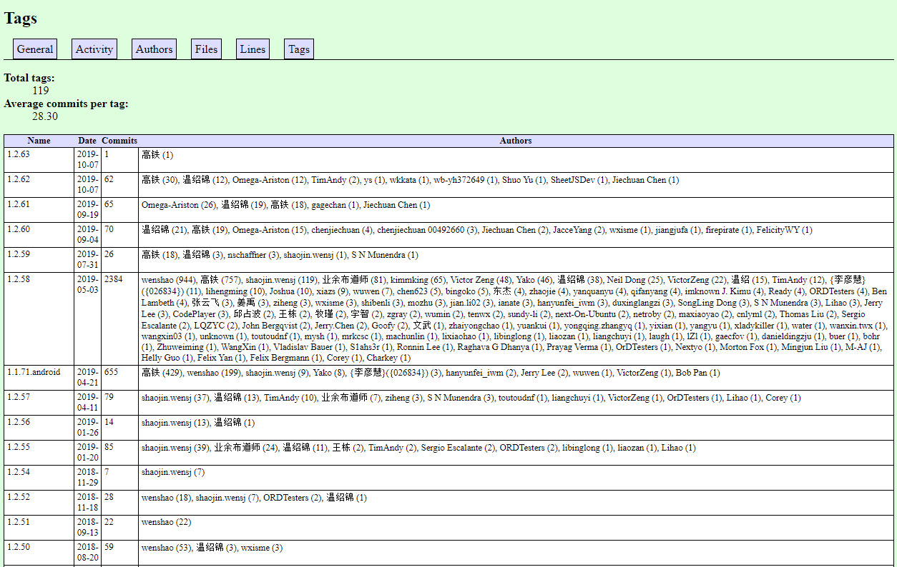

## 背景介绍

如果你在从事 CI/CD 或 DevOps 或者你是研发效能组的一员，你的领导可能想看下 Git 代码提交信息数据的分析，比如：

* 当前仓库的代码提交的代码最多
* 当前仓库的活跃度是什么样子的
* 各个时段的提交分析数据
* 每个版本的贡献排名
* 每周/每月/每年的贡献排名，等等

今天分享一个 Git 历史统计信息生成工具叫 [gitstats](https://github.com/hoxu/gitstats)

这时一个用 python 写的小工具，代码文件很少，但却非常强大，这是我目前发现位数不多的可以生成漂亮的 html 报告并且使用方便的开源项目。

* 另外还有一个推荐报告也很强大，但我还没来得及试的 [git_stats](https://github.com/tomgi/git_stats)

## 如何使用

如果有类 Linux 系统，推荐在 Linux 上下载和安装，我曾尝试用 Windows 来准备环境，在配置 Gnuplot 时（Gnuplot 是一个可移植的命令行驱动的图形工具），之前要下载 Python2，配置 Cygwin，之后步骤需要手动，挺麻烦的我就换用 Linux 上来进行环境准备。以下 Linux 步骤。

```bash
# 源代码是 Python 2 来开发的
sudo yum install python27
# 安装 Gnuplot
sudo yum install gnuplot
# 下载 gitstats
git clone https://github.com/hoxu/gitstats.git
# 下载你要分析的代码仓库，比如阿里巴巴的最高 start 的开源项目 fastjson
git clone https://github.com/alibaba/fastjson.git
# 执行命令，生产报告
cd gitstats
./gitstats ../fastjson ../html/fastjson
# 经过 15 秒钟的执行，生成报告
Generating report...
[0.00393] >> git --git-dir=/workspace/gitstats/.git --work-tree=/workspace/gitstats rev-parse --short HEAD
[0.00236] >> git --version
[0.00716] >> gnuplot --version
Generating graphs...
[0.01676] >> gnuplot "/workspace/html/fastjson/day_of_week.plot"
[0.01571] >> gnuplot "/workspace/html/fastjson/files_by_date.plot"
[0.01281] >> gnuplot "/workspace/html/fastjson/month_of_year.plot"
[0.09293] >> gnuplot "/workspace/html/fastjson/lines_of_code_by_author.plot"
[0.01340] >> gnuplot "/workspace/html/fastjson/commits_by_year.plot"
[0.01799] >> gnuplot "/workspace/html/fastjson/hour_of_day.plot"
[0.01627] >> gnuplot "/workspace/html/fastjson/domains.plot"
[0.01268] >> gnuplot "/workspace/html/fastjson/commits_by_year_month.plot"
[0.09435] >> gnuplot "/workspace/html/fastjson/commits_by_author.plot"
[0.01522] >> gnuplot "/workspace/html/fastjson/lines_of_code.plot"
Execution time 15.16208 secs, 4.58247 secs (30.22 %) in external commands)
You may now run:

   sensible-browser '/workspace/html/fastjson/index.html'
```


## 报告分析

### 一般介绍

可以看到这个项目叫 fastjson，从 2011 年 7 月 31 日开始提交第一次代码，距离当前已经 3060 天了，893 个活跃天，活跃度为 29.18%。总共文件是 2960 个，一共的代码行数是 255084 行。



### 活跃度

在过去的 32 周里，其中前 12 周到 17 周这段时间很活跃，提交很多。另外可以看到在白天 12 点到晚上 20 点这段时间提交很少，大部分程序员在这段时间都在应对公司里的工作。

可以看到 20 点之后提交开始增多，看来是一个努力的开发者。另外可以看到周一到周日都有提交，周六有点减少，一般程序员都会在周六放松一下，周日却没少提交，看来还是花费了不少的个人宝贵时间。


该项目主要完成时间在 2016 年到 2017 年，完成的时区是在东八区，毋庸置疑完全全的中国开发者的项目。



### 贡献者

这里主要是 wenshao （温绍）来开发（提交超过 50% 的代码），另外高铁是第二位贡献者（贡献了 25% 左右的代码）



这张图也是可以看到谁的项目的创建者，以及这几年以来每年的谁的贡献最大。还有可以看到提交者所用的账户，没想到排名第一的竟然是 hotmail，这种只有一直，就是项目的创建者或是主要贡献者用的是 hotmail 邮箱。


### 文件及行数

文件总数是 2960 个，代码行数是 25 万行，平均每个文件的大小是 3.3 KB。

另外还可以看到每年的文件增加趋势图以及这些文件类型数量的排名，可以看到 java 文件占了 96.08%，其次是 json 文件。



### Tags

这个图我觉得也是团队里很重要的一个数据指标，可以看到每个版本的贡献度排名。




## 最后

可以你找任意感兴趣的项目拿来分析一下，比如 996.ICU 以及 Jenkins 等项目。