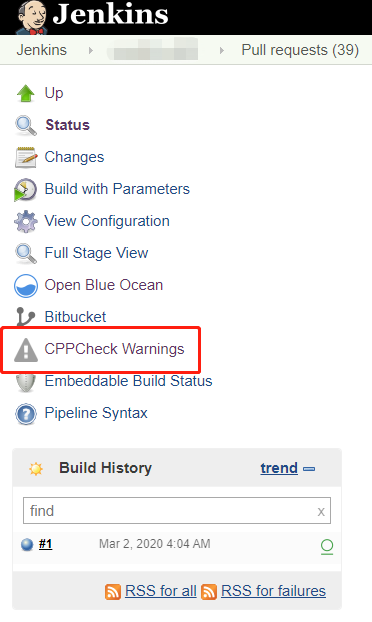
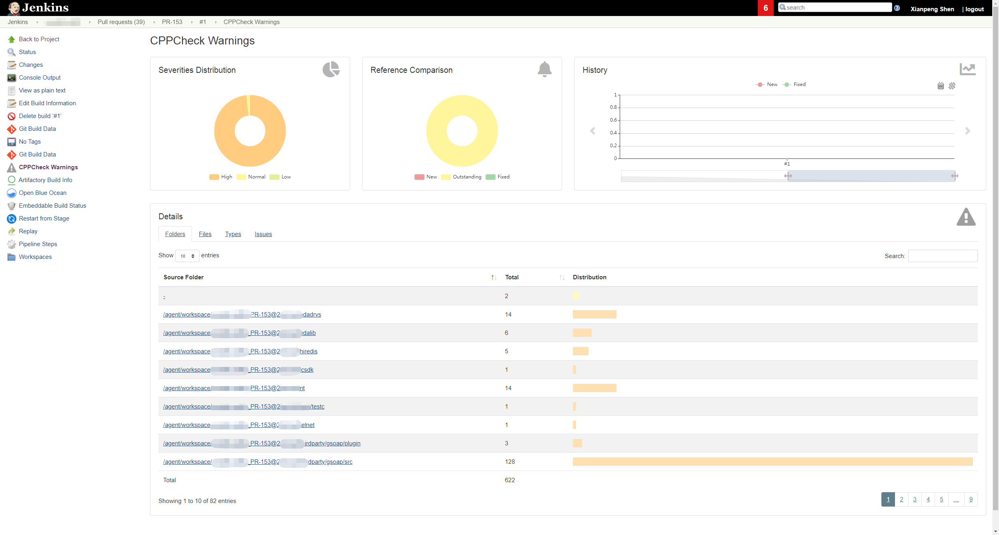

由于历史遗留原因，我们当前产品的代码仓库里遗留很多 Warning，这些 Warning 不是一时半会可以解决掉的。只有通过不断的丰富自动化测试用例，来保障最后的质量关卡，才敢有条不紊的进行 Warining 的修复，在次之前，如何有效杜绝继续引入更多的 Warining 是当下应该做的。

<!-- more -->

因此我想在 Pull Request 阶段加入 C/C++ 的静态代码扫描的集成，但是很多工具只要涉及的是 C/C++ 经常都是收费的，比如这里首选的 SonarQube，Community 版本不支持 C/C++ 代码扫描，只有 Developer 以及 Enterprise 等付费版本才支持，在静态代码扫描还没有带来收益之前，盲目的付费只会给产品带来更多的成本，因此决定先寻找其他开源工具来替代。

最终我选择了 CPPCheck，主要有以下几个原因：

1. 这是为数不多的 C/C++ 开源静态代码扫描工具
2. 可以与 Jenkins 集成，可以在 Jenkins 里查看结果报告
3. 支持 Jenkins Pipeline

本文记录我调查和使用的经验，如果您也相关的需求，提供一点参考。

## 安装 Cppcheck

安装到 Linux

```bash
sudo yum install cppcheck.x86_64
```

其他平台安装请参考 cppcheck [官网](http://cppcheck.sourceforge.net/)

如果你在 Linux 无法通过命令一键安装，也可通过下载源代码构建 cppcheck。以下是从代码手动构建一个 cppcheck 可执行文件的步骤

```bash
cd opt && mkdir cppcheck && cd cppcheck
# 下载代码
wget https://github.com/danmar/cppcheck/archive/1.90.tar.gz
# 解压
tar -xvf 1.90.tar.gz
# make build
cd cppcheck-1.90
mkdir build
cd build
cmake ..
cmake --build .
# link
sudo ln -s /opt/cppcheck/cppcheck-1.90/cppcheck /usr/bin/cppcheck
# 检查是否安装成功
which cppcheck
/usr/bin/cppcheck
cppcheck --version
Cppcheck 1.90
```

## 使用 cppcheck 静态代码扫描

在与 Jenkins 集成之前，先看看这个工具怎么用。通过查阅[Cppcheck 官方文档](http://cppcheck.sourceforge.net/manual.pdf)，一般的使用如下：

```bash
# 例如扫描 src 下 public 和 themes 两个目录下的代码将结果输出到 cppcheck.xml
cppcheck src/public src/themes --xml 2> cppcheck.xml
```

## Cppcheck 与 Jenkins 集成

首先，下载 Cppcheck Jenkins [插件](https://plugins.jenkins.io/cppcheck/)，通过 Pipeline Syntax 生成了此代码 `publishCppcheck pattern: 'cppcheck.xml'`

但是在读取 xml 文件进行报告展示时，我遇到了两个问题：

问题1：分析 cppcheck.xml 我在有的 Linux 机器上成功，有的机器上会失败，我怀疑是我的 JDK 版本不同所致。Jenkins JIRA 我也找到了次问题 [JENKINS-60077](https://issues.jenkins-ci.org/browse/JENKINS-60077) 但目前还没有人来解决。

我之所以没有继续尝试去解决问题1，最主要的原因是它有一个对我来说是更致命的缺陷，那就是下面说的问题。

问题2： 无法通过 Cppcheck Results 报告直接查看代码，这样就算扫描出来了问题还需要去 git 或是本地的 IDE 上去查看具体的问题，大大降低效率。

```bash
# 查看代码文件时会出错
Can't read file: Can't access the file: file:/disk1/agent/workspace/cppcheck-ud113/src/public/dummy/err_printf.c
```

并且官方也相应的 Ticket 记录了该问题 [JENKINS-42613](https://issues.jenkins-ci.org/browse/JENKINS-42613) 和 [JENKINS-54209](https://issues.jenkins-ci.org/browse/JENKINS-54209)，JENKINS-42613 一直在等待 merge，截止发文，都还是暂时没有解决。

最后我发现 [Warnings Next Generation](https://plugins.jenkins.io/warnings-ng/) 这个插件将取代整个 Jenkins 静态分析套件，其中包含了这些插件 Android Lint, CheckStyle, Dry, FindBugs, PMD, Warnings, Static Analysis Utilities, Static Analysis Collector，最后通过 Warnings Next Generation 插件解决了报告展示的问题。

这里可以通过 Pipeline Syntax 生成读取报告代码 `recordIssues(tools: [codeAnalysis(pattern: 'cppcheck.xml')])`

更多有关 Warnings Next Generation 插件的使用，请参看[文档](https://github.com/jenkinsci/warnings-ng-plugin/blob/master/doc/Documentation.md)

### 最终 Pipeline 示例如下

```bash
pipeline{
  agent {
    node {
      label 'cppcheck'
      customWorkspace "/agent/workspace/cppcheck"
    }
  }

  parameters {
    string(name: 'Branch', defaultValue: 'develop', description: 'Which branch do you want to do cppcheck?')
  }

  options {
    timestamps ()
    buildDiscarder(logRotator(numToKeepStr:'50'))
  }

  stage("Checkout"){
    steps{
      checkout([$class: 'GitSCM', branches: [[name: '*/${Branch}']],
      browser: [$class: 'BitbucketWeb', repoUrl: 'https://git.yourcompany.com/projects/repos/cppcheck-example/browse'],
      doGenerateSubmoduleConfigurations: false, extensions: [
      [$class: 'LocalBranch', localBranch: '**'], [$class: 'CheckoutOption', timeout: 30], [$class: 'CloneOption', depth: 1, noTags: false, reference: '', shallow: true,   timeout: 30]], submoduleCfg: [],
      userRemoteConfigs: [[credentialsId: 'd1cbab74-823d-41aa-abb7', url: 'https://git.yourcompany.com/scm/cppcheck-example.git']]])
    }
  }
  stage("Cppcheck"){
    steps{
      script {
        sh 'cppcheck src/public src/themes --xml 2> cppcheck.xml'
      }
    }
  }
  stage('Publish results'){
    steps {
      recordIssues(tools: [cppCheck(pattern: 'cppcheck.xml')])
    }
  }
}
```

### 报告展示

我将 CPPCheck 应用到每个 Pull Request 里，当开发提交新的代码时，CPPCheck 就会去扫描代码，然后跟之前的历史记录做对比。CPPCheck 执行成功并生成报告，这里会出现一个按钮，点击进入。



打开之后就会当前分支代码的扫结果。



CPPCheck 有三个维度来来展示静态代码扫描结果：

1. 严重程度分布（Severities Distribution）：这里分为 High，Normal，Low 三种级别

2. 参考比较（Reference Comparison）：这里会参考之前的数据进行比较，如果有新增就会显示 New，如果是现存的就显示为 Outstanding，如果减少了就会显示 Fixed

3. 历史（History）：随着代码的增加和修改，这里会显示一个历史记录的趋势

注意：cppcheck 相关的 xml 是存储在 Jenkins master 上，只有当前的 Jenkins Job 被人为删掉，那么 cppcheck xml 才会被删掉。

```bash
-sh-4.2$ ls -l cppcheck*
-rw-r--r-- 1 jenkins jenkins 418591 Feb 27 05:54 cppcheck-blames.xml
-rw-r--r-- 1 jenkins jenkins    219 Feb 27 05:54 cppcheck-fixed-issues.xml
-rw-r--r-- 1 jenkins jenkins 142298 Feb 27 05:54 cppcheck-forensics.xml
-rw-r--r-- 1 jenkins jenkins    219 Feb 27 05:54 cppcheck-new-issues.xml
-rw-r--r-- 1 jenkins jenkins 488636 Feb 27 05:54 cppcheck-outstanding-issues.xml
```


点击相应的连接就可以直接跳转到具体的代码警告位置了。

它是不是还挺香的？
