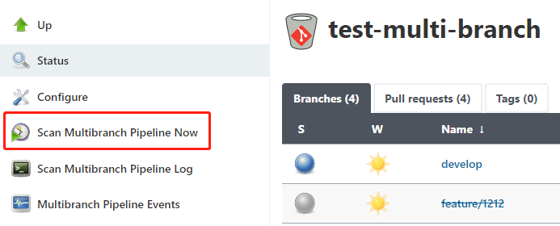
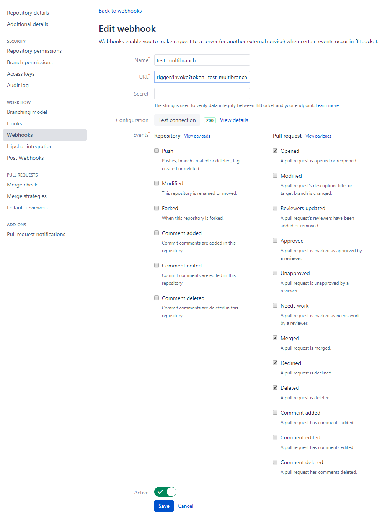
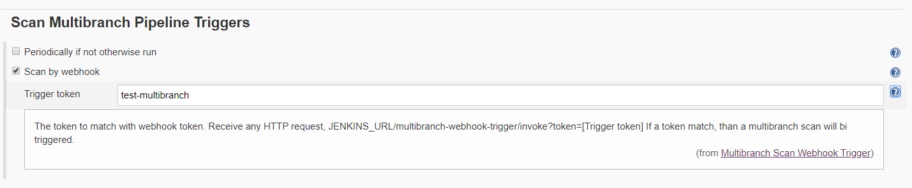
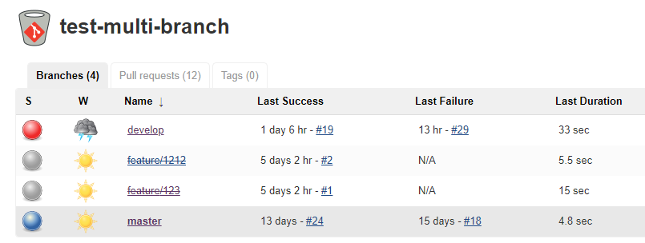
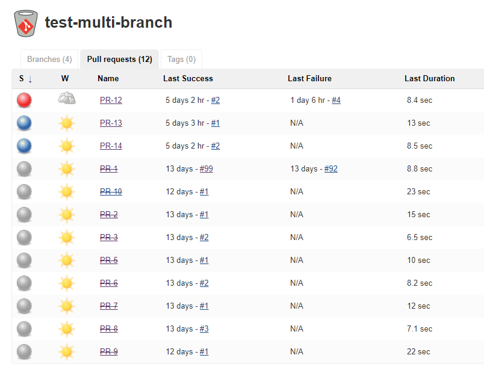

## 问题

Jenkins 的 multi-branch pipeline 想必很多人已经在用了，使用这种类型的 Jenkins Job 最显著的作用就是可以对 Git 仓库里的任何分支和任何 Pull Request（以下简写为 PR）进行构建。

在做 Jenkins 与 Bitbucket 的集成时，需要安装插件：Bitbucket Branch Source，可以通过该插件在 Jenkins 里进行 webhook 的配置。这种方式对于没有 Bitbucket 仓库的管理权限，CI/CD 暂且处于变更比较频繁的阶段，不想麻烦的去申请添加 webhook 的同学来说是非常友好的，就是可以不用通过管理员在 Bitbucket 设置里添加 webhook 也可以实现创建 PR 后触发 Jenkins 构建。

但我最近遭遇了两次：在创建 PR 后没有触发 Jenkins 自动构建，查了 Jenkins 和 Bitbucket Branch Source 插件的配置，并没有任何改动，也各种 Google 之后也没有找到相应的解决办法（如果有遇到此情况的小伙伴欢迎一起交流）。

那既然这条路不稳定，不好走，那就走一条可以走通的路、直接的硬路，即在 Bitbucket 对应的仓库中添加 webhooks。

<!-- more -->

## 原理

通过设置 Webhook 事件，可以监听 git push，创建 Pull Request 等事件，在这些事件发生时自动触发 Jenkins 扫描，从而 Jenkins 可以获取到最新的创建（或删除）的分支（或Pull Request），从而自动构建Jenkins Job。

## 配置

在申请添加 webhooks 之前，我先在个人的私人仓库下，创建了测试仓库对 webhook 进行了测试，在经过反复的测试，觉得没有问题后，将相应的配置通过管理员添加到对应的 Repository 中。如下示例：

* Webhook name: test-multibranch
* Webhook URL: http://localhost:8080/multibranch-webhook-trigger/invoke?token=test-multibranch
* Test connection: 返回 200, 连接测试通过。
* Events:
  * Repository: Push
  * Pull Request: Opened, Merged, Declined, Deleted.
* Active: enable

放两张截图方便参考

Bitbucket webhooks 设置

Jenkins multi-branch pipeline 设置

## 效果

通过以上的设置，开发人员在每次创建 PR 都会立即触发 Jenkins 构建，显著的变化有两个：

* 比以前依赖插件响应速度要快很多，之前的响应速度一般在 1~2 分支才能触发构建
* 稳定程度大大提高，目前为止没有再出现创建 PR 之后没有触发 Jenkins 构建的情况

最终的与 Jenkins 的集成效果是这样的：

* 当创建 (Opened) 一个 Pull Request 时，会自动在 Jenkins 上创建相应的 Pull Request 任务（比如 PR-123）并开始构建。
* 当合并 (Merged) 这个 Pull Request 时，会自动删除 Jenkins 中的 PR-123 任务。
* 当拒绝 (Declined) 这个 Pull Request 时，会自动删除 Jenkins 中的 PR-123 任务。
* 当删除 (Deleted) 这个 Pull Request 时，会自动删除 Jenkins 中的 PR-123 任务。

已经 Merge 的分支，会显示已经划掉了，灰色的，这种分支不可以再进行执行构建；而 `develop` 和 `master` 分支则可以继续手动或自动构建。

已经 Merge 了的 Pull Request 同样显示为已经划掉了，灰色的。`PR-12`, `PR-13`, `PR-14` 可以继续手动或自动构建。

## 补充

这里说一下我为什么没有添加 Modified 事件。此前我是添加了 Modified 事件，我发现一些处于待合并的分支不知不觉被 webhook 触发了很多次，由于我们的全平台构建、扫描、以及测试需要至少 2~3 小时的时间，当处于待合并的 Pull Request 过多时，对构建资源的占用可能会是全天的。

我想应该是其中的哪个事件的特性所导致引起的，果不其然，这时候才注意到 Modified 事件的这段解释：A pull request's description, title, or target branch is changed. 从解释里可以看到 Modified 事件包含修改 PR 描述、标题、还包括了目标分支的变更都会触发构建。

其实这个 Modified 事件的这个特性本身是特别好的，可以不断的将已经合并到目标分支的代码拉取到源分支进行构建，保证源分支的代码一直是与最新的代码进行集成、构建和测试，这样集成的结果才是最准确可靠的。但只是不适合目前的我们，因此暂且没有开启 Modified 事件。

这里没有添加其他 webhook 事件，比如对于主分支的触发事件，这个可以根据具体需要进行添加。如果不是那么频繁，每日构建满足需求，那么在 `Pipeline` 里添加一个 `trigger` 就可以了。
