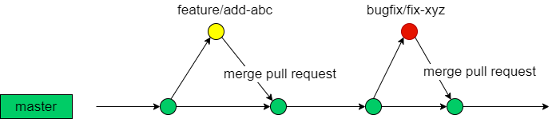

## Background

Recently our team need to share code from internal Bitbucket to external GitHub. I know GitHub can create private and public repository, but we have these points want to keep.

* only share the code what we want to share
* not change current work process, continue use Bitbucket.

So we have created corresponding repositories in the internal Bitbucket, and the master branches of these repositories will periodically synchronize with the master branches of corresponding repositories on GitHub via Jenkins job.

## Branch Strategy

Then the work process will be like

1. Create a feature or bugfix branch (it depends on the purpose of your modification).

2. Commit changes to your feature/bugfix branch.

3. Please pass your feature/bugfix branch test first then create a Pull Request from your branch to master branch, at least one reviewer is required by default.

4. After the reviewer approved, you or reviewer could merge the Pull Request, then the changes will be added to the master branch.

Timing trigger CI job will sync code from internal repositories master branch to GitHub master branch by default. also support manual trigger.



## Jenkins Job

Base on this work is not very frequency, so I want make the Jenkins job simple and easy to maintain, so I don't create every `Jenkinsfile` for every Bitbucket repositories.

Pros

* Only one `Jenkinsfile` for all Bitbucket repositories.
* Less duplicate code, less need to change when maintenance.
* Don't need to add `Jenkinsfile` into very Bitbucket repositories.

Cons

* Can not support SCM trigger, in my view this need add `Jenkinsfile` into repository.

```groovy
// This Jenkinsfile is used to synchronize Bitbucket repositories master branches to GitHub repositories master branches.

@Library('jenkins-shared-library@develop') _

def email = new org.cicd.email()

pipeline {

  agent {
    label "main-slave"
  }
  parameters {
    booleanParam(defaultValue: false, name: 'git-repo-win', description: 'Sync internal git-repo-win master branch with external git-repo-win on GitHub')
    booleanParam(defaultValue: true,  name: 'git-repo-lin', description: 'Sync internal git-repo-lin master branch with external git-repo-lin on GitHub')
    booleanParam(defaultValue: false, name: 'git-repo-aix', description: 'Sync internal git-repo-aix master branch with external git-repo-aix on GitHub')
    booleanParam(defaultValue: false, name: 'git-repo-sol', description: 'Sync internal git-repo-sol master branch with external git-repo-sol on GitHub')
  }
  options {
    timestamps()
    buildDiscarder(logRotator(numToKeepStr:'50'))
  }
  stages {
    stage("Synchronous master branch"){
      steps{
        script {
          try {
            params.each { key, value ->
              def repoName = "$key"
              if ( value == true) {
                echo "Start synchronizing $key Bitbucket repository."
                sh """
                set -x
                rm -rf ${repoName}
                return_status=0
                git clone -b master ssh://git@git.your-company.com:7999/~xshen/${repoName}.git
                cd ${repoName}
                git config user.name "Sync Bot"
                git config user.email "bot@your-company.com"
                git remote add github git@github.com:shenxianpeng/${repoName}.git
                git push -u github master
                return_status="\$?"
                if [ \$return_status -eq 0 ] ; then
                  echo "Synchronize ${repoName} from Bitbucket to GitHub success."
                  cd ..
                  rm -rf ${repoName}
                  exit 0
                else
                  echo "Synchronize ${repoName} from Bitbucket to GitHub failed."
                  exit 1
                fi"""
              } else {
                echo "${repoName} parameter value is $value, skip it."
              }
            }
            cleanWs()
          }
          catch (error) {
            echo "Some error occurs during synchronizing $key process."
          } finally {
            email.Send(currentBuild.currentResult, env.CHANGE_AUTHOR_EMAIL)
          }
        }
      }
    }
  }
}
```

The main part for this `Jenkinsfile` is below, use this function can by passing in parameters when start Jenkins build.

```groovy
params.each { key, value ->

}
```
