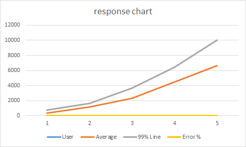

## Record JMeter Scripts

use JMeter's HTTP(S) Test Script Recorder, please refer to this official document https://jmeter.apache.org/usermanual/jmeter_proxy_step_by_step.html

## Running JMeter Scripts

* Debug scripts on JMeter in GUI Mode

  You can debug your record scripts in GUI Mode until there are no errors

* run test scripts in Non-GUI Mode(Command Line mode) recommend

  ```bash
  jmeter -n -t ..\extras\Test.jmx -l Test.jtl
  ```

## Running JMeter Scripts on Jenkins

### Need Tools

1. Jmeter - Web Request Load Testing
2. Jmeter-plugins
    * ServerAgent-2.2.1 - PerfMon Agent to use with Standard Set

### Test server

Two virtual machines

* System under test
* Jmeter execution machine, this server is also Jenkins server

## Implement

### Develop test script

Record Scripts - use JMeter's HTTP(S) Test Script Recorder, please refer to this official document https://jmeter.apache.org/usermanual/jmeter_proxy_step_by_step.html

### Create Jenkins job for running JMeter scripts

1. Create a new item->select Freestyle project
2. Add build step->Execute Windows batch command

    ```bash
    //access to jenkins jobs workspace, empty the last test results
    cmd
    cd C:\Users\peter\.jenkins\jobs\TEST-122 Upload large data\workspace
    del /Q "jtl"\*
    del /Q "PerfMon Metrics Collector"\*
    ```

3. Add build step->Execute Windows batch command

    ```bash
    //add first run jmeter script command, if you want run others script you can continue to add "Execute Windows batch command"
    jmeter -n -t script/UploadLargeData-1.jmx -l jtl/UploadLargeData-1.jtl
    ```

4. Configure build email - Configure System

    ```bash
    //Configure System, Extended E-mail Notification
    SMTP server: smtp.gmail.com

    //Job Configure, Enable "Editable Email Notification"
    Project Recipient List: xianpeng.shen@gmail.com
    Project Reply-To List: $DEFAULT_REPLYTO
    Content Type: HTML (text/html)
    Default Subject:$DEFAULT_SUBJECT
    Default Content: ${SCRIPT, template="groovy-html.template"}

    //Advance setting
    Triggers: Always
              Send to Recipient List
    ```

### Generate test report

JMeter->Add listener->add jp@gc - PerfMon Metrics Collector, browse Test.jtl, click right key on graph Export to CSV

### Analyze test results

Introduction test scenarios

Using 1, 5, 10, 20, 30, (50) users loading test, record every group user test results

> Glossary
>
> * Sample(label) - This indicates the number of virtual users per request.
> * Average - It is the average time taken by all the samples to execute specific label
> * Median - is a number which divides the samples into two equal halves.
> * %_line - is the value below which 90, 95, 99% of the samples fall.
> * Min - The shortest time taken by a sample for specific label.
> * Max - The longest time taken by a sample for specific label.
> * Error% - percentage of failed tests.
> * Throughput - how many requests per second does your server handle. Larger is better.
> * KB/Sec - it is the Throughput measured in Kilobytes per second.

Example: Test results of each scenario shown in the following table

| User | # Samples | Average | Median | 90% Line | 95% LIne | Min | Max | Error % | Throughput | Received | Send KB/sec |
|---|---|---|---|---|---|---|---|---|---|---|---|
|1|31|348|345|452|517|773|5|773|0.00%|2.85215|2.5|0|
|5|155|1166|1164|1414|1602|1639|9|1821|0.00%|4.26445|3.73|0|
|10|310|2275|2299|2687|2954|3671|20|4104|0.00%|4.38547|3.84|0|
|20|620|4479|4620|5113|6152|6435|39|6571|0.00%|4.42826|3.88|0|
|30|930|6652|6899|7488|9552|10051|4|10060|0.00%|4.46776|3.91|0|

Test results analysis chart

 
