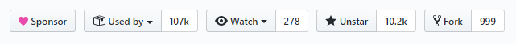

Nightwatch js 是我之前写自动化测试用例使用了很长一段时间的测试框架，我当时的使用 v0.9 版本并且对使用和 API 进行了翻译。作为一名前测试工程师，对于自动化的知识不能不更新下自己的知识库，一转眼 Nightwatch 1.3 版本已经发布了，可以看到它在 GitHub 上的使用和关注度还是很高的。



Nightwarch.js 是一个端到端的基于 Node.js 使用 W3C Webdriver （以前是 Selenium ）的自动化测试框架。它是一个完整的集成解决方案，用于 web 应用程序和网站的端到端测试，以及 Node.js 单元测试和集成测试。

<!-- more -->

查看了一下 Nightwatch 的发布历史（https://github.com/nightwatchjs/nightwatch/releases），可以看到这期间修复了不少 Bug，而且在 v1.3 ​版本还新增一些新的功能。

* 新增 BDD describe Interface - 可以同时运行以 BDD 描述和导出接口编写的测试，无需其他配置。
* 新增 `assert.not` 断言

  ```javascript
  // 原来这么写
  browser.assert.elementNotPresent()
  // 现在可以这么写
  browser.assert.not.elementPresent('.not_present')
  ```

* 新增一些 APIs - 比如 `getElementProperty`, `domPropertyContains`, `domPropertyEquals`, `.property`

* 新增了 CLI 选项
  * `--headless` - 以无头模式启动浏览器（Chrome或Firefox）
  * `--timeout` - 设置断言失败之前重试断言的全局超时

如果要从 v1.0 之前的版本升级，参阅如下升级指南。

## 升级和启动

从 NPM 安装 Nightwatch

```bash
npm install nightwatch --save-dev
```

### 安装浏览器驱动程序

#### Geckodriver（Firefox）

Geckodriver 是用于驱动 Mozilla Firefox 浏览器的 WebDriver 服务。

```bash
npm install geckodriver --save-dev
```

#### Chromedriver

Chromedriver 是用于驱动 Google Chrome 浏览器的 WebDriver 服务。

```bash
npm install chromedriver --save-dev
```

或用一行安装所有内容：

```bash
npm i nightwatch geckodriver chromedriver --save-dev
```

## 运行演示测试

Nightwatch 带有一个 example 文件夹，其中包含一些示例测试。

下面将运行一个基本测试，该测试打开搜索引擎 Ecosia.org，搜索 “nightwatch” 一词，并验证术语 “第一个结果” 是否是 Nightwatch.js 网站。

```bash
./node_modules/.bin/nightwatch node_modules/nightwatch/examples/tests/ecosia.js
```

Windows 用户可能需要运行节点 node node_modules/.bin/nightwatch

## 手动下载浏览器驱动程序

Nightwatch 使用兼容 WebDriver 的服务器来控制浏览器。 WebDriver 是 W3C 规范和行业标准，提供了与浏览器进行交互的平台和 HTTP 协议。

Nightwatch 包括对自动管理以下服务的支持：

### ChromeDriver

* 针对 Chrome 浏览器运行测试
* 下载网址 https://sites.google.com/a/chromium.org/chromedriver/downloads。

从版本 75 开始，Chromedriver 默认启用 W3C Webdriver 协议。如果你现在想坚持使用 JSONWire，请调整 chromeOptions：

```bash
desiredCapabilities : {
  browserName : 'chrome',
  chromeOptions: {
    w3c: false
  }
}
```

### GeckoDriver

针对 Mozilla Firefox 浏览器运行测试。下载网址：https://github.com/mozilla/geckodriver/releases.

### Selenium Standalone Server

* 在一个地方管理多个浏览器配置，还可以利用 Selenium Grid 服务
* 可以从 Selenium 发布页面下载 selenium 服务器 jar 文件 selenium-server-standalone-3.x.x.jar：https://selenium-release.storage.googleapis.com/index.html

重要的是要注意，尽管较早的 Nightwatch 版本（v0.9 及更低版本）需要 Selenium Server，但从 1.0 版本开始不再需要 Selenium。

特定的 WebDriver 设置指南可在 Docs 网站上找到。旧版 Selenium 驱动程序安装指南以及调试说明可以在 Wiki 上找到。

## 例子

示例文件夹中包含示例测试，这些示例演示了多个 Nightwatch 功能的用法。

你还可以查看 nightwatch-website-tests (https://github.com/nightwatchjs/nightwatch-website-tests) 存储库，例如针对 nightwatchjs.org (https://nightwatchjs.org/) 网站的测试。

## Nightwatch 单元测试

Nightwatch 的测试是使用 Mocha 编写的。

1.克隆项目

```bash
git clone https://github.com/nightwatchjs/nightwatch.git
cd nightwatch
npm install
```

2.运行测试

要运行完整的测试套件：
```bash
npm test
```

要检查测试范围，请运行以下命令：

```bash
npm run mocha-coverage
```

然后在浏览器中打开生成的 coverage/index.html 文件。

## Nightwatch 使用示例

以下是我写的一个使用 NightwatchJS 对 Nightwatch 官网 https://nightwatchjs.org 进行测试的一个测试示例（已经升级到 v1.3 版本）以展示在实际项目中使用 Nightwatchjs 如何组织目录结构，区别配置全局和本地环境。

示例仓库的 GitHub 地址是 https://github.com/nightwatchjs-cn/nightwatch-e2e，欢迎 Star 和 Fork。
