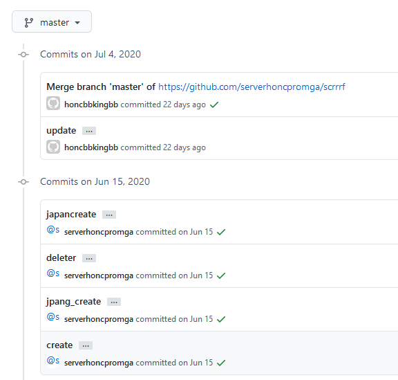
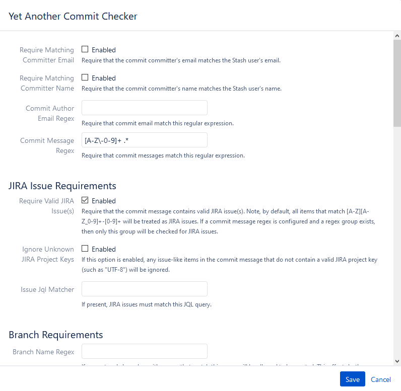

## 背景

在使用 Git 提交代码的时候，在与他人合作同时开发的项目，一个良好的提交信息规范我总结有三个好处：

1. 有助于其他人接手，进行 Bug 修复或是新功能的添加都是很好的参考
2. 并且良好的规范有助于自动化脚本的识别
3. 最后这也是体现了一个程序员的自我修养

因此对于一个长期发展的项目必须要有良好的信息信息规范的约定。先看两个例子：

<!-- more -->

随便找的一个没有任何规范的提交信息




这是 Angular 有规范的提交信息，并且遵循了常规提交 [Conventional Commits](https://www.conventionalcommits.org/en/v1.0.0/)


## 如何治理提交信息规范

在治理提交信息规范问题上，有两个解决办法。

1. 为团队制定出提交信息的规范，让团队了解和遵守。
2. 在提交代码时，设置 Git Hook 把不规范的提交排除在外，比如提示用户当前提交的信息不符合规范。

## 制定规范

制定合理的规范，最便捷的方法是参考软件行业里是否有大家通用的规范。经过一番搜索，虽然行业里并没有绝对的提交信息规范，但我看到有很多项目已经在采用这个 [Conventional Commits](https://www.conventionalcommits.org/en/v1.0.0/) 的提交信息规范，比较有代表性的是 Auglar 及很多项目也在使用。

在此基础上，总结了适合自己团队的规范：

```
JIRA-1234 Feat: support for async execution

^-------^ ^--^: ^-------------------------^
|         |     |
|         |     +--> Summary in present tense.
|         |
|         +--> Type: Feat, Fix, Docs, Style, Refactor, Perf, Test or Chore.
|
+--> Jira ticket number

Type

Must be one of the following:

    Feat: A new feature
    Fix: A bug fix
    Docs: Documentation only changes
    Style: Changes that do not affect the meaning of the code (white-space, formatting, missing semi-colons, etc)
    Refactor: A code change that neither fixes a bug nor adds a feature
    Perf: A code change that improves performance
    Test: Adding missing or correcting existing tests
    Chore: Changes to the build process, .gitignore or auxiliary tools and libraries such as documentation generation, etc.
```

### 参考文档

> Conventional Commits https://www.conventionalcommits.org/en/v1.0.0/

> Angular Commit Guidelines: https://github.com/angular/angular.js/blob/master/DEVELOPERS.md#commits

> Projects Using Conventional Commits: https://www.conventionalcommits.org/en/v1.0.0/#projects-using-conventional-commits

## 设置 Git Hook

以 Bitbuket 为例，开启 [Yet Another Commit Checker](https://mohamicorp.atlassian.net/wiki/spaces/DOC/pages/1442119700/Yet+Another+Commit+Checker+YACC+for+Bitbucket) 这个免费插件。


这里的设置很多，我举两个不那么严格的常见设置。


1. 开启 Require Valid JIRA Issue(s)

这个功能的开启，在开发者提交信息的时候如果不含有相关联的 Jira 单号，或是这个单号不存在，那么都会提交失败。这样就强制将代码与 Jira 单号进行关联。

2. 设置 Commit Message Regex（提交信息正则表达式）

我设置了 `[A-Z\-0-9]+ .*` 这样的正则表达式，这就要求比如有以这样的 Jira 单号

ABCD-1234，并且在写描述之前必须与 Jira 单号之前有一个空格。

通过以上两个功能的设置，就将提交信息限定为如下格式：

```
ABCD-1234 Balabala......
```

### 其他设置



另外还有一些其他的设置，比如关联的 Jira 单子必须处于什么样的状态，这个可以防止已经关闭的 Jira 单子，开发还往上面偷偷的修改代码，这时候测试也发现不了。

还有 Require Matching Committer Email 和 Require Matching Committer Name 来限定开发者必须配置好与登录用户名和邮箱相匹配的用户名和邮箱，来规范提交信息里显示的用户名和邮箱，也方便进行 Git 信息的统计等后续数据的收集。


更多请参考 [Yet Another Commit Checker 插件文档](https://mohamicorp.atlassian.net/wiki/spaces/DOC/pages/1442119700/Yet+Another+Commit+Checker+YACC+for+Bitbucket)。

