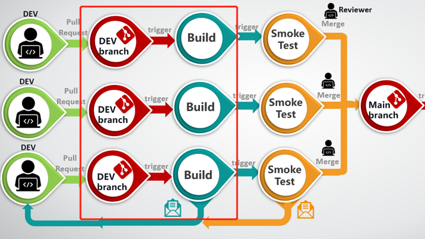
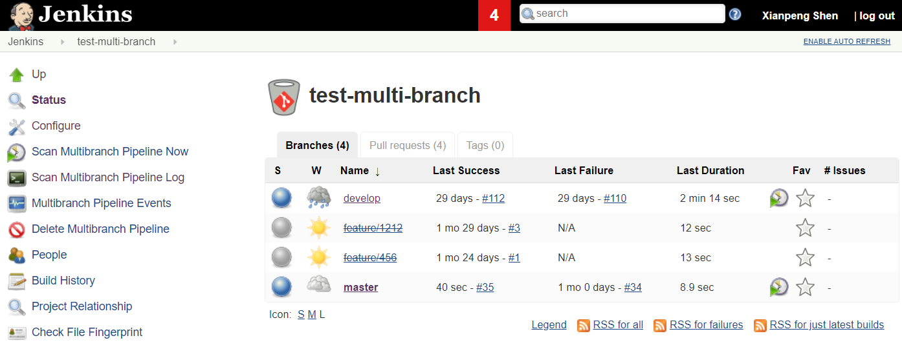
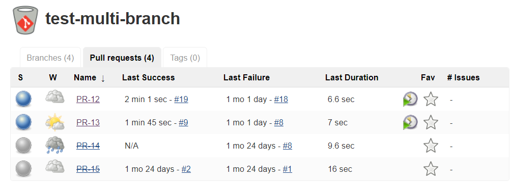

​在使用 Jenkins 实施了企业级的 CI/CD 工作，有如下三个最重要的实践和总结。

第一，Configuration as Code（配置即代码）\
其次，Jenkins shared libraries（Jenkins 共享库）\
最后，Multi-Branch Pipeline（多分支流水线）

## 配置即代码

配置即代码(Configuration as Code)是一种在代码仓库里管理配置的方法。

### 它有什么好处

#### 作业透明化

<!-- more -->

如果你使用过 Bamboo 或 Jenkins 1.x 版本，你知道想要从配置页面(GUI)来快速了解一个作业的逻辑是多么的困难，尤其是对于那些不太了解 CI 工具的人更是难上加难。

因此如果你准备使用 Jenkins 来作为团队的 CI 工具，一定要使用配置即代码，因为代码对于工程师来说更易读和了解背后的逻辑。

#### 可追溯性

对于 GUI 页面配置带来的另外一个重要问题就是无法追溯修改历史，来看别人做了什么修改。能查看其他人的修改对于一些很重要的 Job 是非常重要的，比如像是 Build Jobs 等。把 Jenkins 的配置当作项目代码来管理，这样做的好处不仅在于可跟踪性，还在于在需要时可以回滚到指定版本。

#### 快速恢复

配置即代码的使用还有另一个好处：够在硬件或是系统出了问题后快速恢复 Jenkins。但是，如果 Jenkins 作业是通过 GUI 配置的，当托管 Jenkins 的服务器损坏时，你的业务可能面临丢失的风险。因此，从业务连续性角度来看，它也暗示我们要使用配置即代码。

## Jenkins 共享库

就像编写任何应用程序代码一样，我们需要创建函数、子例程以实现重用和共享。同样的逻辑也适用于 Jenkins Pipeline 配置。比如发送电子邮件、打印日志、将 build 放到 FTP 或Artifactory 等功能都可以放到 Jenkins 共享库中。

如你所见，以下这些 groovy 文件就是 Jenkins 共享库的一部分，它们用来完成发送电子邮件、git 等操作、更新开源、代码扫描（Polaris）及触发其他任务等工作。

```bash
xshen@localhost MINGW64 /c/workspace/cicd/src/org/devops (develop)
$ ls -l
total 28
-rw-r--r-- 1 xshen 1049089 5658 Jun 18 09:23 email.groovy
-rw-r--r-- 1 xshen 1049089  898 Jun 13 20:05 git.groovy
-rw-r--r-- 1 xshen 1049089 1184 Jun  8 12:10 opensrc.groovy
-rw-r--r-- 1 xshen 1049089 1430 Jul  3 10:33 polaris.groovy
-rw-r--r-- 1 xshen 1049089 2936 Jul  3 10:32 trigger.groovy
drwxr-xr-x 1 xshen 1049089    0 Jun  8 12:10 utils/
-rw-r--r-- 1 xshen 1049089  787 May 12 13:24 utils.groovy
```
### 好处

这就是为什么要使用共享库，它不但可以减少重复代码，也更容易维护。比如当你需要管理很多个仓库里的自动化流水线的时候，使用 Jenkins 共享库不需要更新每个代码仓库里的 Jenkinsfile，只更改共享库里的代码即可。

这样的方式也鼓励重用和跨团队共享。例如，我创建的共享库也被公司其他团队在使用。

## 分支流水线

在下面这张图中，开发的每个 Pull Request 通过 Webhook 触发自动构建和冒烟测试，只有通过**构建测试**和**冒烟测试**的修改才允许被合并到主干分支上。



以上的工作流程是利用 Jenkins 多分支流水线来实现的。在进入细节之前，让我们先看看它是什么样子的。



在这个页面看到的所有分支都是在代码仓库里创建后就自动生成的，这样开发者都通过这个 Jenkins Job 可以在自己的分支进行自动化构建和测试。

> 注：如果分支已经从代码仓库删掉了，这些分支则也会相应从这个 Jenkins Job 里删除掉或是像上面那样显示划掉状态（这里取决你 Jenkins 的设置）。Pull Request 也是同理。



这样，当开发人员完成他们的工作时，他们可以使用这些 Jenkins Job 来自己创建正式的 Build，而不再需要 Build 工程师的参与。这在引入多分支流水线之前所达不到的，以前开发总是需要 Build 工程师为他们创建 Build 用来测试，对于一个 20 多人的开发团队，可以想象满足这些需求所要花费多少努力。

### 好处

以上介绍了这个多分支流水线的第一个好处：为团队创建了一个自助服务，节省了开发的时间，也节省了 Build 工程师的时间。

另一个好处是：使主分支将更加稳定，再也不用花大量时间去查找是谁的提交破坏了主干分支的构建或是功能。因为只有通过构建、安装以及冒烟测试的代码才会被合并到主干分支上。

### 价值

从人力成本：这样的自助服务，节省了至少 0.5 人以上的人力成本。让过去的重复劳动者，变成现在基础设施的维护者和开发者。

从质量成本：以我的项目最近一个月大约 30 个 Pull Request 为例，发现其中 6 个在某些平台上存在 Build 问题。你知道如果能在开发阶段就发现问题，而不是被测试、Support 人员甚至是客户发现问题，那么这种发现缺陷的成本就会非常低。
