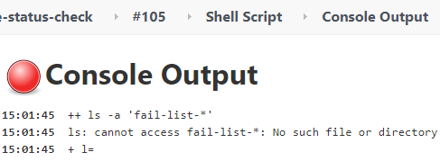

> 《Jenkins Tips 3》—— 每期用简短的图文描述一个 Jenkins 小技巧。

## 问题

在使用 Jenkins pipeline 时，如果 Shell 的返回值不为零（也就是 Shell 命令执行时有错误），Jenkins Job 默认会标记当前的 stage 为失败。因此整个 Job 也会失败。

在有些时候我们希望 Shell 虽然执行失败返回的不为零，但希望Jenkins Job 在执行成功后，要显示成功状态。

<!-- more -->

例如：通过 Shell 命令列出以 `fail-list-` 开头的文件，如果存在则通知用户，如果不存在则不通知用户。

```bash
ls -a fail-list-*
```

默认情况是执行如上命令导致了整个 Job 失败。



## 解决

经过一番调查，使用以下代码片段解决了如上问题。

```java
stage("Send notification") {
  steps {
    script {
      def fileExist = sh script: "ls -a fail-list-* > /dev/null 2>&1", returnStatus: true
      if ( fileExist == 0 ) {
        // send email to user
      }else {
        // if not found fail-list-* file, make build status success.
        currentBuild.result = 'SUCCESS'
      }
    }
  }
}
```

## 分析

在执行 Shell 时，添加了 `returnStatus: true`。这是将状态码返回并保存起来，然后与 0 进行比较。

如果不等于 0，如果不添加 `currentBuild.result = 'SUCCESS'`，Jenkins 的整个 Job 还是会标记为失败状态。添加后，人为的忽略错误，将 Job 状态置为成功。