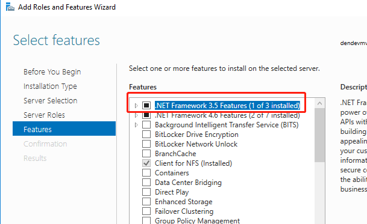
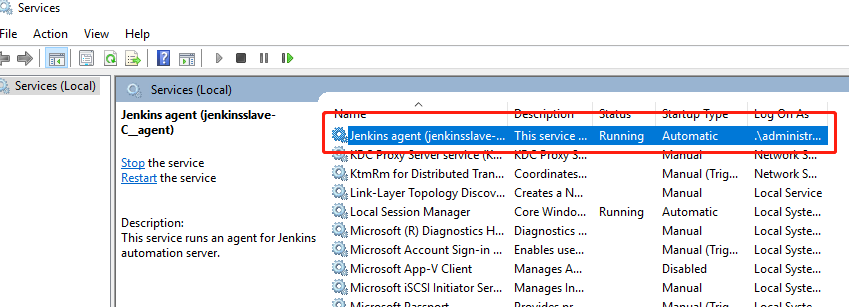
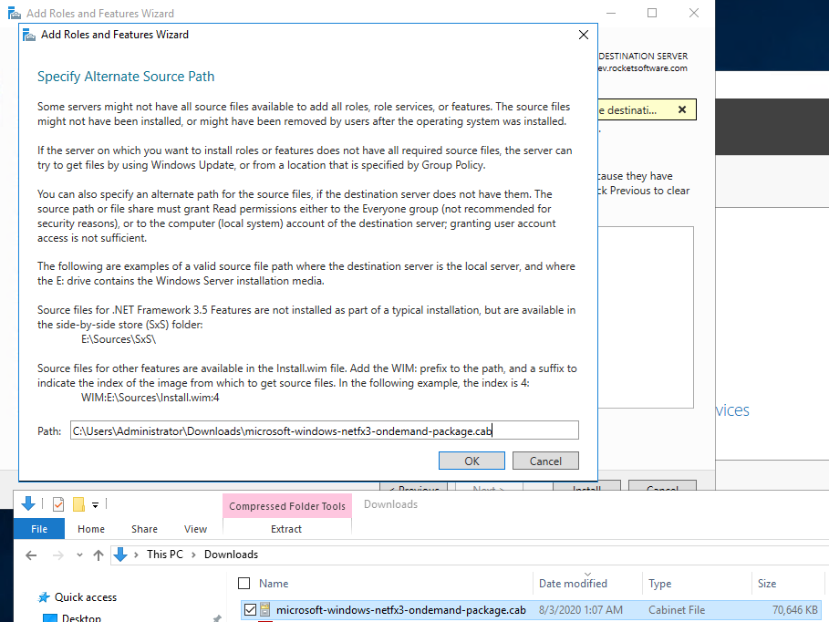

When I upgrade Jenkins 2.176.3 to Jenkins 2.235.1, my Windows agent can not connect with master successfully and out come this warining message ".NET Framework 2.0 or later is required on this computer to run a Jenkins agent as a Windows service".

<!-- more -->

This means I need to upgrade my Windows agent .NET Framework. Here are steps about how to upgade .NET Framework to version 3.5.

## Install .NET Framework 3.5

1. Open Programs and Features 

   

2. Select .NET Framework 3.5 Features (In my screenshot, it had already installed) 

    

Then try to reconnect Jenkins agnet it shoule back to work.

## Install Jenkins agent service

If you can not found `Jenkins agent` like me. 



you can try these steps to install `Jenkins agent`.

```bash
# install Jenkins agent service
cd c:\\jenkins
.\jenkins-agent.exe install
net start jenkinsslave-C__agent

# unstall Jenkins agent service
sc delete jenkinsslave-C__agent
```

## Manual install .NET Framework 3.5

Btw, if you could not installed .NET Framework 3.5 successful. you can try to install manully by this step

1. Manually download [microsoft-windows-netfx3-ondemand-package.cab](https://androidfilehost.com/?w=file-thanks&fid=745425885120760819&mid=281&download_id=ae5a0bbf16ac7040fc659c1ab314a4d1&tid=1596439593&hc=5d26b6c7dad0b741ec6767407c715296cd418b810a28d46cf136fa579b0e008d)

2. Specify the file path like below to install

    


Hope this would also works for you. Pls let me know in case of you have any commnets.


