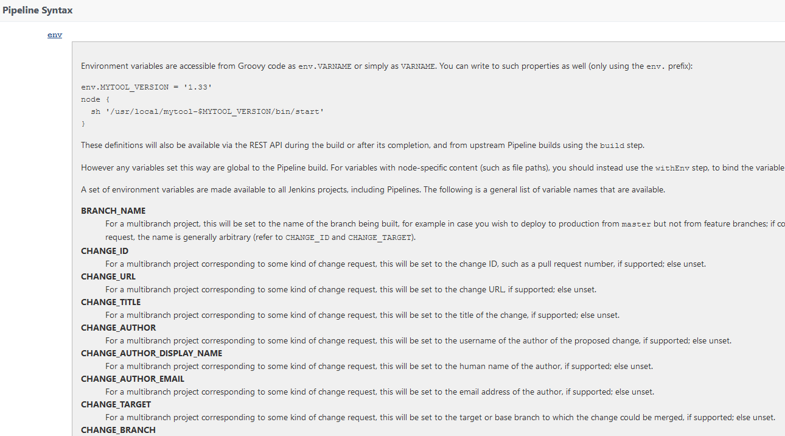
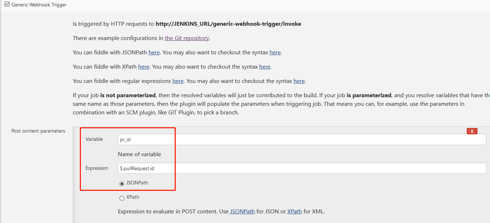
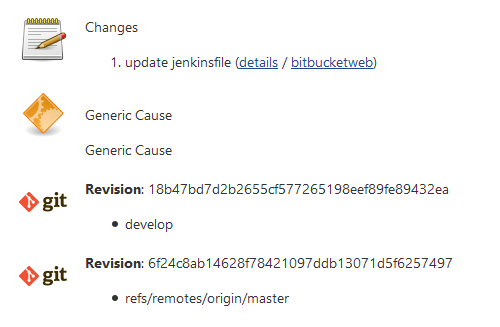
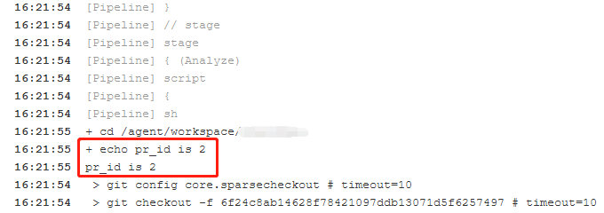

## 背景

本篇讨论如何通过 Jenkins generic webhook trigger 插件来获取 Git 仓库事件（Event）。比如获取仓库的 Pull Request ID 等。

使用过 Jenkins Multi-branch pipeline Job 的用户知道，这个 Job 类型的环境变量中可以得到 Pull Request 的相关信息（从这里可以看到 `http://JENKINS_URL/your-job/pipeline-syntax/globals`）

但为了获取这个变量需要创建这种类型的 Job，获取过程中可能需要 clone 该仓库的代码，有点杀鸡宰牛的意思，看起来并不是一个特别恰当的办法。

如何通过创建一个普通的 Jenkins Job 就能实时获取 Bitbucket 仓库在创建 Pull Request 的时候就能立即获取到这个 Pull Request 的 ID 呢？

1. Bitucket 的 webhook 功能。
2. Jenkins 的 generic-webhook-trigger 这个插件，用来接收 webhook 中的 Event 事件信息。

## 实现步骤

### 设置 Bitbucket Webhook

在需要监听的 Bitbucket 仓库中创建一个 webhook，如下：

* Name: `test-demo`
* URL: `http://JENKINS_URL/generic-webhook-trigger/invoke?token=test-demo`

备注：Bitbucket 中还有一个另外一个设置项，根据我的测试，该设置项 **Post Webhooks** 与上面的 **Webhooks** 都能实现本文要实现的功能。

### 2. 配置 Jenkins Job

如果还想获取其他 Event 信息，请参考这个链接 [bitbucket-server-pull-request.feature](https://github.com/jenkinsci/generic-webhook-trigger-plugin/blob/master/src/test/resources/org/jenkinsci/plugins/gwt/bdd/bitbucket-server/bitbucket-server-pull-request.feature)，按照如上配置即可。

这里的 token 值 `test-demo` 可以任意起名，但要与 Bitbucket event URL 中的 token 保持一致。

## 测试

1. 我在 `Jenkinsfile` 里添加了如下代码片段 `echo pr_id is ${pr_id}` 用来检查输出 Pull Request ID 是否如预期。

2. 然后，在 Bitbucket 配置好的仓库下面创建一个 Pull Request 进行测试

3. Jenkins Job 自动执行了

    

4. 并且获取到了这个 Pull Reuest ID 值

    

## 总结

以上的这种方法适合不想或是不知道如何监听 Git 服务器（Bitbucket、GitHub 或是 GitLab 等）事件而需要要单独创建一个服务而准备的。如果你有什么很好的实践，期待你的留言交流。
