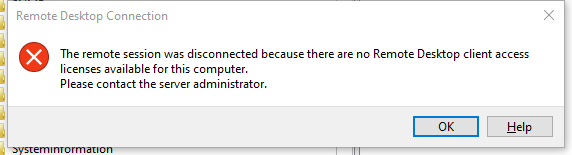
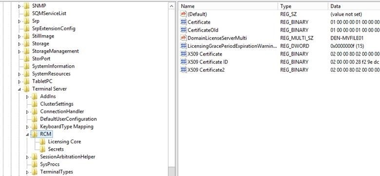

## Problem

Sometime my Windows server 2012 R2 has RDP connect problem below:

```
Remote session was disconnected because there are no Remote Desktop client access licenses available for this computer.
Please contact the server administrator.
```



## How to Fix

You could login to the vSphere Web Client if you have via console.

1. Go into regedit and navigate to 

    

2. Search and Delete `LicensingGracePeriod` and `LicensingGracePeriodExpirationWarningDays`

3. If deletion failed, this failure message appears `unable to delete all specified values`, you need change permission.

> You could follow related [videos](https://www.youtube.com/results?search_query=unable+to+delete+all+specified+values) on YouTuBe
>
> Thanks Bill K. share with me above fix solution.


