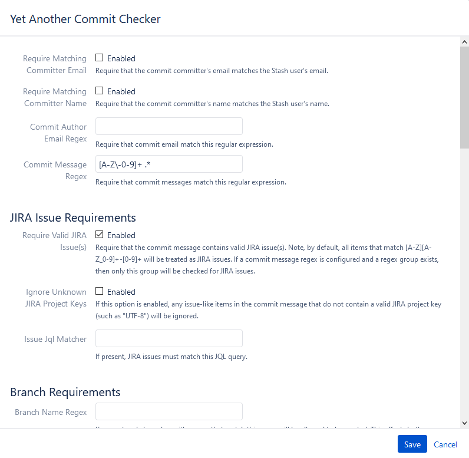

## 为什么要制定规范

古话说，没有规矩不成方圆。在团队协作开发时，每个人提交代码时都会写 commit message，但如果没有规范，每个人都会有自己的书写风格，因此在翻看 git log 时经常看到的是五花八门，十分不利于阅读和维护。

通过下面两个例子来看看没规范和有规范的对比，以及有规范能带来哪些好处。

**提交信息 没规范 vs 有规范**


从这个提交信息里你不知道他修改了什么，修改意图是什么。

<!-- more -->


这是 Angular 的提交信息，它遵循了 [Conventional Commits](https://www.conventionalcommits.org/en/v1.0.0/)，直译过来为常规提交。

这也是行业内使用最为广泛的 Git 提交信息规范，已经有不少的项目在使用，如果你的项目还没有制定 Git 提交信息规范，建议照搬或参考这个规范来制定。

对于一个团队，当很多人在一起合作开发一个项目的时候，预先制定好提交信息规范，对于项目的长远发展以及后续人员加入和维护都非常有帮助。

总结有以下几个好处：

1. 有助于他人更好的理解你的变更意图，更容易贡献/修改代码。
2. 结构化的提交信息有助于自动化脚本的识别和 CI/CD。
3. 提供自动化生成 `CHANGELOGs` 的能力。
4. 最后，这也是体现了一个程序员的自我修养。

**分支创建 没规范 vs 有规范**

如果创建分支没有规范，不加以限制，很多分支会是这样的 `ABC-1234-Test`, `ABC-2345-demo`, `Hotfix-ABC-3456`, `Release-1.0`，甚至更糟。当分支很多的时候会显得混乱，并且不方便检索。

如果制定分支创建规范，比如上面的分支在创建时，通过 Hook 强制限制分支开头必须以类型开始，那么新创建的分支将会是这样的：`bugfix/ABC-1234`, `feature/ABC-2345`, `hotfix/ABC-3456`, `release/1.0` 这不但有助于检索，还方便他人通过类型了解分支用途，以及方便后续的 CI/CD 流水线的开发。

## 如何解决规范问题

应该从两方面着手：

* 首先，为团队制定提交信息以及创建分支规范，让团队成员了解规范并遵守。
* 然后，在提交代码或创建分支时，通过设置的 Git Hook 将不规范的禁止提交到远程仓库。

### 制定Git提交信息规范

制定合理的规范，最有效的方法是参考软件行业里是否有通用的规范。目前行业最为广泛规范是 [Conventional Commits](https://www.conventionalcommits.org/en/v1.0.0/) 很多项目包括 Auglar 也在使用。

可以根据以上规范制定适合自己团队的规范，例如：

```text
JIRA-1234 feat: support for async execution

^-------^ ^--^: ^-------------------------^
|         |     |
|         |     +--> Summary in present tense.
|         |
|         +--> Type: feat, fix, docs, style, refactor, perf, test or chore.
|
+--> Jira ticket number

Type Must be one of the following:

    feat: A new feature
    fix: A bug fix
    docs: Documentation only changes
    style: Changes that do not affect the meaning of the code (white-space, formatting, missing semi-colons, etc)
    refactor: A code change that neither fixes a bug nor adds a feature
    perf: A code change that improves performance
    test: Adding missing or correcting existing tests
    chore: Changes to the build process, .gitignore or auxiliary tools and libraries such as documentation generation, etc.
```

## 设置 Git Hooks

这里以 Bitbuket 为例，其他 Git 工具比如 GitHub，Gitlab 都有类似的功能。

Bitbucket 使用的是 [Yet Another Commit Checker](https://mohamicorp.atlassian.net/wiki/spaces/DOC/pages/1442119700/Yet+Another+Commit+Checker+YACC+for+Bitbucket) 这个免费插件。

首先，开启 Yet Another Commit Checker。


然后逐一介绍 Yet Another Commit Checker 的一些常用的设置。



### 1. 开启 Require Valid JIRA Issue(s)

开启这个功能，在提交信息的时通过 Hook 自动验证是否有 Jira 单号，单号是否存在。如果是否定的，提交失败。这样就强制在提交代码时 commit message 与 Jira 单号进行关联。

### 2. Commit Message Regex

比如设置一个这样简单的正则表达式 `[A-Z\-0-9]+ .*` ，这要求 Jira 单号必须以这种格式 `ABCD-1234` 开头，并且描述信息要与 Jira 单号之间留一个空格。

通过以上设置，就将提交信息限定为如下格式：

```
ABCD-1234 Balabala......
```

再比如这个更为复杂的正则表达式，如下

```
^[A-Z-0-9]+ .*(?<type>chore|ci|docs|feat|fix|perf|refactor|revert|style|test|Bld|¯\\_\(ツ\)_\/¯)(?<scope>\(\w+\)?((?=:\s)|(?=!:\s)))?(?<breaking>!)?(?<subject>:\s.*)?|^(?<merge>Merge.* \w+)|^(?<revert>Revert.* \w+)
```

这个正则表达式不但限制了开头必须以 JIRA 单号开始，中间有一个空格，还必须在描述信息里填写 type 类型，最后才是描述信息。另外还支持如果是如果是 Merge 或是 Revert 会产生其他的描述信息。

通过下面的测试用例来具体理解上述的正则表达式会产生什么样的提交信息规范限制。

```
# 测试通过的用例
NV-1234 chore: change build progress
DT-123456 docs: update xdemo usage
QA-123 ci: update jenkins automatic backup
CC-1234 feat: new fucntional about sync
Merge branch master into develop
Reverted: Revert support feature & bugfix branches build
Merge pull request from develop to master

# 测试不通过的用例
NV-1234 build: update
NV-1234 Chore: change progress
DT-123456 Docs: update xdemo
QA-123ci: update jenkins automatic backup
CC-1234 Feat: new fucntional about sync
DT-17734: 8.2.2 merge from CF1/2- Enhance PORT.STATUS
DT-17636 fix AIX cord dump issue
DT-18183 Fix the UDTHOME problem for secure telnet
DT-18183 Add new condition to get UDTHOME
DT-15567 code merge by Peter Shen.
```

测试结果也可以在这里 https://regex101.com/r/5m0SIJ/10 找到​。​

建议：如果你要在你的 Git 仓库里也要设置这样严格并且复杂的正则表达式，建议一定要经过充分的考虑和测试才把它正式放入你的 Git 仓库的 Hooks 设置中。

### 3. Commit Regex Error

这个设置是用来提示错误信息的。当团队成员在提交时，如果不符合规范提交失败了，会给出合理的提示信息，这有助于找到问题所在。比如提交失败了，会在命令行里看到如下信息：

```
Commit Message Specifications:

<Jira-ticket-number> <type>: <Description>

Example:

ABC-1234 feat: Support for async execution

1. Between Jira ticket number and type MUST has one space.
2. Between type and description MUST has a colon and a space.

Type MUST be one of the following and lowercase

feat: A new feature
fix: A bug fix
docs: Documentation only changes
style: Changes that do not affect the meaning of the code (white-space, formatting, missing semi-colons, etc)
refactor: A code change that neither fixes a bug nor adds a feature
perf: A code change that improves performance
test: Adding missing or correcting existing tests
chore: Changes to the build process, .gitignore or auxiliary tools and libraries such as documentation generation, etc.
```

根据这个描述信息，提交者就能很容易知道正确的规范是什么样子的，然后通过 `git commit --amend` 命令对自己最近一次提交信息做出修改。

### 4. Branch Name Regex

这个是对创建分支时做出的规范限制。在设置了相应的正则表达后，开发在创建分支时，只有符合正则表达式的条件才可以推送到远程仓库中。

例如这个创建分支的正则表达式 `^(bugfix|feature|release|hotfix).*|(master)|(.*-dev)`

这里限制了所有的分支必须以 `bugfix`, `feature`, `release`, `hotfix` 开头或是也可以这样的 `v1.0-dev` 这种类。

你可以根据上面的正则表达式来设计属于自己项目的分支正则表达式。

### 5. Branch Name Regex Error

这个设置是提示推送不规范的分支时的错误信息。预先设置好相应的错误提示信息，有助于用户快速找到推送失败的原因。比如下面的错误信息：

```
Branches must begin with these types: bugfix/ feature/ release/ hotfix/
```

告诉用户，分支必须以 `bugfix/` `feature/` `release/` `hotfix/` 开头。


### 6. 其他设置

另外还有一些其他设置，比如关联的 Jira 单子必须处于什么样的状态。这个可以防止已经是关闭状态 Jira 单子，开发还往上面偷偷的提交代码，这样可能导致未经测试的代码进入仓库。

还有 Require Matching Committer Email 和 Require Matching Committer Name 来限定开发者必须配置好与登录用户名和邮箱相匹配的用户名和邮箱，来规范提交信息里显示的用户名和邮箱，也方便进行 Git 信息的统计等后续数据的收集。

## 参考文档

> Conventional Commits https://www.conventionalcommits.org/en/v1.0.0/ \
> Angular Commit Guidelines: https://github.com/angular/angular.js/blob/master/DEVELOPERS.md#commits \
> Projects Using Conventional Commits: https://www.conventionalcommits.org/en/v1.0.0/#projects-using-conventional-commits \
> Yet Another Commit Checker: https://mohamicorp.atlassian.net/wiki/spaces/DOC/pages/1442119700/Yet+Another+Commit+Checker+YACC+for+Bitbucket
