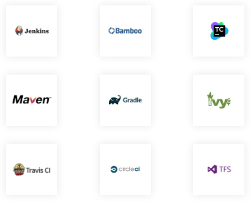
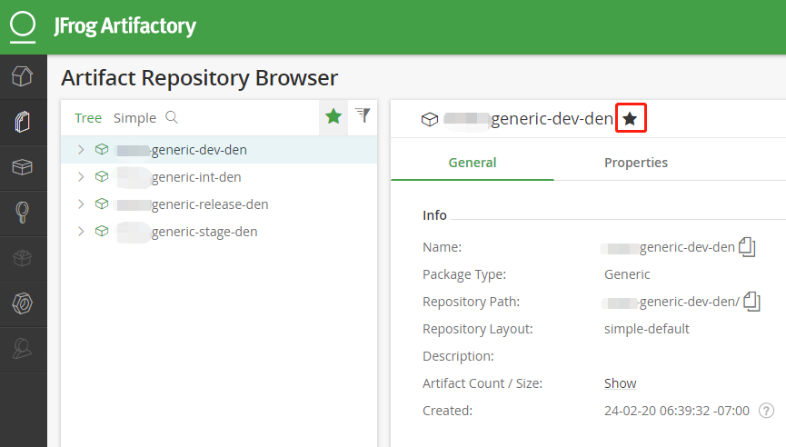

我在使用 Artifactory 做持续集成已经有一段时间了，对企业级 Artifactory 也有了一些经验和总结，希望能通过本篇的分享帮助刚接触这个工具的人了解什么是Artifactory，它能做什么，为什么要选择它，以及在使用过程中应该注意什么。

## 什么是Artifactory

一句话概括：Artifactory 是一个存放制品（Artifacts）的工具。当前，Artifactory 是一个非常有影响力，功能非常强大的工具。

## Artifactory有哪些优势

可能你的团队已经有了自己的管理制品的方式，比如 FTP 等。Artifactory 能带来什么呢？让我先来看看它有哪些优势。

> 注：以下优势都是针对 JFrog Aritifacvtory 企业版来介绍的。开源版，即 OSS 版本不具备以下丰富的功能。

### 优势1：它是一个通用管理仓库

JFrog Artifactory 企业版完全支持所有主要包格式的存储库管理器。它不但可以管理二进制文件，也可以对市面上几乎所有语言的包的依赖进行管理，如下图所示


因此，使用 Artifactory 能够将所有的二进制文件和包存储在**一个地方**。

<!-- more -->

### 优势2：跟 CI 工具更好的集成

它支持所有主流 CI 工具（如下图所示），并在部署期间能捕获详尽的构建环境信息，以实现可完全复制的构建



另外通过提供的丰富的 REST API，因此 GUI 页面上的任何操作都可以通过代码以编程方式完成，方便实现 CI/CD。

### 优势3：提供强大的搜索功能

如果你的构建是存储在 FTP 上，想从大量的制品中找到你要找的那一个，如果不知道它的名字，那么真的很难找到它。

Artifactory 提供了强大的搜索功能，可以通过带有正则表达的名字进行搜索；还可以通过文件的 checksum；以及通过属性（Properties）等方式进行快速搜索，如下示例

#### 例1：通过名字搜索

你想找某一个提交点的构建制品，比如那个提交点的 commit hash 是 `a422912`，那么你就可以直接输入 `*a422912*` 回车，就能快速的从众多的制品中找到，例如 Demo_Linux_bin_a422912.zip


#### 例2：通过属性搜索

比如要找属性 `release.status` 为 `released` 的所有构建那么就可以这样搜索。


#### 例3：通过 checksum 搜索

如果只知道文件的 `checksum`，同样也可以进行搜索。例如通过 `sha1sum` 计算出文件的 `checksum`

```
$ sha1sum test.zip
ad62c72fb097fc4aa7723e1fc72b08a6ebcacfd1 *test.zip
```


### 优势4：管理制品的生命周期

通过定义不同成熟度存储库，然后使用 Artifactory `Promote` 功能可以将制品移动到不同的成熟度存储库，以及通过元数据属性，更好的管理和维护制品的生命周期。

除了这些优势之外，Artifactory 还有更多的特点，我就不一一介绍了。

> 更多功能可以浏览 JFrog Artifactory 的官方介绍 https://jfrog.com/artifactory/features/

接下来通过一个 Demo 来介绍 Artifactory 应该怎么使用，以及其中有哪些最佳实践，避免走弯路。

## Artifactory首页介绍


### 页面顶部

你可以看到这个 Artifactory 已经服务了超过 5000 件的制品。还可以看到 Artifactory 的当前版本号，以及最新版本。

### 页面中部，从左到右

1. 最左边是搜索功能，通过丰富的搜索条件可以轻松找到制品。然后是一些用户手册、视频、REST API 文档等信息。

2. 中间是 Set Me Up，使用它可以选择和筛选你想要操作的存储库，点击特定的存储库可以弹出关于如何使用它的详细说明。

3. 最右边是显示的是最近部署的构建和最多下载量的制品（`95`代表的是下载次数）

### 页面底部

在底部是一些与 Artifactory 集成的相关工具和技术用户文档，方便做集成时快速找到找到最权威的技术资料。

## 实践和工作流

### 设置关注的仓库

在首页的 Set Me Up 里你也看到了我们有很多仓库（Repository），然而在众多仓库中，大多数成员只对其中一些仓库感兴趣，那么就可以只关注部分仓库。添加喜欢，然后点击喜欢按钮就可以只列出你关注的 Artifact Repository 了。



### 仓库权限与保留策略

|仓库(maturity)|保留策略(Retention)|个人账户(Personal Account)|服务账户(Service Account)|管理员(Admin)|
|---|---|---|---|---|
| dev | 通常不清理  |  read/write | read/write  | all |
| int  | 一周或是几天  | read  | read/write   | all  |
| stage  | 永不清理  | read  |  read/write  | all  |
| release  | 永不清理  | read |  read/write  |  all |

通过表格很容易了解这个权限的设置和保留策略，这适合大多数的情况，但不一定适合所有企业情况。

### Artifactory仓库命名方法

在这个列表仓库中，你可以从这些仓库的名称中看到遵循了某些命名约定，这里遵循了 [JFrog Artifactory 推荐的官方命名](https://jfrog.com/whitepaper/best-practices-structuring-naming-artifactory-repositories/) 方法，强烈建议你也这么做。它是由四部分组成：

`<team>-<technology>-<maturity>-<locator>`
 
* 图上的 team 我做了脱敏，我们叫它叫 team1 吧。
* 然后是技术，这里有很多可选的，比如 generic, Docker, Maven, NPM 等等。我用的 generic，这是由于我们的产品是 C/C++ 编译出来的二进制文件，它属于 generic 类别。
* 接下来是成熟度（maturity），一个仓库通常由四个级别的成熟度组成，从低到高这里分别是 `dev`, `int`, `stage` 和 `release`。
* 最后是表示制品的所在位置。比如一个跨国公司，它可能在不同区域都有 Aritfacotory 实例来保证上传/下载速度等需求。图上的 den 就是当前 Artifactory 所在位置的缩写。

### 从构建生成到发布了解它的工作流

`dev` 意味着 development（开发），该仓库对所有产品成员都具有读写权限，他们可以上传一些库或其他一些二进制文件。

`int` 表示 integration（集成），比如从 Jenkins 里成功构建的制品将首先放在这个存储库下，如果构建失败，它将不会被上传到 Artifactory。

`stage` 表示预发布仓库，通过 Unit Test/Smoke Test 的制品会被 `Promote` 这个仓库待进一步测试，比如手动测试。

`release` 通过测试的制品会被 `Promote` 到这个仓库下。

为了更好的管理Artifactory目录和制品的生命周期，我建议**规范分支命名**和对不同阶段的制品**添加属性**。

#### 1. 规范分支命名有利于Artifactory的目录清晰

例如，一个产品叫 ART，它的 Git 仓库也叫 ART，它下面有这样一个分支 `feature/ART-1234`。

Jenkins Pipeline 里的环境变量设置如下：

```
environment {
  INT_REPO_PATH = "team1-generic-int-den/ART/${BRANCH_NAME}/${BUILD_NUMBER}/"
}
```

我们来看看这个分支构建是如何流转的。

这个分支通过 Jenkins 第1构建成功后，它首先会被 `team1-generic-int-den` 仓库下的 `ART/feature/ART-1234/1/` 的目录下面，如果进行第2次构建，并成功，那么它的制品目录会是：
`team1-generic-int-den/ART/feature/ART-1234/2/` 以此类推。

为了更好的管理仓库下面的目录，建议团队事先约定分支命名规范，这样同一种类型的分支的所有构建都会出现在一个目录下面。

关于命名规范可参见这篇文章[程序员自我修养之Git提交信息和分支创建规范](https://shenxianpeng.github.io/2020/09/commit-messages-specification/)

对于 Pull Request Build 如果也想放到 Artifactory 上面，建议像下面这样设置：

```
environment {
  PR_INT_REPO_PATH = "team1-generic-int-den/ART/PRs/${BRANCH_NAME}/${BUILD_NUMBER}/"
}
```

这样所有的 Pull Request Build 构建成功后都会被放到 `PRs` 这个目录下，方便查找和管理。

#### 2. 不同阶段添加不同的属性

如果以上的构建通过了一些质量关卡，比如通过了单元测试、自动化测试以及 SonaQube 的扫描等等，建议添加不同的属性，例如：

`unit.test.status=passed`
`automated.test.status=passed`
`sonaqube.scan.status=passed`

然后根据上面的状态，将符合条件的制品从 `int` 仓库 Promote 到 `stage` 仓库，测试工程师进去 `stage` 仓库下去获取构建并进行测试。通过测试后，对制品添加相应的属性状态，比如在 Property 中添加 `manual.test.status=passed`。

之后发布流水线中去到 stage 仓库里去找满足所有条件的构建进行发布。

`unit.test.status=passed`
`automated.test.status=passed`
`sonaqube.scan.status=passed`
`manual.test.status=passed`

发布成功后，将构建从 `stage` 仓库 promote 到 `release` 仓库中，并添加属性 `release.status=released`，这样就完成了发布。

## 最后

在软件交付中，质量可信、安全可信是评估版本可靠性的两个重要标准。在这个过程中，就像使用漏斗一样将构建通过层层筛选，从 `int` 仓库到 `stage` 仓库，最后到 `release` 仓库完成了制品的发布。通过 Artifactory 为制品管理的打造一个单一可信源，从而为软件的持续交付铺路。

## 往期相关文章

* [初识 JFrog Artifactory](https://shenxianpeng.github.io/2019/11/Artifactory-install-and-upgrade/)
* [Artifactory 与 Jenkins 集成](https://shenxianpeng.github.io/2019/11/Artifactory-integrate-with-Jenkins/)
* [解决 Jenkins Artifactory Plugin 仅在 AIX 上传制品到 https 协议的 Artifactory 失败的问题](https://shenxianpeng.github.io/2020/06/Java-net-SocketException-on-AIX/)
