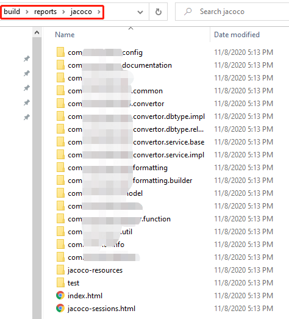
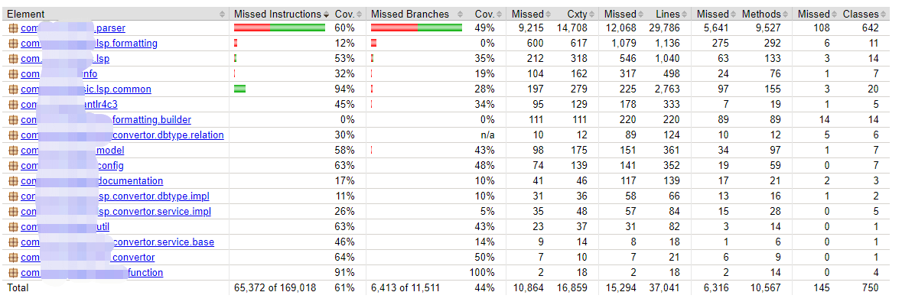

比如使用 gradle 来管理的项目可以在 `build.gradle` 里添加如下代码

```
plugins {
    id 'jacoco'
}


jacoco {
    toolVersion = "0.8.5"
}

test {
    finalizedBy jacocoTestReport // report is always generated after tests run
}

jacocoTestReport {
    dependsOn test // tests are required to run before generating the report
    reports {
        xml.enabled true
        csv.enabled false
        html.destination file("${buildDir}/reports/jacoco")
    }
}
```

然后执行 `gradle test` 就可以了。之后可以可以在 `build\reports\jacoco` 目录下找到报告了。



重点是如何分析报告。打开 index.html，报告显示如下：



TBD...

