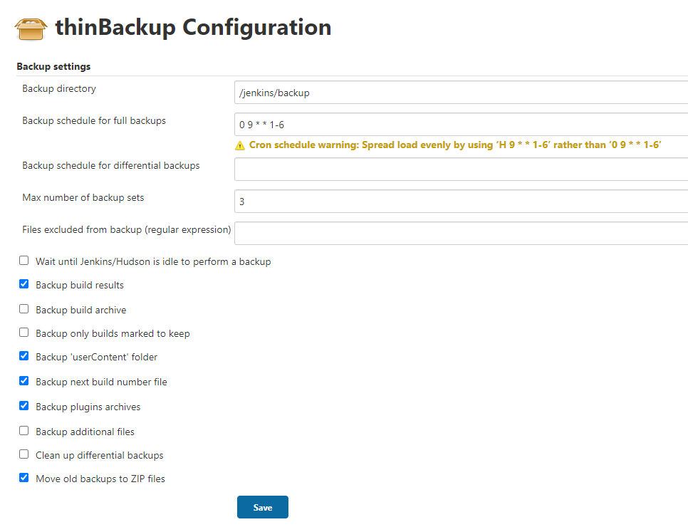

I believe most of you have used the Jenkins configuration as code principle, so you build/test/release process will be described in code.

It looks like all is good, but not all of the configuration is in code, same of the Jenkins system configuration is store in the Jenkins service, so we also need to backup Jenkins in case of any disaster.

There are two ways to backup Jenkins, one used Jenkins plugin, the other is create shell scripts.

## Using plug-in backup

I used the `ThinBackup` plugin, here is my thinBackup configuration.

<!-- more -->

* backup to a folder which user `jenkins` has permission to write. this is important.

  > Previously I backup Jenkins to a mount folder, but it doesn't work recently. so I use user `jenkins` to log in on the Jenkins server and found my `jenkins` can't access the directory, but I personal user can.

* I will daily backup my Jenkins server, from Monday to Saturday.
* Fo me max number of backup sets is 3, because every backup archive more than 400 MB.
* Others check boxs
  * Backup build results
  * Backup 'userContent' folder
  * Backup next build number file
  * Backup plugins archives
  * Move old backups to ZIP files

## Using shell script backup

Here is a popular repository and code for your reference.

* repository: https://github.com/sue445/jenkins-backup-script
* gist: https://gist.github.com/abayer/527063a4519f205efc74
