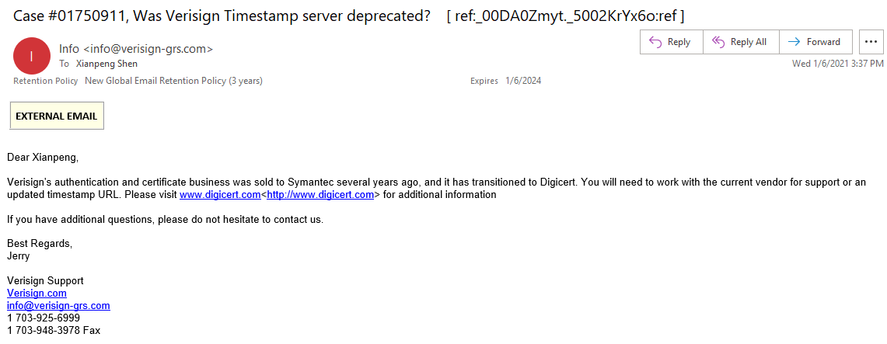

相信许多程序员在新年在做 InstallShield 数字签名的时候，遇到了 Verisign Timestamp 服务器不好用了 http://timestamp.verisign.com/scripts/timstamp.dll

出现了如下错误：

究其原因就是它默认的时间戳服务器，出现了无法访问的情况。

Stack overflow 上面有人给出了答案：https://stackoverflow.com/questions/65541786/is-the-verisign-timestamp-server-down

Verisign Support 给出的回复是：

在我们的身份验证服务出售给赛门铁克(Symantec，现在是Digicert)后，该服务器已弃用。

你可以在网络上寻找免费的 timestamp servers 或这里有一个 `http://timestamp.digicert.com`

因此，`http://timestamp.verisign.com` 将不再有效。

除了上面 Digicert 那个网址，还有如下网址可以作为替换

* http://timestamp.comodoca.com/authenticode
* http://timestamp.globalsign.com/scripts/timestamp.dll
* http://tsa.starfieldtech.com

更换到新的时间戳服务器后，InstallShield 签名恢复正常。

以上是别人的回复，因为在网络上没有找到一个官方回复，我打算发邮件正式问一下。发完不一会就得到了回复：

大意如下：几年前，Verisign 的身份验证和证书业务被出售给赛门铁克(Symantec)，目前已过渡到Digicert。您将需要与当前供应商合作以获得支持或更新的时间戳URL。请访问www.digicert.com<http://www.digicert.com>了解更多信息。

好了，这下实锤了，放心大胆的开始动手修改到新的时间戳吧。
