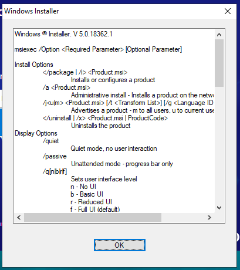

## What's the problem?

Today I am having a problem where the Windows installer I created is not installing, and the following Windows installer box pops up.

But it works well in the previous build, and I didn't make any code changes. It is strange, actually fix this problem is very easy but not easy to find. 

## How to fix it?

In my case, I just remove the space from my build folder naming. I have made follow mistakes:

My previous build name is `v2.2.2.3500-da121sa-Developer`, but for this build, I named it to `v2.2.2.3500-32jkjdk - Developer`

## How to find the solution?

This problem takes me several hours until I google this [article](https://community.spiceworks.com/topic/874022-msiexec-just-returns-a-pop-up) which inspired me. 

Just like the above article, if I try to use the command line `msiexec.exe other-commands ...`, compare with the works installer will also quick to find the root cause.

I realized it immediately I should try to remove the spaces from the build folder... Wow, the installer back to work.

If this happens to you, I hope it also works for you, and leave a comment if it works for you.
