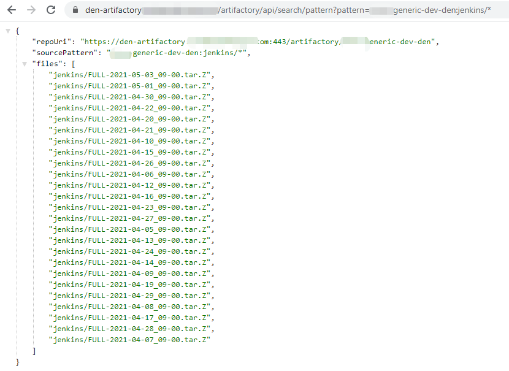

## Problem

When you do CI with JFrog Artifactory when you want to download the entire folder artifacts, but maybe your IT doesn't enable this function, whatever some seasons.

You can try the below JFrog Artifactory API to know if you're using Artifactory whether allowed to download the entire folder artifacts.

just visit this API URL: `https://den-artifactory.company.com/artifactory/api/archive/download/team-generic-release-den/project/abc/main/?archiveType=zip`

You will see an error message returned if the Artifactory is not allowed to download the entire folder.

```json
{
  "errors": [
    {
      "status": 403,
      "message": "Download Folder functionality is disabled."
    }
  ]
}
```
> More details about the API could find here [Retrieve Folder or Repository Archive](https://www.jfrog.com/confluence/display/JFROG/Artifactory+REST+API#ArtifactoryRESTAPI-RetrieveFolderorRepositoryArchive)

## Workaround

So to be enabled to download entire folder artifacts, I found other JFrog Artifactory APIs provide a workaround.

How to download the entire folder artifacts programmatically? this post will show you how to use other [Artifactory REST API](https://www.jfrog.com/confluence/display/JFROG/Artifactory+REST+API) to get a workaround.

### 1. Get All Artifacts Created in Date Range

API URL: [Artifacts Created in Date Range](https://www.jfrog.com/confluence/display/JFROG/Artifactory+REST+API#ArtifactoryRESTAPI-ArtifactsCreatedinDateRange)

This is the snippet code I use this API

```bash
# download.sh

USERNAME=$1
PASSWORD=$2
REPO=$3

# which day ago do you want to download
N_DAY_AGO=$4
# today
START_TIME=$(($(date --date="$N_DAY_AGO days ago" +%s%N)/1000000))
END_TIME=$(($(date +%s%N)/1000000))

ARTIFACTORY=https://den-artifactory.company.com/artifactory

if [ ! -x "`which sha1sum`" ]; then echo "You need to have the 'sha1sum' command in your path."; exit 1; fi

RESULTS=`curl -s -X GET -u $USERNAME:$PASSWORD "$ARTIFACTORY/api/search/creation?from=$START_TIME&to=$END_TIME&repos=$REPO" | grep uri | awk '{print $3}' | sed s'/.$//' | sed s'/.$//' | sed -r 's/^.{1}//'`
echo $RESULTS

for RESULT in $RESULTS ; do
    echo "fetching path from $RESULT"
    PATH_TO_FILE=`curl -s -X GET -u $USERNAME:$PASSWORD $RESULT | grep downloadUri | awk '{print $3}' | sed s'/.$//' | sed s'/.$//' | sed -r 's/^.{1}//'`

	echo "download file path $PATH_TO_FILE"
  curl -u $USERNAME:$PASSWORD -O $PATH_TO_FILE
done
```
Then you just use this as: `sh download.sh ${USERNAME} ${PASSWORD} ${REPO_PATH} ${N_DAY_AGO}`

### 2. Get all artifacts matching the given Ant path pattern

More about this API see: [Pattern Search](https://www.jfrog.com/confluence/display/JFROG/Artifactory+REST+API#ArtifactoryRESTAPI-PatternSearch)

Take an example screenshot of pattern search:



Then you can use Shell, Python language to get the file path from the response, then use ` curl -u $USERNAME:$PASSWORD -O $PATH_TO_FILE` command to download the file one by one.

If you have better solutions, suggestions, or questions, you can leave a comment.
