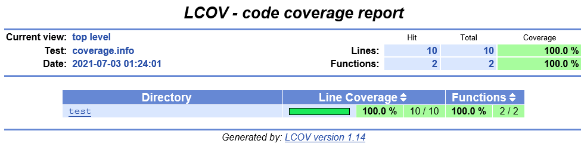
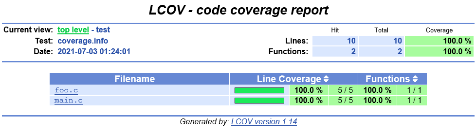
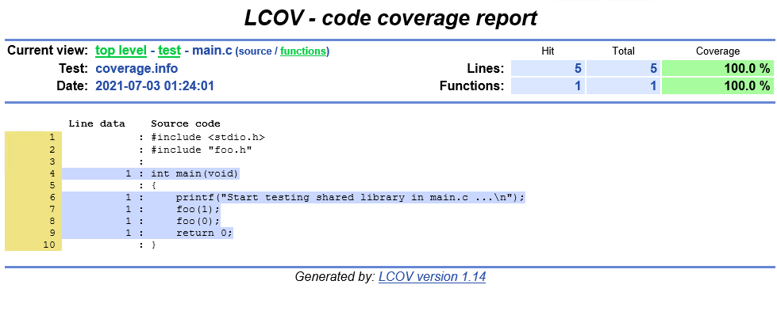
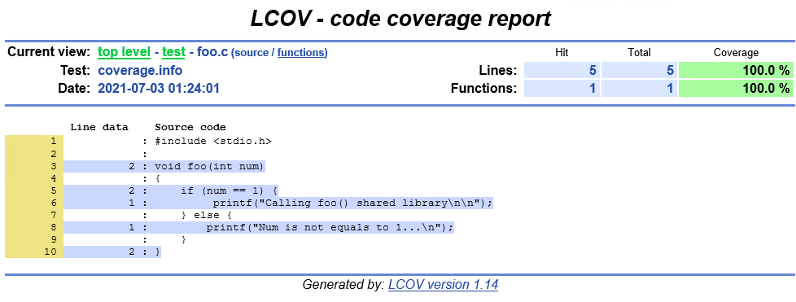
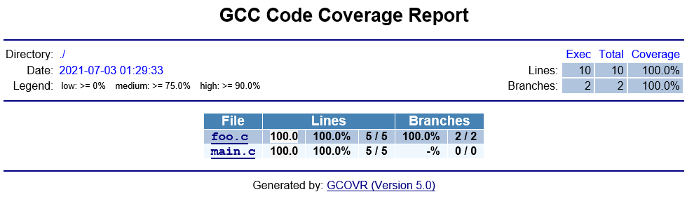
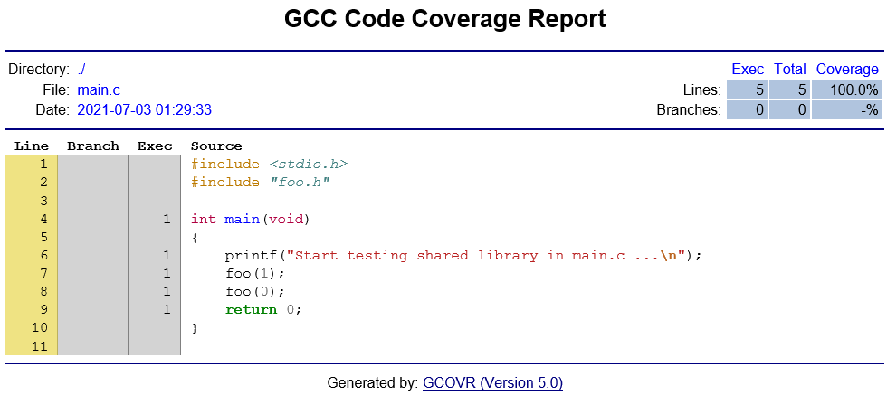
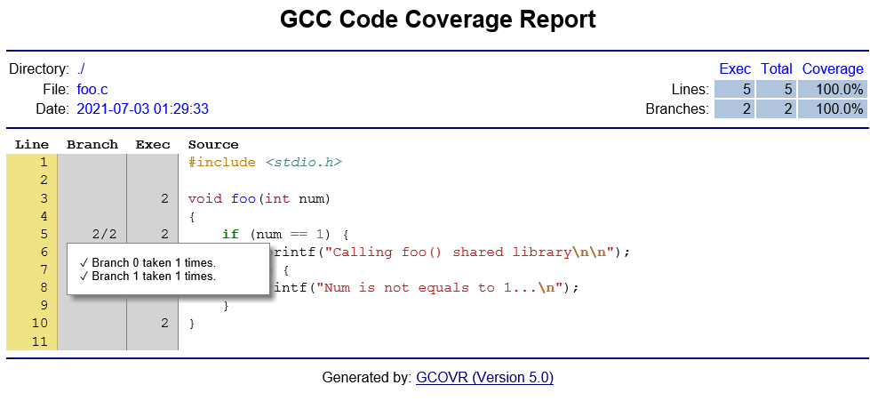

注：这篇文章是边调查边写的，可能存在一些示例、命令输出、以及截图对应不上的情况，因此在调查完成后，我又重新编写了整理的示例代码，并放在 GitHub 上，这是 README: https://github.com/shenxianpeng/gcov-example/blob/master/README-CN.md

因为这篇文章中有用到 gcovr （上面的链接里没有），因此保留这篇就不删除了。

## 前言

在很早之前我做过一次 C/C++ 项目的代码覆盖率工具的调查，是一款叫 [Squish Coco](https://shenxianpeng.github.io/2019/05/squishcoco/) 的付费工具，当时由于有一些问题没有解决，就搁置了并没有最终购买。最近又开始了这项工作，也有购买工具的预算，但作为个人还是希望有好用的开源软件可以来做这件事，也能为产品减少每年几千刀的 License 的支出。

本次调查的是 [Gcov](https://gcc.gnu.org/onlinedocs/gcc/Gcov-Intro.html#Gcov-Intro)，一个可以与 GCC 结合使用的工具，测试程序中的代码覆盖率。

本篇文章通过一个最简单的示例来了解 Gcov 是如何工作的，以及通过 gcovr 来生成 Code Coverage 报告。

> 关于 Squish Coco 与 Gcov/LCOV 的对比，froglogic 官方有一个说明：https://www.froglogic.com/coco/faq/

## Gcov 演示示例

1. 创建 C 程序

```c++
// main.c
#include <stdio.h>
#include "foo.h"

int main(void)
{
    printf("Start testing shared library in main.c ...\n");
    foo(1);
    foo(0);
    return 0;
}

// foo.c
#include <stdio.h>

void foo(int num)
{
    if (num == 1) {
         printf("Calling foo() shared library\n\n");
    } else {
        printf("Num is not equals to 1...\n");
    }
}

// foo.h
#ifndef foo_h__
#define foo_h__

extern void foo(int);

#endif  // foo_h__
```

2. 然后使用 gcc 编译的时候加入 `-fprofile-arcs` 和 `-ftest-coverage` 这两个 flags 进行编译

例如：

```bash
gcc -shared -fPIC -fprofile-arcs -ftest-coverage -o libfoo.so foo.c

# /workspace/code/gcov/test 是我的代码路径
gcc -lgcov -L/workspace/code/gcov/test -o test main.c -lfoo
```

这两个 flags 会让 GCC 在编译出来的二进制文件里加入 instrumentation，也就是我们俗称的插桩，它是用来收集执行的数据。

注：.gcno 注释文件是在用 GCC `-ftest-coverage` 选项编译源文件时生成的，它包含了重建基本块图和给块分配源行号的信息。

> 当前的 GCC 版本是：gcc version 8.3.1 20191121 (Red Hat 8.3.1-5) (GCC)

3. 运行可执行文件 `test` 进行测试

```bash
./test


```

当一个包含用 GCC `-fprofile-arcs` 选项编译的对象文件的程序被执行时，会产生 .gcda 计数数据文件，也就是这里的 `test.gcda` 文件。

每个用该选项编译的对象文件都会创建一个单独的 .gcda 文件，它包含弧线过渡计数、数值剖面计数和一些摘要信息。

4. 执行 `gcov test.c` 生成报告文件 `test.c.gcov`

```bash
[xshen@dendevblr01 gcov]$ gcov test.c
File 'test.c'
Lines executed:100.00% of 3
Creating 'test.c.gcov'

[xshen@dendevblr01 gcov]$ ls
a.out  test.c  test.c.gcov  test.gcda  test.gcno
```

可以看到 `test.c` 代码被 100% 执行了。

## 生成 Code Coverage 报告

目前我看到有两个对于 GCOV 可以生成报告得工具，一个是 [LCOV](http://ltp.sourceforge.net/coverage/lcov.php)，另外一个是 [gcovr](https://github.com/gcovr/gcovr)。

前者主要用 Perl 写的，后者用 Python 来写的，但从使用上来说，我觉得 LCOV 能更方便使用一些，对于具体被执行或没被执行的代码显示的更直观。

### LCOV

http://ltp.sourceforge.net/coverage/lcov.php

具体安装就不介绍了，可以看官方网站。安装完成后，要用到的两个命令

1. 收集 coverage 数据

`lcov --capture --directory project-dir --output-file coverage.info`

```bash
lcov --capture --directory . --output-file coverage.info
Capturing coverage data from .
Found gcov version: 4.8.5
Scanning . for .gcda files ...
Found 2 data files in .
Processing foo.gcda
geninfo: WARNING: cannot find an entry for main.c.gcov in .gcno file, skipping file!
Processing main.gcda
Finished .info-file creation
```

2. 生成 HTML 报告

`genhtml coverage.info --output-directory out`

```bash
sh-4.2$ genhtml coverage.info --output-directory out
Reading data file coverage.info
Found 2 entries.
Found common filename prefix "/workspace/mvas-code/coco"
Writing .css and .png files.
Generating output.
Processing file test/foo.c
Processing file test/main.c
Writing directory view page.
Overall coverage rate:
  lines......: 100.0% (10 of 10 lines)
  functions..: 100.0% (2 of 2 functions)
```

3. 查看报告









### gcovr

这里使用的是 gcovr 这个项目：https://github.com/gcovr/gcovr

1. 安装 `gcovr`

```bash
pip install gcovr
```

2. 重新编译上面的代码

```bash
g++ -fprofile-arcs -ftest-coverage -O0 test.c -o test
```

3. 执行 `./test`

4. 执行 `gcovr -r .` 生成报告

```
-sh-4.2$ gcovr -r .
------------------------------------------------------------------------------
                           GCC Code Coverage Report
Directory: .
------------------------------------------------------------------------------
File                                       Lines    Exec  Cover   Missing
------------------------------------------------------------------------------
test.c                                         3       3   100%
------------------------------------------------------------------------------
TOTAL                                          3       3   100%
------------------------------------------------------------------------------
-sh-4.2$
```

生成 html 报告

```bash
mkdir report
gcovr -r . --html --html-details -o report/coverage.html

-sh-4.2$ ls report
coverage.css  coverage.html  coverage.test.c.d02a618fa88f46a768e6df00dddaad2a.html
```

5. 查看报告

打开 coverage.html







## 更多用法

1. `--coverage` https://gcc.gnu.org/onlinedocs/gcc/Instrumentation-Options.html#index-coverage

2. `GCOV_PREFIX`, `GCOV_PREFIX_STRIP`

默认情况下，每个 source 文件编译通过 `-fprofile-arcs` 参数编译出来的 `.gcda` 文件时放在 object 文件目录下的，但当你的编译的机器和测试的机器不在同一台机器上的时候，就会出现找不到文件的请看。可以在编译之前通过 `GCOV_PREFIX` and `GCOV_PREFIX_STRIP` 这两个参数设置 `.gcda` 文件的输出位置。

https://gcc.gnu.org/onlinedocs/gcc/Cross-profiling.html#Cross-profiling

https://stackoverflow.com/questions/7671612/crossprofiling-with-gcov-but-gcov-prefix-and-gcov-prefix-strip-is-ignored

3. Linux kernel 使用 gcov 的文章，非常好的示例。

https://01.org/linuxgraphics/gfx-docs/drm/dev-tools/gcov.html
