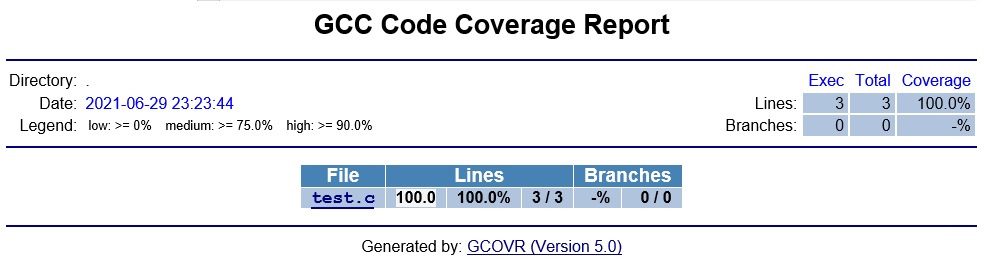

## 前言

在很早之前我做过一次 C/C++ 项目的代码覆盖率工具的调查，是一款叫 [Squish Coco](https://shenxianpeng.github.io/2019/05/squishcoco/) 的付费工具，当时由于有一些问题没有解决，就搁置了并没有最终购买。最近又开始了这项工作，也有购买工具的预算，但作为个人还是希望有好用的开源软件可以来做这件事，为产品减少每年几千刀的 License 的支出。

本次调查的是 [Gcov](https://gcc.gnu.org/onlinedocs/gcc/Gcov-Intro.html#Gcov-Intro)，一个可以与 GCC 结合使用的工具，测试程序中的代码覆盖率。

本篇文章通过一个最简单的示例来了解 Gcov 是如何工作的，以及通过 gcovr 来生成 Code Coverage 报告。

> 关于 Squish Coco 与 Gcov/LCOV 的对比，froglogic 官方有一个说明：https://www.froglogic.com/coco/faq/

## Gcov 演示示例

1. 首先创建一个简单的 C 程序

```c
[xshen@dendevblr01 gcov]$ vi test.c
[xshen@dendevblr01 gcov]$ cat test.c
#include<stdio.h>

int main()
{
    printf("Hello Gcov!\n");
    return 0;
}

[xshen@dendevblr01 gcov]$ ls
test.c
```

2. 然后使用 gcc 编译的时候加入 `-fprofile-arcs` 和 `-ftest-coverage` 这两个 flags 进行编译

例如：

```bash
[xshen@dendevblr01 gcov]$ gcc -fprofile-arcs -ftest-coverage test.c
[xshen@dendevblr01 gcov]$ ls
a.out  test.c  test.gcno
```
这两个 flags 会让 GCC 在编译出来的二进制文件里加入 instrumentation，也就是我们俗称的插桩，它是用来收集执行的数据。

注：.gcno 注释文件是在用 GCC `-ftest-coverage` 选项编译源文件时生成的，它包含了重建基本块图和给块分配源行号的信息。

> 当前的 GCC 版本是：gcc version 8.3.1 20191121 (Red Hat 8.3.1-5) (GCC)

3. 运行可执行文件 `a.out` 进行测试

```bash
[xshen@dendevblr01 gcov]$ ./a.out
Hello Gcov!
[xshen@dendevblr01 gcov]$ ls
a.out  test.c  test.gcda  test.gcno
```

当一个包含用 GCC `-fprofile-arcs` 选项编译的对象文件的程序被执行时，会产生 .gcda 计数数据文件，也就是这里的 `test.gcda` 文件。

每个用该选项编译的对象文件都会创建一个单独的 .gcda 文件，它包含弧线过渡计数、数值剖面计数和一些摘要信息。

4. 执行 `gcov test.c` 生成报告文件 `test.c.gcov`

```bash
[xshen@dendevblr01 gcov]$ gcov test.c
File 'test.c'
Lines executed:100.00% of 3
Creating 'test.c.gcov'

[xshen@dendevblr01 gcov]$ ls
a.out  test.c  test.c.gcov  test.gcda  test.gcno
```

可以看到 `test.c` 代码被 100% 执行了。

## 生成 Code Coverage 报告

这里使用的是 gcovr 这个项目：https://github.com/gcovr/gcovr

1. 安装 `gcovr`

```bash
pip install gcovr
```

2. 重新编译上面的代码

```bash
g++ -fprofile-arcs -ftest-coverage -O0 test.c -o test
```

3. 执行 `./test`

4. 执行 `gcovr -r .` 生成报告

```
-sh-4.2$ gcovr -r .
------------------------------------------------------------------------------
                           GCC Code Coverage Report
Directory: .
------------------------------------------------------------------------------
File                                       Lines    Exec  Cover   Missing
------------------------------------------------------------------------------
test.c                                         3       3   100%
------------------------------------------------------------------------------
TOTAL                                          3       3   100%
------------------------------------------------------------------------------
-sh-4.2$
```

生成 html 报告

```bash
gcovr -r . --html --html-details -o coverage.html

-sh-4.2$ ls
coverage.css  coverage.html  coverage.test.c.d02a618fa88f46a768e6df00dddaad2a.html  test  test.c  test.gcda  test.gcno
```

打开 coverage.html



## 参考文档

`--coverage` https://gcc.gnu.org/onlinedocs/gcc/Instrumentation-Options.html#index-coverage

数据文件环境变量 `GCOV_PREFIX` 和 `GCOV_PREFIX_STRIP` 的设置：https://gcc.gnu.org/onlinedocs/gcc/Cross-profiling.html#Cross-profiling
