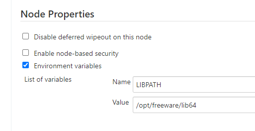
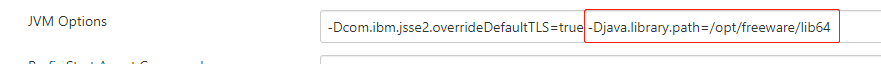

## 前言

随着团队当前的构建机器 AIX 7.1-TL4-SP1 快要 End of Service Pack Support，因此我要对它进行升级，目标是升级到 AIX 7.1-TL5-SP6。

但升级后的操作系统与Jenkins做集成遇到了 git clone 失败的问题。

## 问题1 - Authentication failed

```bash
$ git clone ssh://git@git.company.com:7999/vas/db.git
Cloning into 'db'...
Authentication failed.
fatal: Could not read from remote repository.

Please make sure you have the correct access rights
and the repository exists.
```

像这样的错误，在使用 Git SSH 方式来 clone 代码经常会遇到，一般情况就是通过 `ssh-keygen -t rsa -C your@email.com` 先生成 `id_rsa` keys，然后将 `id_rsa.pub` 的值添加到 GitHub/Bitbucket/GitLab 的 public key 中就能解决。

但这次不一样，尽管已经设置了 public key，但错误依旧存在。很奇快，之前旧的 AIX 7.1 机器是好用的，弄了一台新的怎么就不能用了？

使用 `ssh -vvv <git-url>` 来看看到底这两台机器有什么差异：

```bash
# Old
bash-4.3$ oslevel -s
7100-04-01-1543
bash-4.3$ ssh -vvv git.company.com
OpenSSH_6.0p1, OpenSSL 1.0.1e 11 Feb 2013
debug1: Reading configuration data /etc/ssh/ssh_config
debug1: Failed dlopen: /usr/krb5/lib/libkrb5.a(libkrb5.a.so):   0509-022 Cannot load module /usr/krb5/lib/libkrb5.a(libkrb5.a.so).
        0509-026 System error: A file or directory in the path name does not exist.

debug1: Error loading Kerberos, disabling Kerberos auth.
debug2: ssh_connect: needpriv 0
debug1: Connecting to git.company.com [137.134.250.53] port 22.
debug1: Connection established.
debug3: Incorrect RSA1 identifier
debug3: Could not load "/home/peter/.ssh/id_rsa" as a RSA1 public key
debug1: identity file /home/peter/.ssh/id_rsa type 1
debug1: identity file /home/peter/.ssh/id_rsa-cert type -1
debug1: identity file /home/peter/.ssh/id_dsa type -1
debug1: identity file /home/peter/.ssh/id_dsa-cert type -1
debug1: identity file /home/peter/.ssh/id_ecdsa type -1
debug1: identity file /home/peter/.ssh/id_ecdsa-cert type -1
ssh_exchange_identification: read: Connection reset by peer
```

```bash
# New AIX build machine
$ oslevel -s
7100-05-06-2015
$ ssh -vvv git.company.com
OpenSSH_7.5p1, OpenSSL 1.0.2t  10 Sep 2019
debug1: Reading configuration data /etc/ssh/ssh_config
debug1: Failed dlopen: /usr/krb5/lib/libkrb5.a(libkrb5.a.so):   0509-022 Cannot load module /usr/krb5/lib/libkrb5.a(libkrb5.a.so).
        0509-026 System error: A file or directory in the path name does not exist.

debug1: Error loading Kerberos, disabling Kerberos auth.
debug2: resolving "git.company.com" port 22
debug2: ssh_connect_direct: needpriv 0
debug1: Connecting to git.company.com [137.134.250.53] port 22.
debug1: Connection established.
debug1: identity file /home/peter/.ssh/id_rsa type 1
debug1: key_load_public: No such file or directory
debug1: identity file /home/peter/.ssh/id_rsa-cert type -1
debug1: key_load_public: No such file or directory
debug1: identity file /home/peter/.ssh/id_dsa type -1
debug1: key_load_public: No such file or directory
debug1: identity file /home/peter/.ssh/id_dsa-cert type -1
debug1: key_load_public: No such file or directory
debug1: identity file /home/peter/.ssh/id_ecdsa type -1
debug1: key_load_public: No such file or directory
debug1: identity file /home/peter/.ssh/id_ecdsa-cert type -1
debug1: key_load_public: No such file or directory
debug1: identity file /home/peter/.ssh/id_ed25519 type -1
debug1: key_load_public: No such file or directory
debug1: identity file /home/peter/.ssh/id_ed25519-cert type -1
debug1: Enabling compatibility mode for protocol 2.0
debug1: Local version string SSH-2.0-OpenSSH_7.5
ssh_exchange_identification: read: Connection reset by peer
```

两台机器的 OpenSSH 的版本不同，可能就是因此导致的，很快就找到了类似的问题和答案（Stackoverflow [链接](https://stackoverflow.com/questions/54191112/bitbucket-ssh-clone-on-aix-7-1-fails))

## 问题1 - 解决办法

在 `~/.ssh/config` 文件里添加选项 `AllowPKCS12keystoreAutoOpen no`

但问题来了，这个选项是 AIX 上的一个定制选项，在 Linux 上是没有的。这会导致同一个账户在 Linux 上通过 SSH 进行 clone 会失败。

```bash
# Linux 上不识别改选项
stderr: /home/****/.ssh/config: line 1: Bad configuration option: allowpkcs12keystoreautoopen
/home/****/.ssh/config: terminating, 1 bad configuration options
fatal: Could not read from remote repository.
```

1. 如果 `config` 文件可以支持条件选项就好了，即当为 AIX 是添加选项 `AllowPKCS12keystoreAutoOpen no`，其他系统则没有该选项。可惜 `config` 并不支持。
2. 如果能单独的设置当前 AIX 的 ssh config 文件就好了。尝试将 `/etc/ssh/config` 文件修改如下，重启服务，再次通过 SSH clone，成功~！

```bash
Host *
  AllowPKCS12keystoreAutoOpen no
#   ForwardAgent no
#   ForwardX11 no
#   RhostsRSAAuthentication no
#   RSAAuthentication yes
#   PasswordAuthentication yes
#   HostbasedAuthentication no
#   GSSAPIAuthentication no
#   GSSAPIDelegateCredentials no
#   GSSAPIKeyExchange no
#   GSSAPITrustDNS no
#   ....省略
```

## 问题2 - Dependent module /usr/lib/libldap.a(libldap-2.4.so.2) could not be loaded.

Jenkins 通过 HTTPS 来 checkout 代码的时候，出现了如下错误：

```bash
[2021-06-20T14:50:25.166Z] ERROR: Error cloning remote repo 'origin'
[2021-06-20T14:50:25.166Z] hudson.plugins.git.GitException: Command "git fetch --tags --force --progress --depth=1 -- https://git.company.com/scm/vas/db.git +refs/heads/*:refs/remotes/origin/*" returned status code 128:
[2021-06-20T14:50:25.166Z] stdout: 
[2021-06-20T14:50:25.166Z] stderr: exec(): 0509-036 Cannot load program /opt/freeware/libexec64/git-core/git-remote-https because of the following errors:
[2021-06-20T14:50:25.166Z] 	0509-150   Dependent module /usr/lib/libldap.a(libldap-2.4.so.2) could not be loaded.
[2021-06-20T14:50:25.166Z] 	0509-153   File /usr/lib/libldap.a is not an archive or
[2021-06-20T14:50:25.166Z] 		   the file could not be read properly.
[2021-06-20T14:50:25.166Z] 	0509-026 System error: Cannot run a file that does not have a valid format.
[2021-06-20T14:50:25.166Z] 
[2021-06-20T14:50:25.166Z] 	at org.jenkinsci.plugins.gitclient.CliGitAPIImpl.launchCommandIn(CliGitAPIImpl.java:2450)
[2021-06-20T14:50:25.166Z] 	at org.jenkinsci.plugins.gitclient.CliGitAPIImpl.launchCommandWithCredentials(CliGitAPIImpl.java:2051)
[2021-06-20T14:50:25.166Z] 	at org.jenkinsci.plugins.gitclient.CliGitAPIImpl.access$500(CliGitAPIImpl.java:84)
[2021-06-20T14:50:25.167Z] 	at org.jenkinsci.plugins.gitclient.CliGitAPIImpl$1.execute(CliGitAPIImpl.java:573)
[2021-06-20T14:50:25.167Z] 	at org.jenkinsci.plugins.gitclient.CliGitAPIImpl$2.execute(CliGitAPIImpl.java:802)
[2021-06-20T14:50:25.167Z] 	at org.jenkinsci.plugins.gitclient.RemoteGitImpl$CommandInvocationHandler$GitCommandMasterToSlaveCallable.call(RemoteGitImpl.java:161)
[2021-06-20T14:50:25.167Z] 	at org.jenkinsci.plugins.gitclient.RemoteGitImpl$CommandInvocationHandler$GitCommandMasterToSlaveCallable.call(RemoteGitImpl.java:154)
[2021-06-20T14:50:25.167Z] 	at hudson.remoting.UserRequest.perform(UserRequest.java:211)
[2021-06-20T14:50:25.167Z] 	at hudson.remoting.UserRequest.perform(UserRequest.java:54)
[2021-06-20T14:50:25.167Z] 	at hudson.remoting.Request$2.run(Request.java:375)
[2021-06-20T14:50:25.167Z] 	at hudson.remoting.InterceptingExecutorService$1.call(InterceptingExecutorService.java:73)
[2021-06-20T14:50:25.167Z] 	at java.util.concurrent.FutureTask.run(FutureTask.java:277)
[2021-06-20T14:50:25.167Z] 	at java.util.concurrent.ThreadPoolExecutor.runWorker(ThreadPoolExecutor.java:1153)
[2021-06-20T14:50:25.167Z] 	at java.util.concurrent.ThreadPoolExecutor$Worker.run(ThreadPoolExecutor.java:628)
[2021-06-20T14:50:25.167Z] 	at java.lang.Thread.run(Thread.java:785)
[2021-06-20T14:50:25.167Z] 	Suppressed: hudson.remoting.Channel$CallSiteStackTrace: Remote call to uv12-aix-dendevmvasbld30
[2021-06-20T14:50:25.167Z] 		at hudson.remoting.Channel.attachCallSiteStackTrace(Channel.java:1800)
[2021-06-20T14:50:25.167Z] 		at hudson.remoting.UserRequest$ExceptionResponse.retrieve(UserRequest.java:357)
[2021-06-20T14:50:25.167Z] 		at hudson.remoting.Channel.call(Channel.java:1001)
[2021-06-20T14:50:25.167Z] 		at org.jenkinsci.plugins.gitclient.RemoteGitImpl$CommandInvocationHandler.execute(RemoteGitImpl.java:146)
[2021-06-20T14:50:25.168Z] 		at sun.reflect.GeneratedMethodAccessor904.invoke(Unknown Source)
[2021-06-20T14:50:25.168Z] 		at sun.reflect.DelegatingMethodAccessorImpl.invoke(DelegatingMethodAccessorImpl.java:43)
[2021-06-20T14:50:25.168Z] 		at java.lang.reflect.Method.invoke(Method.java:498)
[2021-06-20T14:50:25.168Z] 		at org.jenkinsci.plugins.gitclient.RemoteGitImpl$CommandInvocationHandler.invoke(RemoteGitImpl.java:132)
[2021-06-20T14:50:25.168Z] 		at com.sun.proxy.$Proxy140.execute(Unknown Source)
[2021-06-20T14:50:25.168Z] 		at hudson.plugins.git.GitSCM.retrieveChanges(GitSCM.java:1221)
[2021-06-20T14:50:25.168Z] 		at hudson.plugins.git.GitSCM.checkout(GitSCM.java:1299)
[2021-06-20T14:50:25.168Z] 		at org.jenkinsci.plugins.workflow.steps.scm.SCMStep.checkout(SCMStep.java:125)
[2021-06-20T14:50:25.168Z] 		at org.jenkinsci.plugins.workflow.steps.scm.SCMStep$StepExecutionImpl.run(SCMStep.java:93)
[2021-06-20T14:50:25.168Z] 		at org.jenkinsci.plugins.workflow.steps.scm.SCMStep$StepExecutionImpl.run(SCMStep.java:80)
[2021-06-20T14:50:25.168Z] 		at org.jenkinsci.plugins.workflow.steps.SynchronousNonBlockingStepExecution.lambda$start$0(SynchronousNonBlockingStepExecution.java:47)
[2021-06-20T14:50:25.168Z] 		at java.util.concurrent.Executors$RunnableAdapter.call(Executors.java:511)
[2021-06-20T14:50:25.168Z] 		at java.util.concurrent.FutureTask.run(FutureTask.java:266)
[2021-06-20T14:50:25.168Z] 		at java.util.concurrent.ThreadPoolExecutor.runWorker(ThreadPoolExecutor.java:1149)
[2021-06-20T14:50:25.168Z] 		at java.util.concurrent.ThreadPoolExecutor$Worker.run(ThreadPoolExecutor.java:624)
[2021-06-20T14:50:25.168Z] 		at java.lang.Thread.run(Thread.java:748)
[2021-06-20T15:21:20.525Z] Cloning repository https://git.company.com/scm/vas/db.git
```

然后我在虚拟机上直接通过命令 `git clone https://git.company.com/scm/vas/db.git` 并没有出现任何问题。最后发现是 `LIBPATH` 这个变量所致。

将它置为空 `export LIBPATH=` 或 `unset LIBPATH`，`git clone https://...` 正常，如果 `LIBPATH=/usr/lib;/lib` 则出现下列错误;

```bash
$ git clone https://git.company.com/scm/vas/db.git
Cloning into 'db'...
exec(): 0509-036 Cannot load program /opt/freeware/libexec64/git-core/git-remote-https because of the following errors:
        0509-150   Dependent module /lib/libldap.a(libldap-2.4.so.2) could not be loaded.
        0509-153   File /lib/libldap.a is not an archive or
                   the file could not be read properly.
        0509-026 System error: Cannot run a file that does not have a valid format.


$ ldd /opt/freeware/libexec64/git-core/git-remote-https | grep libldap.a
         /opt/freeware/lib64/libldap.a(libldap-2.4.so.2)
$ ls -l /usr/lib/libldap.a
lrwxrwxrwx    1 root     system           35 Jun 10 2020  /usr/lib/libldap.a -> /opt/IBM/ldap/V6.4/lib/libidsldap.a
$ ls -l /opt/freeware/lib64/libldap.a
lrwxrwxrwx    1 root     system           13 Jun 10 2020  /opt/freeware/lib64/libldap.a -> libldap-2.4.a
$ ls -l libldap-2.4.a
ls: 0653-341 The file libldap-2.4.a does not exist.
$ ls -l /opt/freeware/lib64/libldap-2.4.a
-rwxr-xr-x    1 root     system       580151 Sep 25 2019  /opt/freeware/lib64/libldap-2.4.a
```

但是不论是修改 `/home/peter/.profile`, `/home/peter/.bash_profile` 或是 `/etc/environment`, `/etc/profile` 里的 LIBPATH，都无法影响到 Jenkins 启动 agent.jar 文件后系统环境变量。

`LIBPATH` 的值始终为 `/tools/AIX-6.1/Java8_64-8.0.0.401/usr/java8_64/jre/lib/ppc64/j9vm:/tools/AIX-6.1/Java8_64-8.0.0.401/usr/java8_64/jre/lib/ppc64:/tools/AIX-6.1/Java8_64-8.0.0.401/usr/java8_64/jre/../lib/ppc64:/usr/lib`

也通过修改 Node Properties -> Environment variables 以及 JVM Options，但还是没能改变 `LIBPATH` 的值。也许是 options 用错了？不得而知。





## 问题2 - 未解决

最终，使用 Jenkins 通过 HTTPS 来下载代码没有解决，暂且使用 SSH 方式来下载。如果你有任何思路或建议，欢迎留言分享，非常感谢.