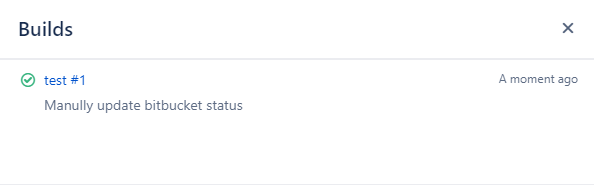

## Backgorud

1. When you want to **add** build status to your Bitbucket the specific commit of a branch when you start a build from the branch

2. When the build status is wrong, you want to **update** it manually. for example, update build status from FAILED to SUCCESSFUL

You can call Bitbucket REST API to do these.

## Code snippet

Below is the code snippet to update Bitbucket build status with REST API in the shell script.

The code on GitHub Gist: https://gist.github.com/shenxianpeng/bd5eddc5fb39e54110afb8e2e7a6c4fb

Click **Read More** to view the code here.

<!-- more -->

```bash
#!/bin/sh

username=your-bitbucket-user
password=your-bitbucket-password

commit_id='57587d7d4892bc4ef2c4375028c19b27921e2485'
# build_result has 3 status: SUCCESSFUL, FAILED, INPROGRESS
build_result='SUCCESSFUL'
description='Manully update bitbucket status'

build_name='test #1'
build_url=http://localhost:8080/job/test/

bitbucket_rest_api='https://myorg.bitbucket.com/rest/build-status/latest/commits'

gen_post_data()
{
cat <<EOF
{
  "state": "$build_result",
  "key": "$commit_id",
  "name": "$build_name",
  "url": "$build_url",
  "description": "$description"
}
EOF
}

echo "$(gen_post_data)"

curl -u $username:$password \
-H "Accept: application/json" \
-H "Content-Type:application/json" \
-X POST $bitbucket_rest_api/$commit_id --data "$(gen_post_data)"

if [ $? -ne 0 ]
then
  echo "$0: Update bitbucket build status failed."
  exit 1
else
  echo "$0: Update bitbucket build status success."
  exit 0
fi
```

And the screenshot of the final update result


