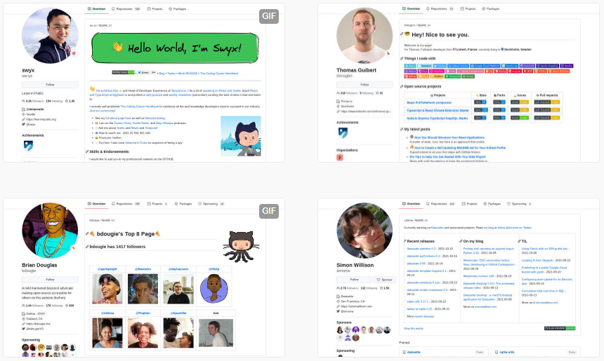

如果你不了解 GitHub 个人首页可以展示丰富的信息，这里先做简单的介绍。你或许看到过别人的 GitHub 个人页上有很丰富多彩的介绍。就像这样。



这其实是 GitHub 早在 2020 年支持的一个新功能：创建一个与你的 GitHub 账号同名的仓库，添加的 `README.md` 会在 GitHub 个人主页显示。

举个例子：如果你的 GitHub 名叫 `gebilaowang`，那么你创建一个叫 `gebilaowang` 的 Git 仓库，添加 README.md 文件就会在主页显示。

因此大家都根据这个特殊仓库建了很多很有特色的个人主页。需要灵感的可以在这里找到很多：https://awesomegithubprofile.tech/

---

回到今天的主题 “如何实现每次发布博客文章都能自动将最新文章同步到 GitHub 个人首页？”

从这个标题可以拆解成两个任务。

1. 把最新博客文章同步到 GitHub 个人资料 `README.md` 文件里。
2. 只有当新的博客文章发布时才进行同步操作。

## 同步最新文章到特殊仓库

这里我用到的是一个开源项目 [blog-post-workflow](https://github.com/gautamkrishnar/blog-post-workflow)，它可以通过 RSS 来提取到我的博客的最新文章。

经过简单的设置，我的特殊仓库中 GitHub Action YML 文件如下：

```yml
# special_repository.yml
name: Latest blog post workflow
on:
  schedule:
    - cron: '* 2 * * *'
  workflow_dispatch:

jobs:
  update-readme-with-blog:
    name: Update this repo's README with latest blog posts
    runs-on: ubuntu-latest
    steps:
      - uses: actions/checkout@v2
      - uses: gautamkrishnar/blog-post-workflow@master
        with:
          # 我的博客 RSS 链接
          feed_list: "https://shenxianpeng.github.io/atom.xml"
          # 获取最新 10 篇文章
          max_post_count: 10
```

在这个 YML 里我用的是定时任务，就是每天早上两点就自动获取一次最新文章并更新到特殊仓库 `README.md` 文件。

这个做法可以接受，但不够节省资源。最好的做法就是有文章 publish 了触发特殊仓库的 GitHub Actions 进行更新。

## 触发另一个仓库的 GitHub Actions

发现 AitHub Acitons 提供了一个叫做 [`repository_dispatch`](https://docs.github.com/en/actions/learn-github-actions/events-that-trigger-workflows#repository_dispatch) 的 event 可以来做这个。就像这样


```yml
on:
  repository_dispatch:
    # 这里的类型是可以自定义的，我将它起名为：special_repository
    types: [special_repository]
```

因此上面的特殊仓库 GitHub Action YML 文件变为：

```yml
# special_repository.yml
name: Latest blog post workflow

on:
  repository_dispatch:
    types: [special_repository]
  workflow_dispatch:

jobs:
  update-readme-with-blog:
    name: Update this repo's README with latest blog posts
    runs-on: ubuntu-latest
    steps:
      - uses: actions/checkout@v2
      - uses: gautamkrishnar/blog-post-workflow@master
        with:
          feed_list: "https://shenxianpeng.github.io/atom.xml"
          max_post_count: 10
```

这样，当有新的文章 publish 的时候通过发送类型为 `special_repository` 事件来触发特殊仓库的 GitHub Actions。

发送类型为 `special_repository` 事件

```bash
curl -XPOST -u "${{ secrets.PAT_USERNAME}}:${{secrets.PAT_TOKEN}}" \
    -H "Accept: application/vnd.github.everest-preview+json" \
    -H "Content-Type: application/json" https://api.github.com/repos/shenxianpeng/shenxianpeng/dispatches \
    --data '{"event_type": "special_repository"}'
```

最后，触发特殊仓库里的 YML 如下:

```yml
# tigger_special_repository.yml
name: Tigger special repository

on:
  push:
    branches: [ master ]
  workflow_dispatch:

jobs:
  build:
    runs-on: ubuntu-latest
    steps:
      - name: Send repository dispatch event
        run: |
          curl -XPOST -u "${{ secrets.PAT_USERNAME}}:${{secrets.PAT_TOKEN}}" \
          -H "Accept: application/vnd.github.everest-preview+json" \
          -H "Content-Type: application/json" https://api.github.com/repos/shenxianpeng/shenxianpeng/dispatches \
          --data '{"event_type": "special_repository"}'
```

注：`PAT_USERNAME` 和 `PAT_TOKEN` 需要在当前的仓库【设置 -> Secrets】里进行添加。

## 最终的效果


