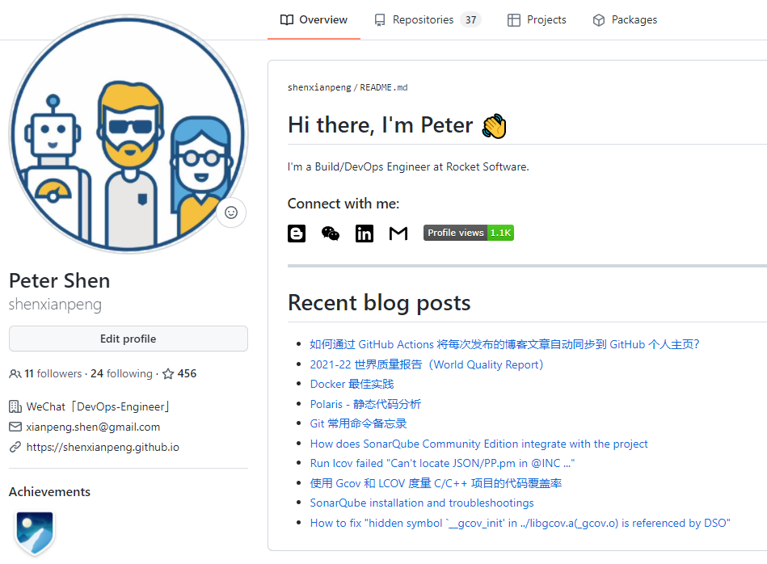
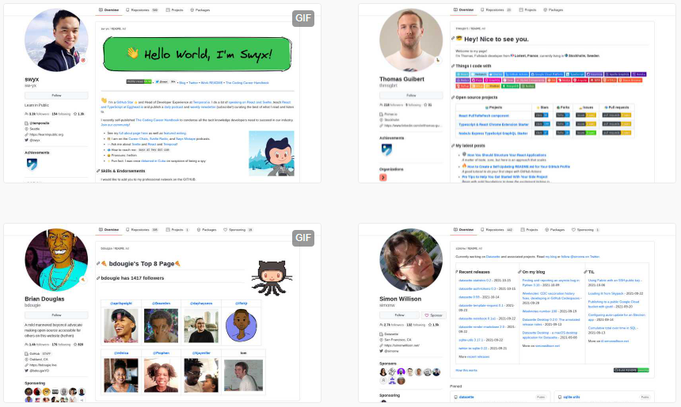
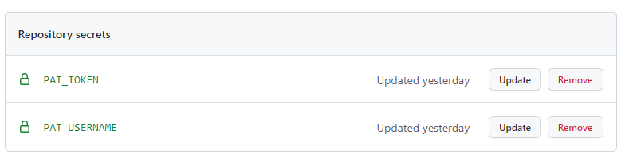

如何将每次发布的博客文章自动同步到 GitHub 个人主页？就像这样，在个人主页展示自己最近发布的博客文章。



当然可以每次发布完一篇文章后到主页上这个特殊的仓库下面的 `README.md` 将标题和链接手动更新一下。但这也太麻烦了，DevOps 工程师不会这么干的 :)

我想象中自动化工作流应该是这样的：

1. 通过 Workflow 自动获取最新的文章的标题和地址并更新 `README.md`
2. 只有当有新的文章发布的时候才触发上面的自动获取文章 Workflow

_如果你不了解为什么 GitHub 个人主页可以显示这些丰富的信息，这里做个简单介绍：这其实是 GitHub 早在 2020 年发布的一个新功能。即创建一个与你的 GitHub 账号同名的仓库，添加的 `README.md` 会在 GitHub 个人主页显示。_

_举个例子：如果你的 GitHub 名叫 `gebilaowang`，那么当你创建一个叫 `gebilaowang` 的 Git 仓库，添加 README.md 后就会在主页显示。_

_针对这个功能 GitHub 上有很多丰富多彩的个人介绍（如下）。更多灵感可以参看这个链接：https://awesomegithubprofile.tech/_




## 如何自动获取文章并更新 `README.md`

这一点要表扬一下 GitHub Actions 这个功能，在 GitHub 上面有非常丰富的针对 Actions 开发的小功能。

_我也是其中之一，最近我和另外一个贡献者在维护 [C/C++ Lint Action](https://github.com/marketplace/actions/c-c-lint-action) 如果喜欢的话不妨点个 Star 支持一下 :)_

因此这个自动获取最新文章标题和链接的轮子也不用造了，我用了一个开源项目叫 [blog-post-workflow](https://github.com/gautamkrishnar/blog-post-workflow)，它可以通过 RSS（订阅源）来获取到博客的最新文章。

_它不但支持博客还支持 StackOverflow 以及 Youtube 视频等资源。_

然后在 GitHub 同名的仓库下添加一个 Workflow YML `.github/workflows/blog-post-workflow.yml` 。

```yml
name: Latest blog post workflow
on:
  schedule:
    - cron: '* 2 * * *'
  workflow_dispatch:

jobs:
  update-readme-with-blog:
    name: Update this repo's README with latest blog posts
    runs-on: ubuntu-latest
    steps:
      - uses: actions/checkout@v2
      - uses: gautamkrishnar/blog-post-workflow@master
        with:
          # 我的博客 RSS 链接
          feed_list: "https://shenxianpeng.github.io/atom.xml"
          # 获取最新 10 篇文章
          max_post_count: 10
```

目前这个 Worflow 里用的是定时来触发，就是每天早上两点就自动获取一次最新文章并更新这个特殊仓库 `README.md`。这个做法还可以，但不够节省资源也不够完美。

最好的做法是：只有当有新文章发布时才触发上面的 Worflow 更新 `README.md`。这样需要在存放文章的 Git 仓库里添加另外一个 Worflow 来触发更新  `README.md` 操作。

## 如何从外面触发 GitHub Actions

GitHub Actions 提供了一个 Webhook 事件叫做 [`repository_dispatch`](https://docs.github.com/en/actions/learn-github-actions/events-that-trigger-workflows#repository_dispatch) 可以来做这件事。

它的原理是这样的：使用 GitHub API 来触发一个 Webhook 事件，这个事件叫做 `repository_dispatch`，这个事件里的类型是可以自定义的，并且在要被触发的 workflow 里需要使用 `repository_dispatch` 事件。

也就是说需要存放博客文章的仓库里添加一个 Worflow 通过发送 `repository_dispatch` 事件触发特殊仓库中的 Worflow。

这里我定义事件类型叫 `special_repository`，即它只接受来自 GitHub API `repository_dispatch` 事件中的类型叫 `special_repository` 因此接受事件的 `.github/workflows/blog-post-workflow.yml` 文件更新如下：

```yml
# special_repository.yml
name: Latest blog post workflow

on:
  repository_dispatch:
    # 这里的类型是可以自定义的，我将它起名为：special_repository
    types: [special_repository]
  workflow_dispatch:

jobs:
  update-readme-with-blog:
    name: Update this repo's README with latest blog posts
    runs-on: ubuntu-latest
    steps:
      - uses: actions/checkout@v2
      - uses: gautamkrishnar/blog-post-workflow@master
        with:
          feed_list: "https://shenxianpeng.github.io/atom.xml"
          max_post_count: 10
```

那么发送事件的 Workflow 改怎么写呢？即如果发送一个类型为 `special_repository` 的`repository_dispatch` 事件。

可以通过 `curl` 直接调用 API 来完成。

```bash
curl -XPOST -u "${{ secrets.PAT_USERNAME}}:${{secrets.PAT_TOKEN}}" \
    -H "Accept: application/vnd.github.everest-preview+json" \
    -H "Content-Type: application/json" https://api.github.com/repos/shenxianpeng/shenxianpeng/dispatches \
    --data '{"event_type": "special_repository"}'
```

最后，触发事件仓库里 Workflow `.github/workflows/send-dispatch.yml` 如下:

```yml
name: Tigger special repository

on:
  push:
    # 当 master 分支有变更的时候触发 workflow
    branches:
      - master
  workflow_dispatch:

jobs:
  build:
    runs-on: ubuntu-latest
    steps:
      - name: Send repository dispatch event
        run: |
          curl -XPOST -u "${{ secrets.PAT_USERNAME}}:${{secrets.PAT_TOKEN}}" \
          -H "Accept: application/vnd.github.everest-preview+json" \
          -H "Content-Type: application/json" https://api.github.com/repos/shenxianpeng/shenxianpeng/dispatches \
          --data '{"event_type": "special_repository"}'
```

注：`PAT_USERNAME` 和 `PAT_TOKEN` 需要在当前的仓库【设置 -> Secrets】里进行添加。



完！

---

上述引用的 GitHub 仓库：

> 接受事件（特殊）仓库地址：https://github.com/shenxianpeng/shenxianpeng \
> 发送事件（文章）仓库地址：https://github.com/shenxianpeng/shenxianpeng.github.io
