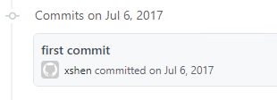

在写博客和公众号这件事上，不知不觉已经是我的第五个年头了。那就做个五年小结吧，分享一下我的职业线路图的变化以及在写作这件事情的一点点收获。

## 从QA到DEV到DEVOPS

最早关注我公众号读者朋友应该是因为软件测试而关注的。是的，我做了近 10 的软件测试工作，先后在 SIMcom、东软、京东商城、外企从事过功能、自动化、性能测试工作。

在做测试工程师的前几年，我发现编码能力不但是开发工程师的立命之本也是测试工程师的必备技能，所以我决定要成为自动化测试工程师！从京东一直做到了转岗前。

做自动化测试这几年，我发现自己相对于“发现”问题更喜欢“解决”问题，我开始准备并希望有机会去做开发，我认为这对于我职业发展会是一次非常好的经历，不但可以提高自己的编程能力，还可以因为角色的转变对开发、测试都有了解，为自己今后的职业发展找到更多可能性。

因为这些年的测试开发经验，编码能力还过得去，终于我有了从测试转开发的机会。起初的艰难和压力都是我工作近 10 年来前所未有的，白天看代码、晚上看代码、周末看代码... 天天如此。经过了半年多的努力，才终于上岸，可以做C/C++ 项目的 Bugfix 了。

也正是因为有开发、自动化、持续集成的经验，在团队需要一名 Build/Release 工程师的时候，我找到了最适合自己的岗位：Build/DevOps 工程师，负责产品的自动化构建、发布、基础设施建设、CI/CD 以及提高研发效能的相关工作。

就这样我从 QA 到 DEV 到 DEVOPS。通过我公众号的更名记录也能看到我的我职业路线变更足迹：

* 2017年08月01日 注册“软件测试QA”
* 2018年12月26日 “软件测试QA”改名“DevQA”
* 2018年12月29日 “DevQA”改名“软件测试与开发”
* 2019年07月28日 “软件测试与开发”改名“DevOps攻城狮”

## 写作有哪些收获

写博客和公众号是一项长期收益远超短期收益的事情。

对于绝大多数人写作在短期内几乎不会有什么收益，还会花费大量的业余时间，妥妥的是用爱在发电。从金钱角度来衡量这件事，这是一件投入和产出完全不成比例的事情，很难坚持。

如果从长期来看，坚持技术写作一定会带来价值的，我总结有以下 4 点好处：

1. 好记性不如烂笔头 - 当我们弄明白了一个技术难题，虽然当时明白了，但如果没记录下来，很有可能以后遇到同样的问题又不知道该如何解决。
2. 写下来才能理清思路 - 虽然一个问题我们认为自己弄明白了，一个问题我们认为自己弄明白了，当你写想跟别人分享的时候，很可能会发现有些逻辑说不通，你需要继续思考并彻底理清思路。
3. 打造学习飞轮 - 当你坚持分享并有人关注到你并与你互动的时候，你就会有动力继续分享，学习新的知识然后再分享，一旦学习的飞轮造好了，坚持下去就变得容易。
4. 带来间接或直接的收益 - 间接收益比如丰富了简历、面试官读过你的文章，或是因为你小有名气直接找到你，这些都可能在未来帮助找到心仪的工作；直接利益包括流量&广告收益、卖专栏、做咨询等，能做到一些需要有好的自媒体运营以及超强的输出能力。

当时我并没有想到这么多，只是觉得自己也可以分享，就在 2017 年 7 月 6 日，我通过 GitHub Page 建立了自己的[个人博客](https://shenxianpeng.github.io)

内容已经有了，复制过来也不费电，还能学习下公众号怎么玩，就在同年 8 月开通了我的微信公众号；在 2020 年五一假期为我的博客创建了微信小程序(DevOps攻城狮)

花了很多业余时间来写文章，说说目前都有哪些实质性的收获吧

1. 知道如何在 GitHub 上建站、发布博客，把 GitHub 变成最常访问的网站之一
2. 知道 Hexo 博客如何集成 Disqus, Google Analytics, Google Adsense, etc，并做了很多个改进
3. 知道如何使用和集成 Github Actions、Travis、SonarQube 等工具
4. 知道如何运营一个公众号；知道如何创建、发布一个微信小程序
5. 参与到开源项目，在开源项目中学习编码、开阔眼界，学习最佳实践
6. 身边的同事说 ta 读到了我的文章，找到并关注了我的微信公众号
7. 收到过咨询，还收到咨询者的感谢红包，能够帮到别人并收到正反馈非常开心
8. 收到过出版社编辑老师的邀请，写一本技术书籍。但由于工作很忙以及还有更重要的知识要学习，最终主动放弃这次机会。
9. ... ...

除此之外，我觉得最大的收获是**打造自己的学习飞轮，把分享变成一种习惯**。

## 日拱一卒，功不唐捐

不期未来，坚持做好一件事，其他的都交给时间吧。有句话说得好，最好的时间是十年前，其次就是现在。

如果你有想做而没做的事，现在开始做一点都不晚，只要身体好还能再做几十年呢，到时候你一定会是某个领域的专家。

—— 2022 年 2 月 20 日，凌晨更新。

## 相关推荐阅读

> * [做了9年测试，我为何转开发？](https://shenxianpeng.github.io/2018/07/why-I-move-to-development/)
> * [从测试到开发的五个月](https://shenxianpeng.github.io/2018/12/from-qa-to-dev/)

---

欢迎扫码关注公众号「DevOps攻城狮」- 专注于DevOps领域知识分享。

