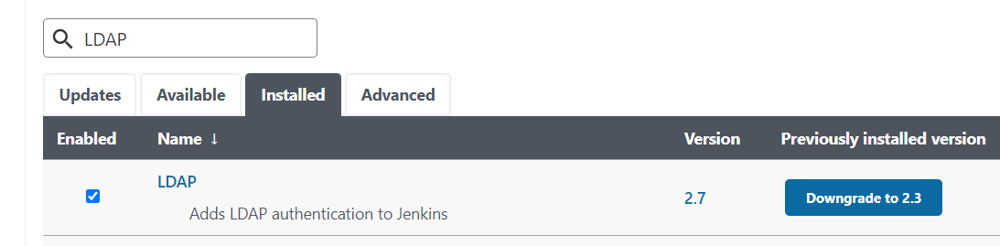
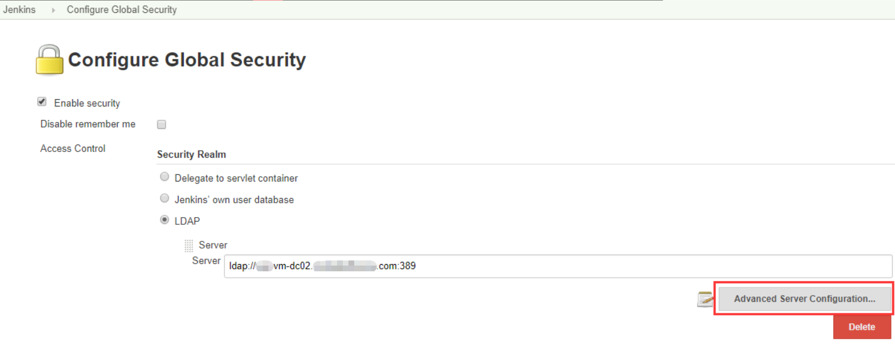

## Introduction

In organizations, using LDAP login very common way for users to log in with their credentials.

## How to configure LDAP

Preparation: Installed LDAP Jenkins plugin



About how to configure it, you can refer to Jenkins LDAP Plugin documentation https://plugins.jenkins.io/ldap/

This is my LDAP configuration just for testing.

<!-- more -->




## Can not login with LDAP?

Sometimes, for some reason, there is a problem with your organization's LDAP server and you can't log in to Jenkins using LDAP, but you need to use Jenkins now.

You can disable LDAP authentication by changing `config.xml`.

```bash
# Login, cd to jenkins server folder
$ cd /var/lib/jenkins/

# Highly rememend you to backup config.xml before making any change !!!
# If you don't backup config.xml, you'll lost your LDAP configration after reboot service.
$ cp config.xml config.xml.bak

# Modify config.xml from
<useSecurity>true</useSecurity>
# To
<useSecurity>false</useSecurity>

# Restart Jenkins server
sudo service jenkins restart
```

Then you can log into the Jenkins server again.

Once your organization's LDAP works again, you can replace `config.xml` with your backup config.xml file. Then your users can continue to log in via LDAP.
