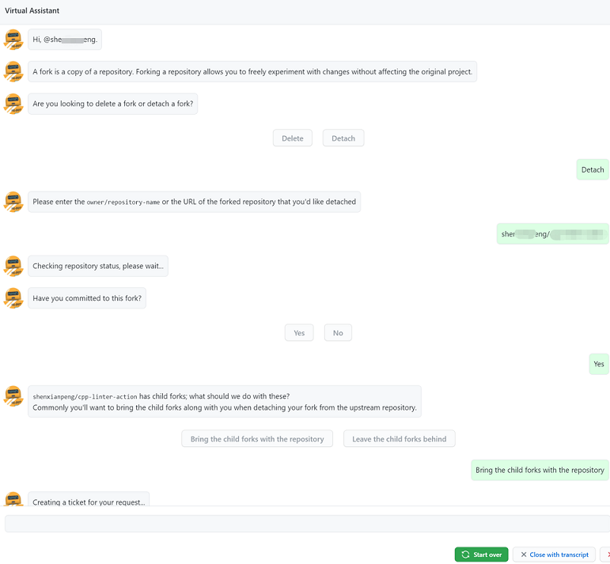
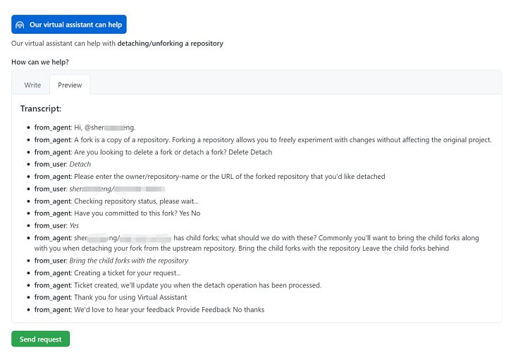

## 背景

有开发者、甚至公司可能会遇到过以下几个问题：

1. 最开始 Fork 了一个仓库，之后做了大量的修改，从功能到开发语言，已经与父仓库各自发展了
2. 由于是 Fork 的仓库，在每次提 Pull Request 的默认目标分支是父仓库，一不注意就会提 PR 到父仓库里去了
3. Fork 的仓库有人贡献并使用了，但不能显示贡献者，以及该项目被哪些其他的项目所使用，这不利于项目的发展

基于这些问题，开发者会考虑与父仓库进行分离，但目前 GitHub 没有提供 Unfork/Detach 的功能。

如果直接删除项目并重建可以达到分离的目的，但这样会丢失一些重要的信息，比如项目中的 Issues，Wikis 以及 Pull Requests 等。

> Unfork 跟字节旗下火山引擎白嫖 Apache SkyWalking 有本质区别，更像是 Hudson 和 Jenkins 的分道扬镳。

## 解决办法

在经过一番调查和测试，目前最可行的办法就是通过 GitHub Support 来处理，具体操作如下：

1. 打开这个连接：https://support.github.com/contact?tags=rr-forks
2. 选择你的账户或是组织，然后在 Subject 中输入 "unfork" 会自动弹出虚拟助手，选择虚拟机助手
    
3. 然后根据虚拟助手的问题然后选择答案（如下是部分截图）
     
4. 最后这些对话会自动转换成文字脚本，然后 Send request，等着 Support 处理就可以了（不会太久）
    

这里要注意一下，如果你的仓库被其他人 Fork 了，你想跟父仓库分离之后继续保留你的子仓库的 Fork 记录，你应该选择 "Bring the child forks with the repository"。

另外，通过其他方式，比如命令 `git clone --bare` 和 `git push --mirror`，可以保留完成的 Git 历史，但不能保留 Issues，Wikis 以及 Pull Requests 等信息。

希望对你有所帮助。

## 参考

* [Delete fork dependency of a GitHub repository](https://stackoverflow.com/questions/16052477/delete-fork-dependency-of-a-github-repository)
* [Unfork a Github fork without deleting](https://stackoverflow.com/questions/29326767/unfork-a-github-fork-without-deleting/41486339#41486339)

---

关注公众号「DevOps攻城狮」（转载本站文章请注明作者和出处，请勿用于任何商业用途）
