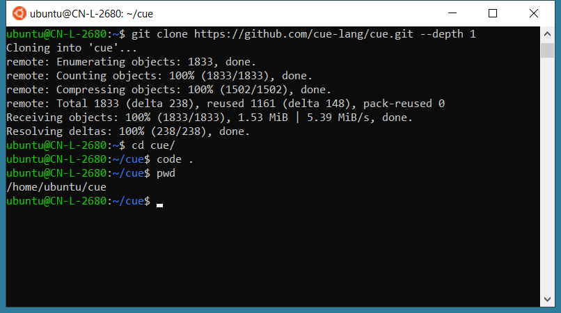

许久以来，大部分程序员都遇到过在 Windows 做开发那种不便。

比如不能像 Linux 和 Mac 那样只需要输入一行命令就能安装 openjdk，python，node 等等。因此有的程序员从此转到了 Mac 上开发，也有的干脆就使用 Linux 作为开发机。

只有那些不得不用 Windows 作为开发环境程序员还一直留在了 Windows 上继续凑合中。

直到 WSL 的到来，WSL + VS Code + Docker Desktop 这三剑客的组合，开始让我觉得在 Windows 上做开发是一件很爽的事情。

## 什么是 WSL

WSL 是 Windows Subsystem for Linux 的缩写。它是 Windows 10 操作系统的一项功能，使你能够在 Windows 上直接运行 Linux 文件系统，以及 Linux 命令行工具和 GUI 应用程序，并与传统的 Windows 桌面和应用程序一起运行。

> WSL 的最低版本要求是 Windows 10 version 1903 及更高。

WSL 是专为那些需要使用 Linux 的开发人员所开发的，例如从事网络开发人员、开源项目、以及需要部署到 Linux 服务器环境的开发者。

WSL 适用于喜欢使用 Bash、常用 Linux 工具（sed、awk等）和 Linux 优先框架（Ruby、Python 等），同时也喜欢使用 Windows 作为生产力工具的人。

下面来看看 WSL 和虚拟机相比有哪些优势。

## 使用 WSL 的几点优势

1. 与完整的虚拟机相比，WSL需要的资源（CPU、内存和存储）更少
2. WSL 允许你在 Windows 命令行、桌面和商店应用程序旁边运行 Linux 命令行工具和应用程序，并从 Linux 中访问你的 Windows 文件，有更好的交互体验。
3. 最最重要的是，使用 WSL 结合 VS Code + Docker 既有 Linux 的完美体验感，也同时拥有在 Windows 上的办公生产力。这是虚拟机或是 Linux 操作系统所办不到。Mac 可以，但并不是所有人都适合 Mac。

下面就来说说如何安装 WSL，以及和 VS Code + Docker 进行搭配使用。

## 安装 WSL

```powershell
wsl --install
```

这个命令将启用所需的可选组件，下载最新的 Linux 内核，将 WSL 2 设置为你的默认值，并为你安装一个 Linux 发行版（默认为 Ubuntu）。

```powershell
# 查看可用的发行版列表
C:\Users\xshen>wsl --list --online
The following is a list of valid distributions that can be installed.
Install using 'wsl --install -d <Distro>'.

NAME            FRIENDLY NAME
Ubuntu          Ubuntu
Debian          Debian GNU/Linux
kali-linux      Kali Linux Rolling
openSUSE-42     openSUSE Leap 42
SLES-12         SUSE Linux Enterprise Server v12
Ubuntu-16.04    Ubuntu 16.04 LTS
Ubuntu-18.04    Ubuntu 18.04 LTS
Ubuntu-20.04    Ubuntu 20.04 LTS
```

安装其他发行版，比如 Debian

```powershell
wsl --install -d Debian
```

更详细的请参考官方[文档](https://docs.microsoft.com/en-us/windows/wsl/install)

## WSL + VS Code 演示

以下以 Ubuntu 为例，演示从下载代码，并通过 VS Code 打开代码目录进行 Coding。

此时我已经通过 WSL 打开了已经安装好的 Ubuntu 操作系统了。



首选下载代码

```bash
ubuntu@CN-L-2680:~$ git clone https://github.com/cue-lang/cue.git --depth 1
Cloning into 'cue'...
remote: Enumerating objects: 1833, done.
remote: Counting objects: 100% (1833/1833), done.
remote: Compressing objects: 100% (1502/1502), done.
remote: Total 1833 (delta 238), reused 1161 (delta 148), pack-reused 0
Receiving objects: 100% (1833/1833), 1.53 MiB | 5.39 MiB/s, done.
Resolving deltas: 100% (238/238), done.
```

然后到下载好的代码目录下面，输入 `code .`

```bash
ubuntu@CN-L-2680:~$ cd cue/
ubuntu@CN-L-2680:~/cue$ code .

# 只有第一次才会安装 VS Code Server
Installing VS Code Server for x64 (dfd34e8260c270da74b5c2d86d61aee4b6d56977)
Downloading: 100%
Unpacking: 100%
Unpacked 2341 files and folders to /home/ubuntu/.vscode-server/bin/dfd34e8260c270da74b5c2d86d61aee4b6d56977.
```

第一次会自动下载并安装 VS Code Server，安装完成后会自动启动你本机上的 VS Code，并打开了 Ubuntu 上的代码目录，整个过程非常丝滑。

之后你就可以在 VS Code 上通过命令行 `apt-get` 命令安装你需要的任何软件了，真爽~


> 本机 VS Code 上需要安装微软出的 [Remote - WSL](https://marketplace.visualstudio.com/items?itemName=ms-vscode-remote.remote-wsl) 插件；\
> 另外，如果需要在 WSL 中使用 Docker，需要在 Windows 上预先安装 [Docker Desktop](https://www.docker.com/products/docker-desktop/)。

---

转载本站文章请注明作者和出处，请勿用于任何商业用途。欢迎关注公众号「DevOps攻城狮」
