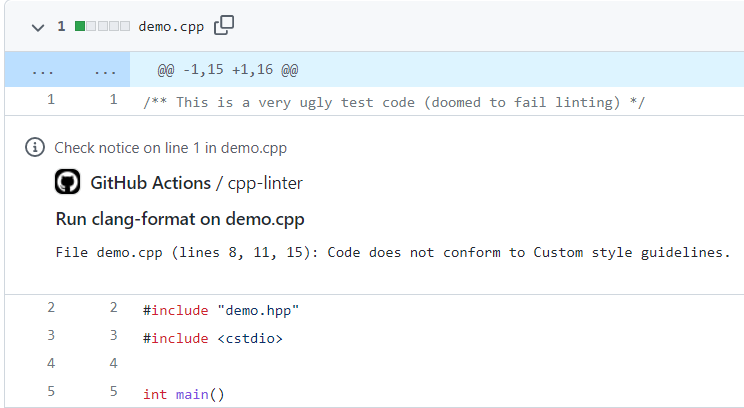
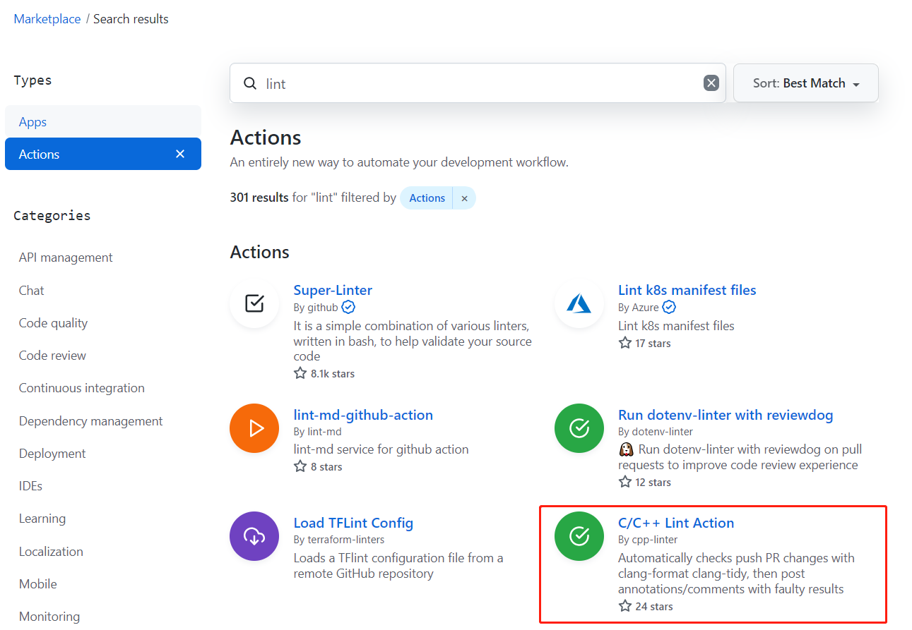

正如标题所说本篇主要分享关于 C/C++ 代码格式化和静态分析的一些实践。

对于 C/C++ 语言的代码格式化和检查工具用的最为广泛的就是使用 [LLVM](https://llvm.org/) 项目中的 [Clang-Format](https://clang.llvm.org/docs/ClangFormat.html) 和 [Clang-Tidy](https://clang.llvm.org/extra/clang-tidy/) 工具。

> LLVM 项目是模块化和可重用的编译器和工具链技术的集合。

如果想使用 clang-format 和 clang-tidy，可以通过在 IDE 中安装插件，然后利用 IDE 进行代码的格式化和静态检查。

但问题是不同的开发人员会使用不同的 IDE，安装不同的插件，这本身就需要比较高的学习成本。另外没法保证所有开发人员都会造作并且在提交代码的时候运行了 Clang-Format 或 Clang-Tidy。

## 怎样确保每次提交都执行了 Clang-Format 或 Clang-Tidy

1. 通过 CI 在代码合并前自动检查。并报告问题，然后倒逼开发执行 Clang-Format 和 Clang-Tidy 的操作。
2. 通过 git hook 在提交代码时自动检查。让开发提交代码的时候自动执行 Clang-Format 和 Clang-Tidy，如果不符合规范则提示并自动 Format，如果符合规范则 `git commit` 成功。

### 通过 CI 在代码合并前自动检查

如果你的代码是存放在 GitHub 上面，那么非常建议你使用 [cpp-linter-action](https://github.com/cpp-linter/cpp-linter-action) 这个 GitHub Action。它有以下这些重要特性：

1. 支持 public 和 private 仓库
2. 分析结果支持 Annotations 或 Thread Comment 进行展示
3. 支持绝大多数版本的 Clang 工具，从最新版本 `v14` 到最旧版本 `v3`
4. 还有很多其他的 [optional-inputs](https://github.com/cpp-linter/cpp-linter-action#optional-inputs)

下面就来如何使用：

只需要在 `.github/workflows/` 下面创建一个 cpp-linter.yml，内容如下：

```yaml
name: cpp-linter

on:
  pull_request:
    types: [opened, reopened]
  push:

jobs:
  cpp-linter:
    runs-on: ubuntu-latest
    steps:
      - uses: actions/checkout@v3
      - uses: cpp-linter/cpp-linter-action@v1
        id: linter
        env:
          GITHUB_TOKEN: ${{ secrets.GITHUB_TOKEN }}
        with:
          style: file

      - name: Fail fast?!
        if: steps.linter.outputs.checks-failed > 0
        run: |
          echo "Some files failed the linting checks!"
          exit 1
```

如果发现没有进行格式化的代码或是静态检查问题，这个 workflow 就会失败，并且默认会有如下注释说明，默认是开启的。



如果开启了 Thread Comment 选项（即 `thread-comments: true`）就会在 Pull Request 中添加如下 Comment。


目前该项目已经受到了很多知名项目所使用，在 GitHub Marketplace 上面搜索它的排名也非常靠前，开发者也在积极维护可以放心使用。



如果你使用的不是 GitHub 作为代码管理工具，比如 Bitbucket，GitLab 等，可以直接使用该项目的 core package [cpp-linter](https://github.com/cpp-linter/cpp-linter)

注意 annotations 和 comment 这两个功能目前只支持 GitHub，该项目未来考虑支持其他 SCM，像 Bitbucket，GitLab。

### 通过 git hook 在提交代码时自动检查

cpp-linter 还提供了另外一种方式：即通过 git hook 在提交代码时自动检查，这种方式不限制使用任何 SCM。

只需要在项目仓库中添加一个 `.pre-commit-config.yaml` 配置文件，然后将 [cpp-linter-hooks](https://github.com/cpp-linter/cpp-linter-hooks) 这个 hook 添加进去，具体设置如下：

> `.pre-commit-config.yaml` 是 [`pre-commit`](https://pre-commit.com/) framework 的默认配置文件。

1. 安装 `pre-commit` 。

    ```python
    pip install pre-commit
    ```

2. 添加 `pre-commit` 的配置文件。更多配置可以参考 [README](https://github.com/cpp-linter/cpp-linter-hooks)

    ```yaml
    repos:
    - repo: https://github.com/cpp-linter/cpp-linter-hooks
      rev: v0.2.1
      hooks:
        - id: clang-format
          args: [--style=file]  # to load .clang-format
        - id: clang-tidy
          args: [--checks=.clang-tidy] # path/to/.clang-tidy
    ```

    > 这里的 file 是指 `.clang-format`, clang-format 默认支持的编码格式包括 LLVM, GNU, Google, Chromium, Microsoft, Mozilla, WebKit，如果需要特殊设置的时候可以在仓库的根目录下面创建配置文件 `.clang-format`。同理，如果默认的静态分析不满足要求，可以在仓库的根目录下创建配置文件 `.clang-tidy`。

3. 安装 git hook 脚本

    ```bash
    pre-commit install
    pre-commit installed at .git/hooks/pre-commit
    ```

4. 之后每次提交代码都会自动执行 clang-format 和 chang-tidy。

    如果检查到没有格式化或有静态分析错误，会提示如下错误信息。

    chang-format 的输出

    ```bash
    clang-format.............................................................Failed
    - hook id: clang-format
    - files were modified by this hook
    ```

    并自动进行格式化

    ```diff
    --- a/testing/main.c
    +++ b/testing/main.c
    @@ -1,3 +1,6 @@
    #include <stdio.h>
    -int main() {for (;;) break; printf("Hello world!\n");return 0;}
    -
    +int main() {
    +  for (;;) break;
    +  printf("Hello world!\n");
    +  return 0;
    +}
    ```

    chang-tidy 的输出

    ```bash
    clang-tidy...............................................................Failed
    - hook id: clang-tidy
    - exit code: 1

    418 warnings and 1 error generated.
    Error while processing /home/ubuntu/cpp-linter-hooks/testing/main.c.
    Suppressed 417 warnings (417 in non-user code).
    Use -header-filter=.* to display errors from all non-system headers. Use -system-headers to display errors from system headers as well.
    Found compiler error(s).
    /home/ubuntu/cpp-linter-hooks/testing/main.c:3:11: warning: statement should be inside braces [readability-braces-around-statements]
      for (;;) break;
              ^
              {
    /usr/include/stdio.h:33:10: error: 'stddef.h' file not found [clang-diagnostic-error]
    #include <stddef.h>
            ^~~~~~~~~~
    ```

## 选择 CI 还是 git hook

当然也可以两个都选。如果你的团队已经在使用 [`pre-commit`](https://pre-commit.com/)，那么使用 git hook 更为方便，只需要添加 [cpp-linter-hooks](https://github.com/cpp-linter/cpp-linter-hooks) 即可，否则可以通过添加 CI 来检查。

---

转载本站文章请注明作者和出处，请勿用于任何商业用途。欢迎关注公众号「DevOps攻城狮」
