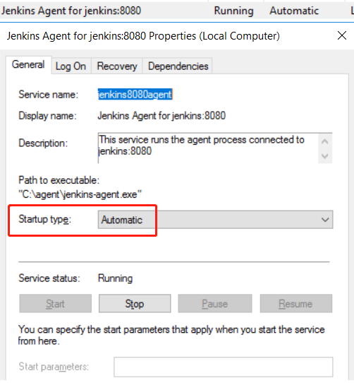
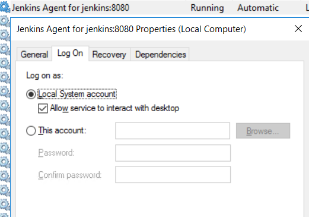

## What's the issue

My Windows build machine is regular reboot after Windows updates, but my Jenkins agent service on this Windows can not
start automatically even I have set the startup type to Automatic.

## Solution 1

After some research, select "Allow service to interact with desktop" with service properties on Log On tab can fix this problem.

In service properties -> Log On -> Select "Local System account" and select the checkbox for "Allow service to interact with desktop". 

## Solution 2

<!-- more -->

If above solution still does not work, you can write a restart jenkins agent service batch script and put it to Startup folder.

Here is a example: [Setup autostart Jenkins agent service after Windows reboot](https://github.com/shenxianpeng/win-jenkins-agent#setup-autostart-jenkins-agent-service-after-windows-reboot)

## Semi-automatic setup Jenkins Agent on Windows

The above mentioned project [win-jenkins-agent](https://github.com/shenxianpeng/win-jenkins-agent) not only supports auto start Jenkins agent server after Windows reboot, but also supports semi-automatic setup Jenkins agent on Windows.

---

转载本站文章请注明作者和出处，请勿用于任何商业用途。欢迎关注公众号「DevOps攻城狮」
