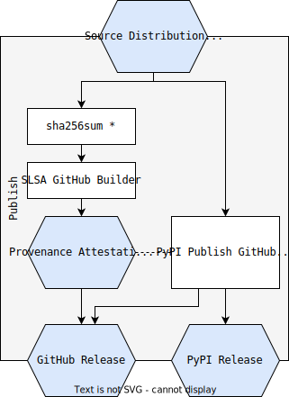
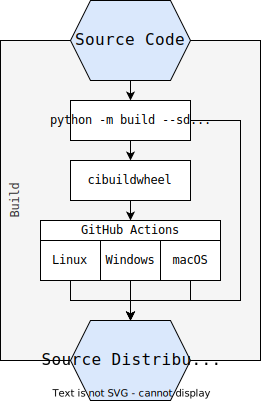

软件工件的供应链层 (SLSA) 是一个用于生成和验证软件工件来源的工具框架。在 Python 生态系统中，有两种主要类型的软件工件：轮子（wheels）和源代码分发（distributions）。

我们如何使用 SLSA 框架来生成和验证 Python 工件的来源呢？

> 本篇文章是由我翻译、并根据我的实践和理解而形成的。英文原文在这里：https://sethmlarson.dev/python-and-slsa 

## 内容

1. [构建纯净的Python包](#构建纯净的Python包)
2. [生成出处证明](#生成出处证明)
3. [上传到PyPI](#上传到PyPI )
4. [验证Python包的来源](#验证Python包的来源)
5. [二进制Python包](#二进制Python包)
6. [文中用到的项目](#文中用到的项目)

注意：本文主要介绍**托管在 GitHub 上的 Python 项目**。SLSA 框架可通过 GitHub Actions 来实现开箱即用，只需最少的配置即可完成。

如果你对 Python 打包的术语或流程感到好奇，[Python 打包用户指南](https://packaging.python.org/en/latest/overview/#packaging-python-libraries-and-tools) 是了解更多信息的最佳场所。

下面是维护人员和用户的端到端工作流程，从构建 distributions、生成出处证明、验证出处、发布到 PyPI，以及在验证其出处后安装 wheel。让我们一起完成每一步！


## 构建纯净的Python包

纯 Python 包通常只有两个工件：源代码 distribution 和纯 Python wheel。纯 Python 包可以使用名为 [build](https://pypi.org/project/build/) 的包从源代码构建。

下面是 GitHub Actions job 定义，它构建纯 Python Wheel Package 和源代码 distribution，并为每个工件创建 SHA-256 哈希值：

```yaml
jobs:
  build:
    steps:
      - uses: actions/checkout@...
      - uses: actions/setup-python@...
        with:
          python-version: 3.x
      - run: |
          # 安装 build，创建 sdist 和 wheel
          python -m pip install build
          python -m build

          # 收集所有文件的哈希值
          cd dist && echo "hashes=$(sha256sum * | base64 -w0)" >> $GITHUB_OUTPUT
      - uses: actions/upload-artifacts@...
        with:
          path: ./dist
```

这里将 build 完的 wheel package 上传到 GitHub Artifacts 存起来，用作后续在 “上传到PyPI” job 中使用。另外还将 `dist` 下的所有文件的哈希值存储在 `hashes` 用作后续 job `provenance` 的输入。

> 注意： SLSA 使用 `sha265sum` 的输出作为出处证明中 `subject-base64` 字段的输入。`sha256sum` 的输出是一个或多个对散列 + 名称。

## 生成出处证明

现在我们已经构建了 sdist 和 wheel，我们可以从文件哈希生成来源证明。

因为我们需要将 Build 阶段的的输出作为这里生成出处的输入，因此这里使用了 [needs](https://docs.github.com/en/actions/using-workflows/workflow-syntax-for-github-actions#jobsjob_idneeds) 选项来作为 job `provenance` 执行的前提条件。可以看到上面生成的哈希值在这里被 `subject-base64` 所使用。

```yaml
jobs:
  provenance:
    needs: [build]
    uses: slsa-framework/slsa-github-builder/.github/workflows/generator_generic_slsa3.yml@v1.9.0
    permissions:
      # 需要检测 GitHub 操作环境
      actions: read
      # 需要通过 GitHub OIDC 创建出处
      id-token: write
      # 需要创建并上传到 GitHub Releases
      contents: write
    with:
      # 生成的 package SHA-256 哈希值
      subject-base64: ${{ provenance.needs.build.output.hashes }}
      # 将出处文件上传到 GitHub Release
      upload-assets: true
```

你会注意到，这并没有像 GitHub 工作流那样定义任何单独的步骤。相反 SLSA builders 使用[可重用工作流](https://docs.github.com/en/actions/using-workflows/reusing-workflows)功能来证明给定的 builders 行为不能被用户或其他进程修改。

出处证明文件是 [JSON lines](https://jsonlines.org/)，以 `.intoto.jsonl` 结尾。`*.intoto.jsonl` 文件可以包含多个工件的证明，也可以在同一文件中包含多个出处证明。该 `.jsonl` 格式意味着该文件是一个 “JSON lines” 文件，即每行一个 JSON 文档。

> 注意：这里有一点令人困惑的是 GitHub job 中的 `id-token` 需要 `write` 权限才能读取 GitHub OIDC 令牌。`read` 不允许你读取 OIDC...🤷。有关 `id-token` 权限的更多信息，请参阅 [GitHub 文档](https://docs.github.com/en/actions/deployment/security-hardening-your-deployments/about-security-hardening-with-openid-connect#adding-permissions-settings)。

## 上传到PyPI 

我们使用官方 [pypa/gh-action-pypi-publish](https://github.com/pypa/gh-action-pypi-publish) GitHub Action 将 wheel 包上传到 PyPI。

请注意，这个 `publish` job 需要在 `build` 和 `provenance` 都完成后开始执行，这意味着我们可以假设  `provenance` job 已经为我们起草了 GitHub Release（因为 `upload-assets: true` 的设置），并且我们可以假设该 job 已成功。如果不先创建来 provenance 文件，我们不想将这些 wheel 包上传到 PyPI，因此我们最后上传到 PyPI。



```yaml
publish:
  needs: ["build", "provenance"]
  permissions:
    contents: write
  runs-on: "ubuntu-latest"
  steps:
  # 下载已构建的 distributions
  - uses: "actions/download-artifact@..."
    with:
      name: "dist"
      path: "dist/"
  # 上传 distributions 到 GitHub Release
  - env:
      GITHUB_TOKEN: "${{ secrets.GITHUB_TOKEN }}"
    run: |
      gh release upload ${{ github.ref_name }} \
        dist/* --repo ${{ github.repository }}
  # 发布 distributions 到 PyPI
  - uses: "pypa/gh-action-pypi-publish@..."
    with:
      user: __token__
      password: ${{ secrets.PYPI_TOKEN }}
```

请注意，该 `publish` job 需要在开始之前完成 `build` 和作业。`provenance` 这意味着我们可以假设出处作业已经为我们创建了 GitHub 发布草案（感谢该 `upload-assets: true` 设置），并且我们可以假设该作业已成功。如果不先创建来源文件，我们不想将这些发行版上传到 PyPI，因此我们最后上传到 PyPI。

## 验证Python包的来源

让我们使用一个真正的 Python 项目来验证它的出处。以 urllib3 项目为例，它在 GitHub Releases 发布了版本中包含出处证明，这里演示的是使用它的最新版本 [`2.1.0`](https://github.com/urllib3/urllib3/releases/tag/2.1.0) 。

首先我们需要下载 [slsa-verifier](https://github.com/slsa-framework/slsa-verifier/releases) 用来验证出处。下载完该 `slsa-verifier` 工具后，让我们从 PyPI 获取 urllib3 wheel 包，而不使用 [pip download](https://pip.pypa.io/en/stable/cli/pip_download/). 我们使用该 [`--only-binary`](https://pip.pypa.io/en/stable/cli/pip_install/#cmdoption-only-binary) 选项强制 pip 下载 wheel。


```bash
python3 -m pip download --only-binary=:all: urllib3
Collecting urllib3
  Downloading urllib3-2.1.0-py3-none-any.whl.metadata (6.4 kB)
Downloading urllib3-2.1.0-py3-none-any.whl (104 kB)
   ━━━━━━━━━━━━━━━━━━━━━━━━━━━━━━━━━━━━━━━━ 104.6/104.6 kB 761.0 kB/s eta 0:00:00
Saved ./urllib3-2.1.0-py3-none-any.whl
Successfully downloaded urllib3
```

下载软件包后，我们需要从 GitHub 版本下载出处证明。我们需要使用与包版本相同的 GitHub Release 来确保获得正确的出处证明，因此 tag 也是 2.1.0。

```bash
curl --location -O https://github.com/urllib3/urllib3/releases/download/2.1.0/multiple.intoto.jsonl
```

该出处文件的名称为 `multiple.intoto.jsonl`，这是一个包含多个工件证明的出处证明的标准名称。对于 Python 项目来说几乎总是如此，因为几乎总是有一个源代码 distribution 和至少一个 wheel。

此时，我们当前的工作目录中应该有两个文件：wheel 和出处证明，`ls` 浏览一下确保已经准备好了：

```bash
ls
multiple.intoto.jsonl  urllib3-2.1.0-py3-none-any.whl
```

从这里我们可以使用 `slsa-verifier` 来验证出处。我们可以验证最重要的事情，即哪个 GitHub 仓库实际构建了 wheel，以及其他信息，例如 git 标签、分支和建造者 ID：

源存储库 (`--source-uri`)
建造者 ID (`--builder-id`)
Git 分支 (`--source-branch`)
git 标签 (`--source-tag`)

因此，如果我们想验证轮子的源存储库，我们可以使用 `--source-uri`。当然还可以验证 `--builder-id`，`--source-branch` 和 `--source-tag`。具体我的测试目前 `--builder-id`，`--source-branch` 似乎有问题。

```bash
# 这里仅验证 GitHub 仓库
slsa-verifier verify-artifact --provenance-path multiple.intoto.jsonl --source-uri github.com/urllib3/urllib3 urllib3-2.1.0-py3-none-any.whl 
Verified signature against tlog entry index 49513169 at URL: https://rekor.sigstore.dev/api/v1/log/entries/24296fb24b8ad77a08c2f012d69948ed5d12e8e020852bb7936ea9208d684688e5108cca859a3302
Verified build using builder "https://github.com/slsa-framework/slsa-github-generator/.github/workflows/generator_generic_slsa3.yml@refs/tags/v1.9.0" at commit 69be2992f8a25a1f27e49f339e4d5b98dec07462
Verifying artifact urllib3-2.1.0-py3-none-any.whl: PASSED

PASSED: Verified SLSA provenance
```

**成功了**！🥳 我们已经验证了这个 wheel 的出处，所以现在我们可以放心的安装它，因为我们知道它是按照我们的预期构建的：

```bash
python3 -m pip install urllib3-2.1.0-py3-none-any.whl 
Defaulting to user installation because normal site-packages is not writeable
Processing ./urllib3-2.1.0-py3-none-any.whl
Installing collected packages: urllib3
  Attempting uninstall: urllib3
    Found existing installation: urllib3 2.0.5
    Uninstalling urllib3-2.0.5:
      Successfully uninstalled urllib3-2.0.5
Successfully installed urllib3-2.1.0
```

## 二进制Python包

Python wheel 并不全是纯 Python！Python 的最大优势之一是作为 C、C++、Fortran、Rust、Go（等）的粘合语言，与其他一些编程语言相比，Python 的打包和起源故事变得更加复杂。

需要为多个平台、架构构建二进制 wheel，如果项目无法使用稳定的 [ABI](https://docs.python.org/3/c-api/stable.html#stable-application-binary-interface) ，则需要为每个新的 Python 版本编译新的 wheel。要了解在这种情况下项目需要多少个 wheel，你可以查看 MarkupSafe，它在 [v2.1.3 中提供了近 60 个wheel](https://pypi.org/project/MarkupSafe/#files)。当新的 Python 版本发布时，至少还会有 10 个版本来覆盖 Python 3.12 的所有平台。

不幸的是，这意味着我们需要在初始版本发布后的某个时间创建新的工件，而 SLSA 中没有一个简单的办法。这个问题有两种解决方案：

* 为包创建一个新版本，而不仅仅是新 wheels。
* 构建新的 wheels 并创建新的出处证明。

### 创建新版本

最简单的方法是在将 `cibuildwheel` GitHub Action 更新到最新版本后为包创建一个新版本以支持所有新的 Wheel 目标。这将创建一个新的来源证明、sdist 和 wheel。然而，如果项目的源代码没有任何改变，这感觉像是一个不幸的结果。



与新轮子相比，新版本会引起更多的流失：

* 维护人员的额外工作
* 存储和计算资源（PyTorch 的每个版本[大约有 6GB 的 wheels](https://pypi.org/project/torch/#files)）
* 依赖者需要更新锁定文件（依赖机器人疲劳，有人吗？）
* 下游重新打包和分发

### 发布后wheels的出处

那么，如果我们不想仅仅为了新轮子的出处而创建新版本，该怎么办呢？

Markupsafe 的解决方案是添加一个手动 [workflow_dispatch](https://docs.github.com/en/actions/using-workflows/manually-running-a-workflow) 触发器来运行典型的 wheel 构建工作流程，但配置为仅为给定的 Python 版本（即 `cp312` CPython 3.12）构建新的 wheels。然后这些 wheels 会像平常一样通过 SLSA 进行证明并上传到 PyPI，但新的出处证明文件会添加到现有的 GitHub 发布工件中。

这是有效的，因为 PyPI 上的所有工件都有出处证明。有一些缺点：

* 新的出处证明位于 GitHub Release 的单独工件中，而不是现有的出处证明中。这意味着想要验证新车轮来源的用户可能需要一些手动发现和步骤来下载正确的来源证明文件。
* 通常新的架构或平台需要新版本的 `cibuildwheel`。由于需要更新源代码才能升级正在 `cibuildwheel` 使用的版本，因此过去版本的 git 标签将与构建新轮子所需的确切 git 提交不匹配。这意味着出处证明不会包含有关 git 标签的信息，因此使用该 `--source-tag` 选项进行验证将无法按预期进行。

上述第一点的另一个潜在解决方案是创建一个全新的来源证明，其中包含新旧工件的哈希值。

## 文中用到的项目

以下这些是本文使用的所有项目和工具：

* [SLSA GitHub Builder](https://github.com/slsa-framework/slsa-github-generator/blob/main/internal/builders/generic/README.md)
* [slsa-framework/slsa-verifier](https://github.com/slsa-framework/slsa-verifier)
* [pypa/gha-action-pypi-publish](https://github.com/pypa/gh-action-pypi-publish)
* [pypa/build](https://github.com/pypa/build)
* [pypa/cibuildwheel](https://github.com/pypa/cibuildwheel)

以下项目是用来展示如何在 GitHub Actions 中针对 Python 项目配置 SLSA：

* [urllib3/urllib3](https://github.com/urllib3/urllib3/blob/main/.github/workflows/publish.yml)
* [pallets/markupsafe](https://github.com/pallets/markupsafe/blob/main/.github/workflows/publish.yaml)

---

转载本站文章请注明作者和出处，请勿用于任何商业用途。欢迎关注公众号「DevOps攻城狮」
