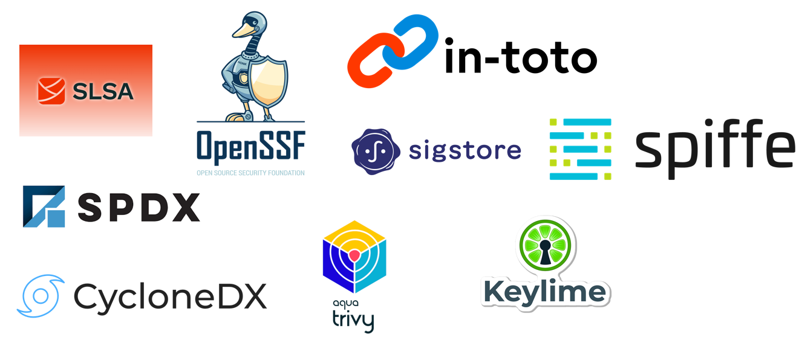

## Why Software Supply Chain Security is important?

Software supply chain security is the act of securing the components, activities, and practices involved in creating software.

Attacks in the software supply chain have become more and more frequent in recent years, SonaType reported more than 700% of attacks in open-source software from 2019 to 2022.

 

In this [Google Security Blog](https://security.googleblog.com/2021/06/introducing-slsa-end-to-end-framework.html), there are many real examples of software supply chain attacks that pose growing threats to users and Google proposed a solution called SLSA in 2021.

Also, some well-known organizations such as Linux Foundation and CNCF have created standards and tools to address the issue of how to produce trusted software and attestations.



Based on this background, many organizations want to incorporate best practices from the open-source community into our CICD pipeline. 

## How to adopt Supply Chain Security for GitHub and Non-GitHub projects

Next, I will show you how to adopt on both GitHub and Rocket Bitbucket as an example to show you how we integrate software supply chain security

### GitHub projects

On GitHub, the easiest and most popular option is to use slsa-github-generator, a tool provided by the official slsa-framework for native GitHub projects to create attestations during the build process and upload signed attestations to Rekor a transparency log system created by Sigstore. Here is the [demo reposistory](https://github.com/shenxianpeng/slsa-provenance-demo) for reference.

Before installing your product package, the user can download the package and verify the provenance file at the end of .intoto.jsonl first, then run the following command manually or in their CI pipeline to verify whether the artifact is tampered with or not

```
bash-4.4$ slsa-verifier verify-artifact test-1.0.0-py3-none-any.whl --provenance-path test-1.0.0-py3-none-any.whl.intoto.jsonl --source-uri github.com/shenxianpeng/slsa-provenance-demo
Verified signature against tlog entry index 49728014 at URL: https://rekor.sigstore.dev/api/v1/log/entries/24296fb24b8ad77af7063689e8760fd7134f37e17251ec1d5adc16af64cb5cb579493278f7686e77
Verified build using builder "https://github.com/slsa-framework/slsa-github-generator/.github/workflows/generator_generic_slsa3.yml@refs/tags/v1.9.0" at commit fb7f6df9f8565ed6fa01591df2af0c41e5573798
Verifying artifact test-1.0.0-py3-none-any.whl: PASSED

PASSED: Verified SLSA provenance
```

### Non-GitHub projects

However, there are many organizations' codes are hosted on Non-GitHub SCM, so you can use the Witness, a tool from CNCF in-toto, which can help us generate and verify attestations. 

It’s easy to scale Witness to your products, just integrate witness command into the existing build command it will generate proof of the software build and release execution process and can be verified. 

You can follow [this demo to integrate with witness](https://github.com/shenxianpeng/witness-demo), then will generate the build package along with attestations file, policy-signed.json file, and a public key.

Before user installing your product package, they can run the following command manually or in their CI pipeline to verify whether the artifact is tampered or not.

```bash
witness verify -f dist/witness_demo-1.0.0-py3-none-any.whl -a witness-demo-att.json -p policy-signed.json -k witness-demo-pub.pem 
INFO    Using config file: .witness.yaml             
INFO    Verification succeeded                       
INFO    Evidence:                                    
INFO    0: witness-demo-att.json 
```

---

转载本站文章请注明作者和出处，请勿用于任何商业用途。欢迎关注公众号「DevOps攻城狮」
