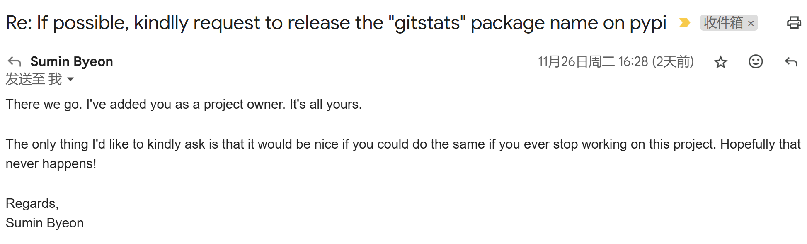

最近的晚上的时间（一般要等到孩子睡了）我正在做一件事：复活已经沉寂多年的 GitStats 项目。

此前，我曾写过两篇关于 GitStats 的文章，如果感兴趣，可以查阅了解。

* [Git 历史统计信息生成器 GitStats](https://shenxianpeng.github.io/2019/12/git-stats/)
* [通过 Jenkins 定期自动给老板提供 Git 仓库的多维度代码分析报告](https://shenxianpeng.github.io/2020/01/git-stats-jenkins/)

<!-- more -->
## 什么是 GitStats

GitStats 是一个用 Python 写的工具，用来分析 Git 仓库的历史记录，并生成 HTML 报告。

然而，它只支持 Python 2，且作者已经停止维护（最后一次提交还停留在 9 年前）。

在当前开发环境中，兼容性和使用便捷性都受到很大限制，但不可否认，它的价值依旧存在。

因此，我决定对这个项目进行现代化改造。

## 我已经完成的工作

1. **迁移到 Python 3.9+**：重构代码以支持 Python 3 版本。✅
2. **创建现代化流水线**：增加 CI/CD 等工具，便于持续开发和发布。✅
3. **发布到 PyPI**：用户现在可以通过 pip install gitstats 来安装。✅
4. **提供 Docker 镜像**：用户无需自行处理依赖，运行 gitstats 更加便捷。✅
4. **提供在线预览**：创建一个展示页面，让用户直观了解 GitStats 的功能。✅

## 特别感谢

在这里我要特别感谢 Sumin Byeon（@suminb）。从他的介绍来看，他应该是一位生活在韩国的程序员。

原本 GitStats 在 PyPI 上的 Owner 是他，因此我无法直接使用这个名字。我尝试过其他名字，例如 git-stats 和 gitstory，但都因与其他项目的名字相近而被 PyPI 拒绝。

看到他的项目已经有五年没有维护了，我抱着试一试的心态给他发了一封邮件，问他是否愿意将 GitStats 的名字转让给我，因为我正在重振这个项目。

没想到，他很快回复了，并最终同意将 GitStats 的名字交给我。他唯一的条件是，如果将来我停止维护 GitStats，而其他人需要这个名字时，我也能像他一样将名字交给对方。

我答应了他，也承诺将长期维护 GitStats。（希望我能够做到）

## 未来计划

1. **解决有价值的 Issue**：梳理原仓库中未解决的问题，挑选具有价值的进行修复。
2. **审查现有 Pull Requests**：评估原仓库的 PR，视情况合并到当前项目中。
3. **更新文档**：完善文档，使其更清晰易懂。
4. **添加新功能**：增加功能，使项目更强大、更有用。
5. **优化 UI**：提升界面美观性，改善用户体验。

## 如何参与

如果你对 GitStats 的改进有兴趣，欢迎参与这个项目！你可以：

1. **建议功能**：提出想法或功能请求，帮助项目更贴近用户需求。
2. **贡献代码**: 修复 Bug 或添加功能，为项目直接出力。
3. **分享推广**：将 GitStats 推荐给可能感兴趣的朋友或社区。

最后，让我们携手合作，让 GitStats 再次焕发活力！

_写于 2024 年 11 月 28 日凌晨 2:50_

---

转载本站文章请注明作者和出处，请勿用于任何商业用途。欢迎关注公众号「DevOps攻城狮」
