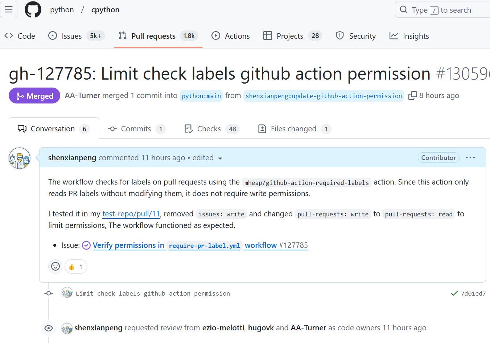

昨晚，哄完女儿睡觉已经是午夜十二点了。我回到自己的屋里，打开 GitHub，看看当晚有没有什么可以贡献的项目。

这次，我决定去 CPython 的 Issue 区找找有没有适合自己的贡献机会。

> CPython 就是大名鼎鼎的 Python 编程语言的官方代码仓库。

其实，早就想找机会为 CPython 贡献代码，但一直没能迈出第一步。这次，我想用自己的方式寻找突破口。

这种想法的启发，来自 Tian Gao（GitHub ID：gaogaotiantian），他是 Python 的 Core Developer（核心开发者），专注于维护 pdb，并曾跻身 Python 贡献排行榜前 100 名。

于是，我筛选了一些自己感兴趣的类别，当然就是 Infra 和 DevOps 相关的问题。很快，我找到了一张合适的 Issue，修改代码、测试、提交 Pull Request，然后就去睡觉了。

**今天早上醒来，我发现我的 PR 已经被 Merge 到 CPython 主分支了！**

这算不上什么了不起的成就，但却是一个很好的学习过程。从一名 Python 爱好者，到为 Python 社区贡献代码，在这个过程中，不仅能提升相关技能，还能与优秀的开发者交流，积累宝贵的经验。

从短期来看，或许不会带来直接的收益，但如果这是你真正热爱的事情，那么长期投入一定是值得的。

拥有 Python Core Developer 这样的身份认可，在国内可能有助于获得更理想的工作机会。然而，并非所有公司都青睐这种“双时区开发者”（白天工作，晚上开源）。

但如果你的目标是寻找远程工作，或者申请欧美国家的签证，这样的经历无疑会成为一个重要的加分项。

---

转载本站文章请注明作者和出处，请勿用于任何商业用途。欢迎关注公众号「DevOps攻城狮」
