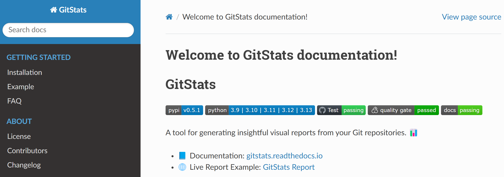

在日常的开源项目或团队协作中，我们经常会需要一个易于维护、可自动部署的文档系统。

最近在维护自己的开源项目时，我尝试用 [Sphinx](https://www.sphinx-doc.org/) 来生成文档，并通过 [ReadTheDocs](https://readthedocs.org/) 实现了自动构建和托管，整体体验还不错。

记录一下配置过程，希望能帮到有类似需求的朋友。

## 为什么选择 Sphinx 和 ReadTheDocs

- **Sphinx** 是一个用 Python 编写的文档生成工具，最初为 Python 官方文档设计，支持 reStructuredText 和 Markdown（通过插件）。
- **ReadTheDocs** 是一个文档托管平台，可以自动从你的 Git 仓库拉取代码、构建并发布文档，支持 webhook 自动触发。

这两个工具的组合非常适合持续维护和更新文档，而且社区成熟、资料丰富。

<!-- more -->

## 基础配置步骤

以下是一个实际项目中配置的完整流程。

### 1. 安装 Sphinx 和相关依赖

推荐使用虚拟环境，然后安装：

```bash
# docs/requirements.txt
sphinx==5.3.0
sphinx_rtd_theme==1.1.1

# 如果你需要支持 Markdown，可以添加:
myst_parser==0.18.1
```

```bash
pip install -r docs/requirements.txt
```

说明：

- `sphinx-rtd-theme` 是 ReadTheDocs 使用的默认主题

### 2. 初始化文档项目结构

在项目根目录执行：

```bash
sphinx-quickstart docs
```

建议将 `source` 和 `build` 目录分开

执行完后，`docs` 目录下会生成 `conf.py` 和 `index.rst` 等文件。

### 3. 修改 `conf.py` 配置文件

几个关键设置如下：

```python
# Read the Docs configuration file
# See https://docs.readthedocs.io/en/stable/config-file/v2.html for details
from datetime import datetime

project = "GitStats"
author = "Xianpeng Shen"
copyright = f"{datetime.now().year}, {author}"
html_theme = "sphinx_rtd_theme"
```

如果你需要支持 Markdown，需要在 `conf.py` 中添加:

```python
extensions = [
    'myst_parser',  # 支持 Markdown
]
```

## 配置 ReadTheDocs 自动构建

只要项目结构清晰，ReadTheDocs 基本可以一键跑通。

### 1. 导入项目到 ReadTheDocs

- 登录 [https://readthedocs.org/](https://readthedocs.org/)
- 点击 "Import a Project"，选择你的 GitHub 或 GitLab 仓库
- 确保仓库中包含 `docs/conf.py`，系统会自动识别

### 2. 添加 `.readthedocs.yml` 配置文件

为了更好地控制构建过程，建议在项目根目录添加 `.readthedocs.yml`：

```yaml
# Read the Docs configuration file
# See https://docs.readthedocs.io/en/stable/config-file/v2.html for details
version: 2

# Set the OS, Python version, and other tools you might need
build:
  os: ubuntu-24.04
  tools:
    python: "3.12" # use 3.12 because 3.13 removed imghdr module, it will cause error

sphinx:
   configuration: docs/source/conf.py

python:
   install:
   - requirements: docs/requirements.txt
```

配置完成后，每次提交 Pull Request 时，ReadTheDocs 都会自动拉取并构建最新文档供你预览，确保文档如你所期望的那样。

## 最终效果

构建完成后，ReadTheDocs 会提供一个类似 `https://your-project.readthedocs.io/` 的文档地址，方便团队协作和用户查阅。

我目前的开源项目也采用了这套方案，例如：[GitStats 文档](https://gitstats.readthedocs.io/en/latest/)



## 小结

只要做好上述的配置，几乎可以实现“写完文档，提交即上线”，大大提高了文档维护的效率。

如果你正在写开源项目文档，或者想给团队项目（尤其是 Python 项目）补上文档系统，不妨试一试 Sphinx + ReadTheDocs。

---

转载本站文章请注明作者和出处，请勿用于任何商业用途。欢迎关注公众号「DevOps攻城狮」
