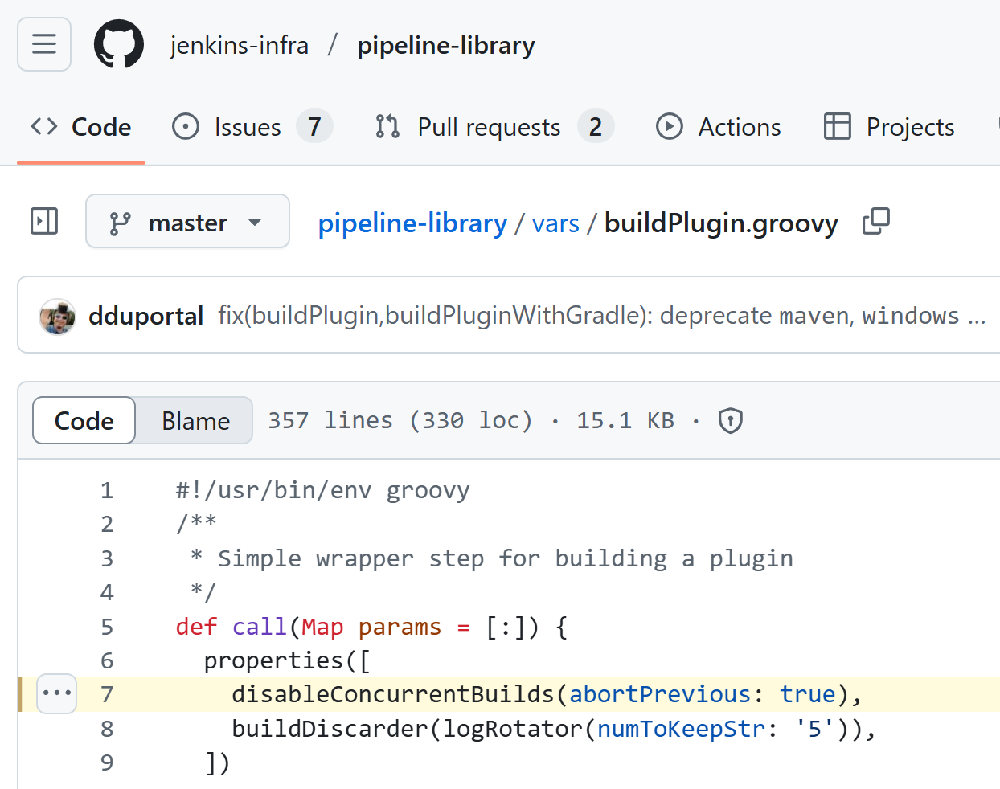
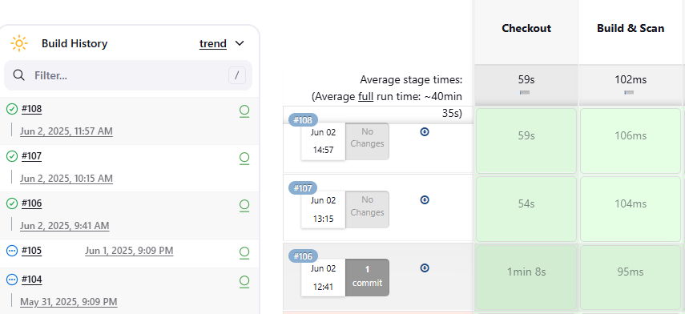

## 背景介绍

在我们的 Jenkins 流水线中，经常会遇到这样一种情况：当同一个分支或 PR 已有一个构建任务正在运行时，如果此时有新的提交进来，当前构建会被自动中断，转而执行新的构建任务。

这是由于我们需要合理控制资源使用，尤其是对于那些构建时间较长的任务。如果允许同一个分支或 PR 同时触发多个构建，Jenkins Agents 很快就会被大量占用，导致后续任务只能排队等待。

因此，在 Jenkinsfile 中，我们经常会设置这样的选项：

```groovy
// 禁止并发构建，允许中断前一个任务
disableConcurrentBuilds abortPrevious: true
```

这段代码你可能在不少 Jenkinsfile 中看到，就算是 Jenkins 团队他们自己的 CI 也是这样设置的。



这样做的好处是显而易见的，但在某些情况时也带来了一个新的问题，比如：

> 当一个 release 分支正在运行的构建任务，会被新的合并触发的构建中断。尤其是当它即将完成时，却因为新的合并代码触发了新的构建任务，导致前一个任务被中断。

这让 QA 同事很抓狂：一个马上就要交付测试的 Build，结果因为新的合并被中断了，还得重新等待……

<!--more-->

于是他们提出了一个需求：

> PR 构建可以中断来节省资源没问题，但像 `devel` 或 `release` 分支上的构建，如果已经在运行，就不应该被中断。新的合并触发的构建应该排队等待，直到前一个任务完成后再运行。

起初我认为这个设置是全局生效的，没办法按分支进行区分。查了一下 ChatGPT 和 Google，也确实没发现特别简单的方法能做到“某些分支不中断，而是排队”。

后来我想到了一个非常简单的做法：

可以通过一段简单的判断逻辑，在 pipeline 的起始位置判断当前构建是基于哪个分支，然后根据分支类型动态设置 `abortPrevious` 的值：

```groovy
def call() {
    def isAboutPrevious = true

    if (env.BRANCH_NAME == 'devel' || env.BRANCH_NAME.startsWith('release/')) {
        isAboutPrevious = false // devel 和 release 分支，不中断
    }

    pipeline {
        options {
            disableConcurrentBuilds abortPrevious: isAboutPrevious
        }
        stages {
            // ... 构建流程
        }
    }
}
```

## 最终效果

这段逻辑已经合并到了我们的共享 Jenkins 库中。上线后的表现完全符合预期：

✅ 同一个 devel / release 分支上的构建任务会排队执行，不再中断
✅ 同一个 PR 的构建依然会中断前一个任务，从而节省资源
✅ 无需单独创建 Jenkinsfile，也没有引入复杂逻辑，维护成本极低

改动之前是这样的：



* Job #104：还没跑完就被中断了
* Job #105：同样的命运，又被新合并触发的构建终止了

我们希望达到的效果是：

* Job #106：即使有新的合并，也能继续正常运行
* Job #107：在队列中等待，等 #106 完成后再开始执行

## 总结一下

如果你也在使用 Jenkins 进行多分支构建，并且对某些特定分支有类似的需求，这个方法值得一试：

简单的一段条件判断，就可以实现按需控制构建是否会被中断。

欢迎大家在留言区交流你们的 Jenkins 构建优化经验！👋

<!--如果你觉得这篇文章对你有帮助，记得【点赞】【在看】支持一下我 🙌～-->

---

转载本站文章请注明作者和出处，请勿用于任何商业用途。欢迎关注公众号「DevOps攻城狮」
