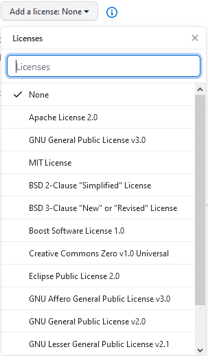

现在的一般的企业在发布 Open Source 的时候，它们背后都有法律团队来确定 License 的问题，也就是著作权问题。因此，企业开发者一般都不需要考虑这个问题。

如果你是作为个人开发者发布一个 Open Source 的时候就需要先考虑一下了（一旦项目火了呢），因此到底要选择什么样的 License 呢？

以 GitHub 为例，在创建仓库之初就可以选择添加 License，但是这么多的 License 到底应该选择哪种协议呢？

